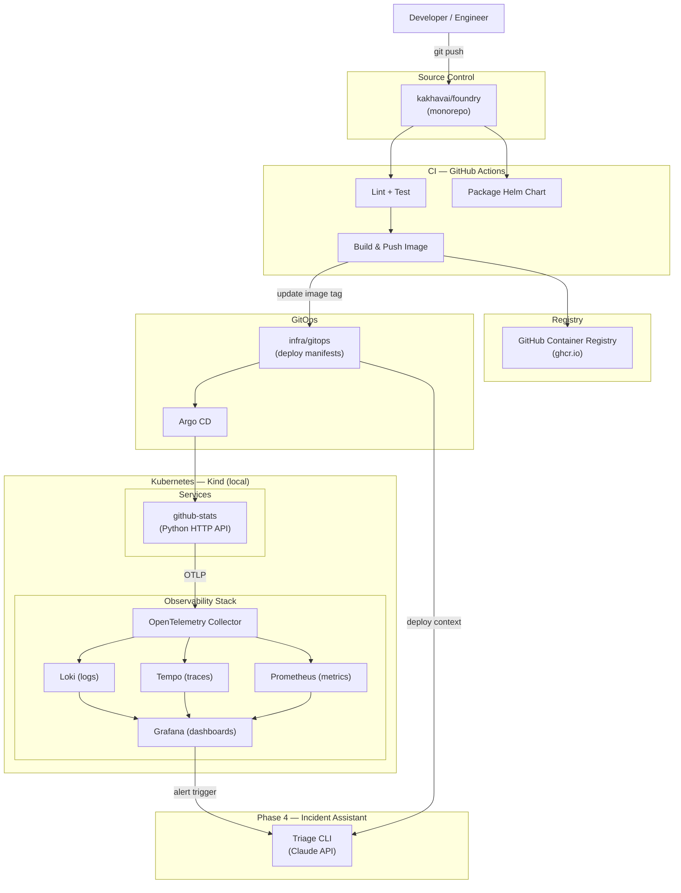

# Foundry

A standardized Kubernetes service delivery platform with CI/CD automation, Helm-based deployment, GitOps workflows, and integrated observability using OpenTelemetry and the Grafana LGTM stack.

> Built to demonstrate a reusable golden path for onboarding services to Kubernetes — standardizing build, deployment, telemetry, and safe rollout behavior across multiple services.

---

## Architecture



---

## Repo Structure

```
foundry/
  services/
    github-stats/        # Python HTTP API — GitHub Activity Stats
  helm/
    charts/              # Helm charts per service
  .github/
    workflows/           # CI pipelines (reusable + per-service)
  infra/
    kind/                # Local Kind cluster config
    grafana-stack/       # Loki, Tempo, Prometheus, Grafana manifests
    gitops/              # GitOps deploy manifests (Argo CD source of truth)
  docs/
    architecture/        # System diagrams and architecture docs
    plans/               # Design docs and implementation plans
    runbooks/            # Operational runbooks
  README.md
```

---

## Phases

| Phase | Dates | Goal |
|---|---|---|
| 1 | Apr 13 – Apr 26 | First paved road — one service, full stack |
| 2 | Apr 27 – May 10 | Golden path — reusable, second service onboarded |
| 3 | May 11 – May 31 | GitOps + safe deployment — production-style operations |
| 4 | Jun 1 – Jun 14 | Incident assistant — AI-powered triage layer |

---

## Local Dev + Deploy

> Setup instructions will be added at the end of Phase 1.

---

## Docs

- [Master Architecture](docs/architecture/master-architecture.md)
- [Phase 1 — First Paved Road](docs/architecture/phase-1-first-paved-road.md)
- [Phase 2 — Golden Path](docs/architecture/phase-2-golden-path.md)
- [Phase 3 — GitOps Deployment](docs/architecture/phase-3-gitops-deployment.md)
- [Phase 4 — Incident Assistant](docs/architecture/phase-4-incident-assistant.md)
- [Why This Design](docs/why-this-design.md)
