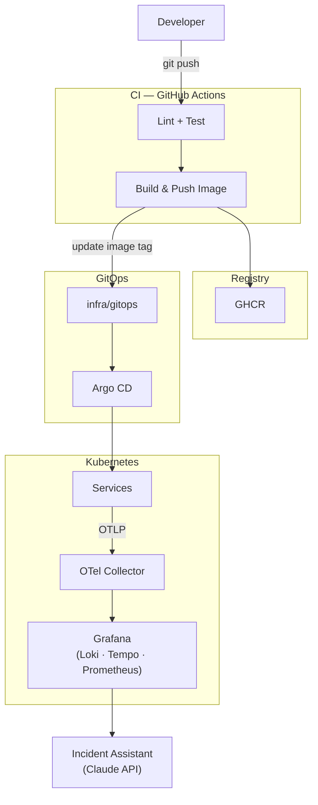

# Foundry

A standardized Kubernetes service delivery platform — CI/CD, Helm-based deployment, GitOps, and integrated observability via OpenTelemetry and the Grafana LGTM stack.



---

## Repo Structure

```
foundry/
  services/              # service source code
  helm/charts/           # Helm charts per service
  .github/workflows/     # CI pipelines (reusable + per-service)
  infra/
    kind/                # local Kind cluster config
    grafana-stack/       # observability stack manifests
    gitops/              # Argo CD source of truth for deploys
  docs/
    architecture/        # system diagrams and component docs
    plans/               # design docs and implementation plans
    runbooks/            # operational runbooks
```

---

## Phases

| Phase | Dates | Goal |
|---|---|---|
| 1 | Apr 13 – Apr 26 | First paved road — one service, full stack |
| 2 | Apr 27 – May 10 | Golden path — reusable conventions, second service |
| 3 | May 11 – May 31 | GitOps + safe deployment, rollback, release observability |
| 4 | Jun 1 – Jun 14 | AI-assisted incident triage |

---

## Local Dev + Deploy

### Prerequisites

| Tool | macOS | Windows |
|---|---|---|
| Docker | [Docker Desktop](https://www.docker.com/products/docker-desktop/) | [Docker Desktop](https://www.docker.com/products/docker-desktop/) |
| uv | `brew install uv` | `winget install astral-sh.uv` |
| kind | `brew install kind` | `winget install Kubernetes.kind` |
| kubectl | `brew install kubectl` | `winget install Kubernetes.kubectl` |
| helm | `brew install helm` | `winget install Helm.Helm` |
| helmfile | `brew install helmfile` | `scoop install helmfile` |
| helm-diff | `helm plugin install https://github.com/databus23/helm-diff` | `helm plugin install https://github.com/databus23/helm-diff` |

> After installing with winget/scoop on Windows, open a new terminal for PATH changes to take effect.
>
> **Windows:** `helm plugin install` requires PowerShell Core. Install it with `winget install Microsoft.PowerShell` and open a new terminal before running the plugin install.

### github-stats service

```bash
cd services/github-stats
uv sync           # install deps into .venv
uv run pytest     # run tests
uv run uvicorn github_stats.main:app --reload  # start with hot reload (http://localhost:8000)
```

### Local Kubernetes cluster (Kind)

```bash
# Create the cluster
kind create cluster --config infra/kind/cluster.yaml

# Verify it's up
kubectl get nodes

# Delete when done
kind delete cluster --name foundry
```

### Deploy github-stats to Kind

```bash
# Load the local image into the cluster (no registry needed locally)
docker build -t github-stats:local services/github-stats/
kind load docker-image github-stats:local --name foundry

# Install via Helm
helm upgrade --install github-stats helm/charts/github-stats \
  --set image.repository=github-stats \
  --set image.tag=local \
  --set image.pullPolicy=Never

# Check it's running
kubectl get pods
kubectl port-forward svc/github-stats-github-stats 8000:8000
# then: curl http://localhost:8000/health
```

### Observability Stack

Deploys OTel Collector, Loki, Tempo, Prometheus, and Grafana into the `monitoring` namespace via Helmfile.

```bash
# Add chart repos (first time only)
cd infra/grafana-stack
helmfile repos

# Deploy the full stack
helmfile apply

# Verify all pods are running
kubectl get pods -n monitoring

# Tear down
helmfile destroy
```

**Access the UIs:**

```bash
# Grafana — http://localhost:3000 (login: admin / admin)
kubectl port-forward -n monitoring svc/grafana 3000:80

# Prometheus — http://localhost:9090
kubectl port-forward -n monitoring svc/prometheus-server 9090:80

# Loki (raw API) — http://localhost:3100/ready
kubectl port-forward -n monitoring svc/loki 3100:3100

# Tempo (raw API) — http://localhost:3200/ready
kubectl port-forward -n monitoring svc/tempo 3200:3200
```

The `github-stats` dashboard loads automatically in Grafana. Panels show live data once the service is running and instrumented with the OTel SDK.

---

## Docs

- [Architecture Overview](docs/architecture/architecture-overview.md)
- [Why This Design](docs/why-this-design.md)
- [Phase 1 — First Paved Road](docs/architecture/phase-1-first-paved-road.md)
- [Phase 2 — Golden Path](docs/architecture/phase-2-golden-path.md)
- [Phase 3 — GitOps Deployment](docs/architecture/phase-3-gitops-deployment.md)
- [Phase 4 — Incident Assistant](docs/architecture/phase-4-incident-assistant.md)
