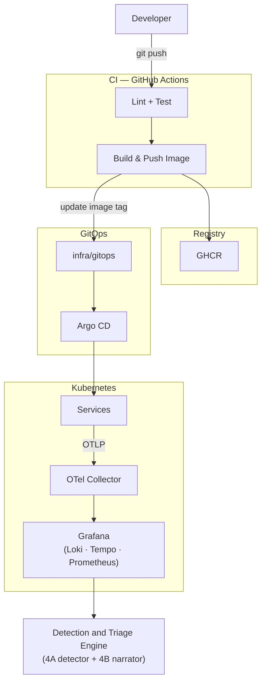

# Foundry

A production-grade Kubernetes platform monorepo covering the full service delivery lifecycle: CI/CD, Helm-based deployment, GitOps with Argo CD, and integrated observability via OpenTelemetry and the Grafana LGTM stack (Loki, Grafana, Tempo, Prometheus).

The application running on this platform is a fantasy football prediction product. The platform is application-agnostic; the fantasy app provides a real-world workload that exercises the platform end-to-end.


```mermaid
graph TD
    Dev["Developer"]

    subgraph "CI — GitHub Actions"
        Lint["Lint + Test"]
        Build["Build & Push Image"]
    end

    subgraph "Registry"
        GHCR["GHCR"]
    end

    subgraph "GitOps"
        GitOpsRepo["infra/gitops"]
        Argo["Argo CD"]
    end

    subgraph "Kubernetes"
        Services["Services"]
        OTelCol["OTel Collector"]
        Grafana["Grafana\n(Loki · Tempo · Prometheus)"]
    end

    Assistant["Detection and Triage Engine\n(4A detector + 4B narrator)"]

    Dev -->|"git push"| Lint --> Build --> GHCR
    Build -->|"update image tag"| GitOpsRepo --> Argo --> Services
    Services -->|"OTLP"| OTelCol --> Grafana
    Grafana --> Assistant
```

---

## Repo Structure

```
foundry/
  services/              # service source code
  helm/
    charts/              # generic-service Helm chart (shared by all services)
    values/              # per-service value overrides
  scripts/               # local dev/deploy helper scripts
  .github/workflows/     # CI pipelines (per-service, using generic-service chart)
  infra/
    kind/                # local Kind cluster config
    grafana-stack/       # observability stack manifests
    gitops/              # Argo CD source of truth for deploys
  docs/
    architecture/        # system diagrams and component docs
    plans/               # design docs and implementation plans
    runbooks/            # operational runbooks
```

---

## Phases

**Currently here: Phase 5 in progress — Stage 1 (rigorous testing) delivered; chaos/scale and the adversarial agent layer remain.** Status is verified against the tree, not doc-presence. Milestone tags follow [`docs/tagging-policy.md`](docs/tagging-policy.md).

| Phase | Goal | Status | Landed |
|---|---|---|---|
| 1 | First paved road — one service, full stack | ✅ Done | [#10](https://github.com/kakhavai/foundry/pull/10) · `phase-1` |
| 2 | Golden path — reusable conventions, second service | ✅ Done | [#12](https://github.com/kakhavai/foundry/pull/12) · `phase-2` |
| 3 | GitOps + safe deployment, rollback, release observability | ✅ Done | `b68a58f` · `phase-3` |
| 4 | Incident Detection and Triage Engine (4A detector + 4B narrator) | ✅ Done | [#36](https://github.com/kakhavai/foundry/pull/36) · `phase-4` |
| 5 | Resilience testing + AI agent adversarial layer | 🚧 In progress | Stage 1 delivered; no tag until all stages land |
| 6 | AWS deployment — EKS via Terraform, ECR, ALB ingress, IRSA + OIDC | 📋 Planned | — |
| 7 | AI observability & governance — instrument runtime AI (triage narrator) + developer AI (Claude Code) into the OTel/Grafana stack | 📋 Planned | — |

---

## Local Dev + Deploy

### Prerequisites

| Tool | macOS | Windows |
|---|---|---|
| Docker | [Docker Desktop](https://www.docker.com/products/docker-desktop/) | [Docker Desktop](https://www.docker.com/products/docker-desktop/) |
| uv | `brew install uv` | `winget install astral-sh.uv` |
| kind | `brew install kind` | `winget install Kubernetes.kind` |
| kubectl | `brew install kubectl` | `winget install Kubernetes.kubectl` |
| helm | `brew install helm` | `winget install Helm.Helm` |
| helmfile | `brew install helmfile` | `scoop install helmfile` |
| helm-diff | `helm plugin install https://github.com/databus23/helm-diff` | `helm plugin install https://github.com/databus23/helm-diff` |

> After installing with winget/scoop on Windows, open a new terminal for PATH changes to take effect.
>
> **Windows:** `helm plugin install` requires PowerShell Core. Install it with `winget install Microsoft.PowerShell` and open a new terminal before running the plugin install.

### Run a service locally (no Kubernetes)

```bash
cd services/weather
uv sync                                                                    # install deps into .venv
uv run uvicorn weather.main:app --reload --host 0.0.0.0 --port 8000       # start with hot reload
uv run pytest                                                              # run tests
uv run ruff check .                                                        # lint
uv run ruff format .                                                       # format
```

```bash
# Same pattern for other services — adjust the module name and port:
cd services/player-projections
uv sync
uv run uvicorn player_projections.main:app --reload --host 0.0.0.0 --port 8001
uv run pytest
uv run ruff check .
uv run ruff format .
```

### Spin up the full local stack

One command from the repo root brings up the cluster, observability, all services, and all port-forwards:

```bash
python scripts/stack-up.py
```

Or pick specific services:

```bash
python scripts/stack-up.py weather
```

Once running, access everything at:

| Service | URL |
|---|---|
| weather | http://localhost:8000 |
| player-projections | http://localhost:8001 |
| Grafana | http://localhost:3000 (admin / admin) |
| Prometheus | http://localhost:9090 |
| Loki | http://localhost:3100/ready |
| Tempo | http://localhost:3200/ready |
| Argo CD | http://localhost:8080 (admin / printed on startup) |

Ctrl+C stops the port-forwards. The cluster and Helm releases stay running so you can restart forwards without re-deploying. To fully tear down:

```bash
kind delete cluster --name foundry
```

### Deploy a single service (without full stack)

```bash
# From repo root
python scripts/deploy-local.py weather
```

This runs:
1. `docker build -t weather:local services/weather/`
2. `kind load docker-image weather:local --name foundry`
3. `helm upgrade --install weather helm/charts/generic-service -f helm/values/weather/values.yaml ...`

### Local Kubernetes cluster (Kind)

```bash
# Create the cluster manually if needed
kind create cluster --config infra/kind/cluster.yaml

# Verify it's up
kubectl get nodes

# Tear down
kind delete cluster --name foundry
```

### Observability Stack

Deploys OTel Collector, Loki, Tempo, Prometheus, and Grafana into the `monitoring` namespace via Helmfile.

```bash
# Add chart repos (first time only)
cd infra/grafana-stack
helmfile repos

# Deploy the full stack
helmfile apply

# Verify all pods are running
kubectl get pods -n monitoring

# Tear down
helmfile destroy
```

**Access the UIs:**

```bash
# Grafana — http://localhost:3000 (login: admin / admin)
kubectl port-forward -n monitoring svc/grafana 3000:80

# Prometheus — http://localhost:9090
kubectl port-forward -n monitoring svc/prometheus-server 9090:80

# Loki (raw API) — http://localhost:3100/ready
kubectl port-forward -n monitoring svc/loki 3100:3100

# Tempo (raw API) — http://localhost:3200/ready
kubectl port-forward -n monitoring svc/tempo 3200:3200
```

The `weather` and `player-projections` dashboards load automatically in Grafana. Panels show live data once services are running and instrumented with the OTel SDK.

### Argo CD

`argocd-deploy.py` is the dedicated script for the Argo CD lifecycle.

**First time setup:**

```bash
python scripts/argocd-deploy.py install --env local
python scripts/argocd-deploy.py ui
```

**Sub-commands:**

| Command | What it does |
|---|---|
| `install --env <env>` | Install Argo CD via Helmfile, bootstrap app-of-apps, wait for all Applications to sync |
| `verify --env <env>` | Read-only health check: pods running, Applications Synced+Healthy, repo reachable |
| `promote <svc> --from <env> --to <env>` | Promote an image tag, commit/push, watch target env sync |
| `watch <svc> --env <env>` | Stream rollout status and confirm Application is Synced+Healthy |
| `ui [--port 8080]` | Port-forward the Argo CD UI and print URL + admin password |
| `help [<command>]` | Show usage for a specific command |

All sub-commands accept `--context <ctx>` to target a non-default kubectl context (e.g. an EKS cluster). Omit it to use the active context.

**After a merge (CI updated the image tag — watch the rollout):**

```bash
python scripts/argocd-deploy.py watch weather --env local
```

**Promote a verified build to staging:**

```bash
python scripts/argocd-deploy.py promote weather --from local --to staging --context my-staging-context
python scripts/argocd-deploy.py verify --env staging --context my-staging-context
```

**What Argo CD is doing:** it watches `https://github.com/kakhavai/foundry` every ~3 minutes. When CI merges a change and commits a new image tag to `infra/gitops/envs/<env>/<service>/values.yaml`, Argo CD detects it and rolls out the new image automatically. You never run `helm upgrade` directly.

To roll back a service, use `rollback.py` then confirm with `verify`:

```bash
python scripts/rollback.py weather <target-tag>
python scripts/argocd-deploy.py verify --env local
```

See [docs/deployment-lifecycle.md](docs/deployment-lifecycle.md) for the full deploy flow.

---

## Docs

- [Architecture Overview](docs/architecture/architecture-overview.md)
- [Why This Design](docs/why-this-design.md)
- [Phase 1 — First Paved Road](docs/architecture/phase-1-first-paved-road.md)
- [Phase 2 — Golden Path](docs/architecture/phase-2-golden-path.md)
- [Phase 3 — GitOps Deployment](docs/architecture/phase-3-gitops-deployment.md)
- [Phase 4 — Incident Detection and Triage Engine](docs/architecture/phase-4-incident-detection-triage.md)
- [Phase 5 — Resilience Testing & AI Adversarial Layer](docs/architecture/phase-5-resilience-and-ai-testing.md)
- [Phase 6 — AWS Deployment](docs/architecture/phase-6-aws-deployment.md)
- [Phase 7 — AI Observability & Governance](docs/architecture/phase-7-ai-observability.md)
