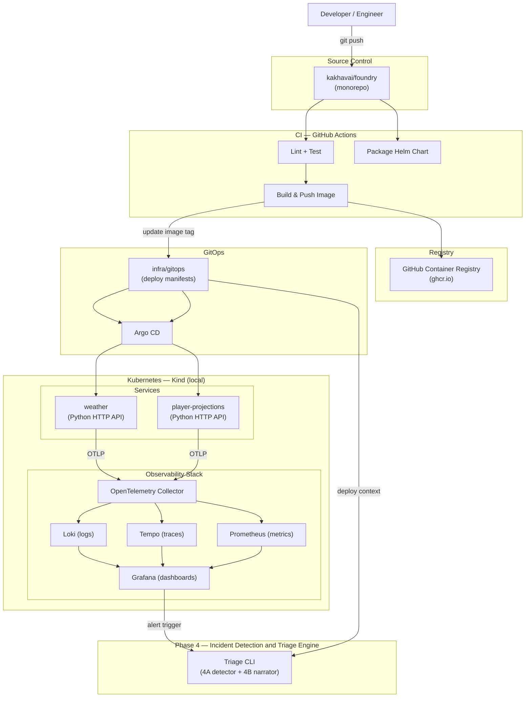

# Architecture Overview — Foundry Platform

This document describes the complete Foundry platform as a system. It is the single "what is this" view — the authoritative reference for how all components fit together across all phases.

---

## Diagram

---

## Components

### Developer Workflow
A developer pushes code to the monorepo. GitHub Actions picks up the change, runs lint and tests, builds a container image, pushes it to GHCR, and updates the image tag in the GitOps manifests directory.

### CI — GitHub Actions
Three logical stages run on every push to a service:
1. **Lint + Test** — code quality and correctness gate
2. **Build & Push Image** — produces a tagged, immutable image in GHCR
3. **Package Helm Chart** — validates and versions the Helm chart

Reusable workflow templates (Phase 2) allow any new service to opt into this pipeline with minimal configuration.

### Container Registry — GHCR
GitHub Container Registry is used as the image store. Images are tagged with the Git SHA for full traceability from deploy back to source commit.

### GitOps — infra/gitops + Argo CD
The `infra/gitops/` directory is the source of truth for what runs in the cluster. CI writes the new image tag there after a successful build. Argo CD detects the change and reconciles the cluster state. No manual `kubectl apply` in production flow.

### Kubernetes — Kind (local)
Local development and demonstration runs on Kind (Kubernetes in Docker). The same Helm charts and GitOps manifests used locally are designed to be portable to a real cluster.

### Services
Services live in `services/<name>/`. Each service owns its own Dockerfile, dependency lockfile, and application code — no shared Python libraries across services. What is shared is infrastructure.

**CI:** A thin caller workflow (`.github/workflows/<service-name>.yml`) directly invokes composite actions for lint/test and Helm lint. Adding a service = add one caller file (~40 lines). The caller sets path filters and calls `.github/actions/python-lint-test` and `.github/actions/helm-lint`.

**Deployment:** `helm/charts/generic-service/` is a single parameterized base chart used by every standard HTTP service. Adding a service = add `helm/values/<service-name>/values.yaml`. The base chart automatically injects OTel env vars and Prometheus pod annotations — every service gets full observability with zero per-service observability config.

Current services are `weather` (current conditions per pro football stadium, in bulk or one at a time) and `player-projections` (polls an internal player-data backend; stubs gracefully until that upstream is built).

### Observability Stack
All telemetry flows through a single OpenTelemetry Collector, which fans out to:
- **Loki** — log aggregation
- **Tempo** — distributed tracing
- **Prometheus** — metrics scraping and storage
- **Grafana** — unified dashboards across all three backends

This shared backend model means every service gets observability by default, with no per-service configuration of the backend stack.

### Phase 4 — Incident Detection and Triage Engine
A CLI tool (`foundry triage`) split on a hard boundary: a deterministic **detection engine** (4A) collects telemetry, scores anomalies, ranks suspects, and emits a structured `EvidenceBundle`; a **narrator** (4B) consumes the bundle and produces a human-readable triage narrative via the Claude API. Assistive only — no autonomous actions.

### Phase 7 — AI Observability and Governance
Makes AI usage itself a first-class observable signal in the existing OTel/Grafana stack, along two tracks. **Runtime AI:** the 4B narrator's Claude call (and, later, Phase 5's adversarial agents) is wrapped in OpenTelemetry GenAI-convention spans via a reusable helper — token, derived cost, latency, and finish-reason signals flow to Tempo/Prometheus, correlated with the incident trace. **Developer AI:** Claude Code's native OTLP exporter is pointed at the existing Collector, with a governance processor that anonymizes identity and blocks prompt-content logging; the dashboard pairs AI-usage signals with DORA delivery metrics so activity is never mistaken for outcome. OTel-native by constraint — no SaaS observability silo. Governance-first: cost budgets, PII protection, and provenance are the substance; the dashboards are cheap on this stack.

---

## Design Decisions

See [Why This Design](../why-this-design.md) for the reasoning behind key architectural choices.
