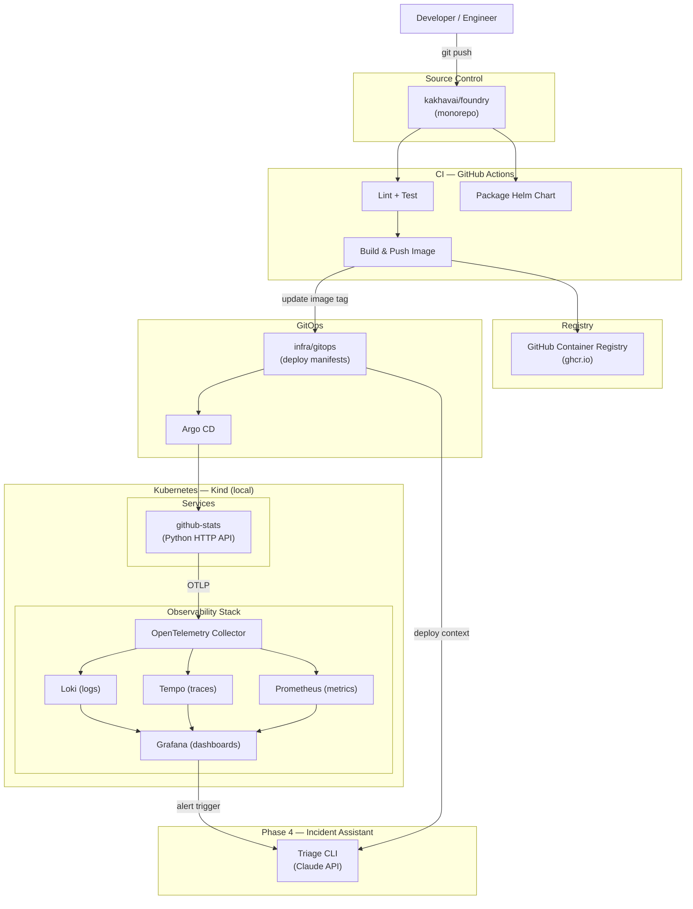

# Master Architecture — Foundry Platform

This document describes the complete Foundry platform as a system. It is the single "what is this" view — the authoritative reference for how all components fit together across all phases.

---

## Diagram

---

## Components

### Developer Workflow
A developer pushes code to the monorepo. GitHub Actions picks up the change, runs lint and tests, builds a container image, pushes it to GHCR, and updates the image tag in the GitOps manifests directory.

### CI — GitHub Actions
Three logical stages run on every push to a service:
1. **Lint + Test** — code quality and correctness gate
2. **Build & Push Image** — produces a tagged, immutable image in GHCR
3. **Package Helm Chart** — validates and versions the Helm chart

Reusable workflow templates (Phase 2) allow any new service to opt into this pipeline with minimal configuration.

### Container Registry — GHCR
GitHub Container Registry is used as the image store. Images are tagged with the Git SHA for full traceability from deploy back to source commit.

### GitOps — infra/gitops + Argo CD
The `infra/gitops/` directory is the source of truth for what runs in the cluster. CI writes the new image tag there after a successful build. Argo CD detects the change and reconciles the cluster state. No manual `kubectl apply` in production flow.

### Kubernetes — Kind (local)
Local development and demonstration runs on Kind (Kubernetes in Docker). The same Helm charts and GitOps manifests used locally are designed to be portable to a real cluster.

### Services
Services live in `services/<name>/`. Each service:
- has its own Dockerfile
- emits structured logs, traces, and metrics via the OpenTelemetry SDK
- exports telemetry to the OTel Collector via OTLP

The first service is `github-stats` — a Python HTTP API that pulls and exposes GitHub activity data.

### Observability Stack
All telemetry flows through a single OpenTelemetry Collector, which fans out to:
- **Loki** — log aggregation
- **Tempo** — distributed tracing
- **Prometheus** — metrics scraping and storage
- **Grafana** — unified dashboards across all three backends

This shared backend model means every service gets observability by default, with no per-service configuration of the backend stack.

### Phase 4 — Incident Assistant
A CLI tool that accepts a service name and incident trigger, queries recent deploy context, logs, traces, and metrics, and produces a structured triage summary using the Claude API. Assistive only — no autonomous actions.

---

## Design Decisions

See [Why This Design](../why-this-design.md) for the reasoning behind key architectural choices.
