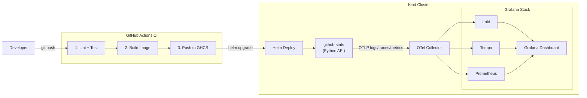

# Phase 1 — First Paved Road

**Dates:** April 13 – April 26, 2026

**Goal:** Stand up the first complete paved road for a single service — from source to deployed, observable service running in Kubernetes.

---

## Diagram

---

## What Gets Built

### Service — github-stats
A Python HTTP API (FastAPI) that exposes GitHub activity data for a given user. Endpoints:
- `GET /health` — liveness check
- `GET /metrics` — Prometheus scrape endpoint
- `GET /activity/{username}` — recent GitHub events
- `GET /stats/{username}` — summary stats (commit count, PR count, top repos)

The service is instrumented with the OpenTelemetry Python SDK. Every request produces a trace span. Request count and latency are emitted as metrics. Structured JSON logs are written to stdout.

### Dockerfile
Multi-stage build. Slim final image based on `python:3.12-slim`. Non-root user.

### GitHub Actions CI
Three jobs on push to `services/github-stats/**` or `helm/charts/github-stats/**`:
1. `lint-test` — runs `ruff` (lint) and `pytest`
2. `build-push` — builds and pushes image to GHCR, tagged with Git SHA
3. `helm-lint` — runs `helm lint` on the chart

### Helm Chart
A standard Helm chart under `helm/charts/github-stats/` with:
- `Deployment` with configurable replicas, image tag, resource limits
- `Service` (ClusterIP)
- `ConfigMap` for OTel endpoint and env config
- `values.yaml` with sensible defaults

### Kind Cluster
Local cluster config under `infra/kind/`. Single-node cluster sufficient for Phase 1.

### Observability Stack
Deployed via manifests in `infra/grafana-stack/`:
- OpenTelemetry Collector (DaemonSet-style, single instance for local)
- Loki (single binary mode)
- Tempo (single binary mode)
- Prometheus (with scrape config for the service)
- Grafana (with datasources pre-configured)

### Starter Dashboard
One Grafana dashboard covering:
- Request rate (requests/sec by endpoint)
- Error rate (4xx, 5xx)
- P50 / P95 / P99 latency
- Log stream panel
- Trace search link

---

## Milestones

| Date | Checkpoint |
|---|---|
| April 19 | Repo structure, service created, Docker build working, Kind cluster running |
| April 26 | CI working, Helm deploy working, observability visible, architecture docs done |

---

## Deliverables

- `services/github-stats/` — working Python service
- `helm/charts/github-stats/` — working Helm chart
- `.github/workflows/github-stats.yml` — CI pipeline
- `infra/kind/cluster.yaml` — Kind cluster config
- `infra/grafana-stack/` — observability stack manifests
- `docs/architecture/` — this doc + architecture overview
- `README.md` — local dev + deploy instructions
- Grafana dashboard (exported as JSON in `infra/grafana-stack/dashboards/`)
