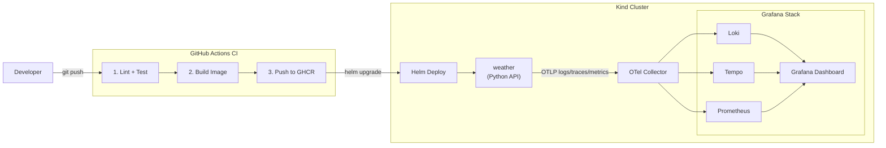

# Phase 1 — First Paved Road

> **Status:** ✅ **Done** · landed in [#10](https://github.com/kakhavai/foundry/pull/10) · tagged `phase-1` · [roadmap](../../README.md#phases)

**Goal:** Stand up the first complete paved road for a single service — from source to deployed, observable service running in Kubernetes.

---

## Diagram

```mermaid
graph LR
    Dev["Developer"]

    subgraph "GitHub Actions CI"
        Lint["1. Lint + Test"]
        Build["2. Build Image"]
        Push["3. Push to GHCR"]
    end

    subgraph "Kind Cluster"
        Helm["Helm Deploy"]
        GHStats["weather\n(Python API)"]
        OTelCol["OTel Collector"]
        subgraph "Grafana Stack"
            Loki["Loki"]
            Tempo["Tempo"]
            Prom["Prometheus"]
            Grafana["Grafana Dashboard"]
        end
    end

    Dev -->|"git push"| Lint --> Build --> Push
    Push -->|"helm upgrade"| Helm --> GHStats
    GHStats -->|"OTLP logs/traces/metrics"| OTelCol
    OTelCol --> Loki & Tempo & Prom --> Grafana
```

---

## What Gets Built

### Service — weather
A Python HTTP API (FastAPI) that returns current weather conditions for a given location using the Open-Meteo API (free, no auth required). Endpoints:
- `GET /health` — liveness check
- `GET /metrics` — Prometheus scrape endpoint
- `GET /weather/{location}` — current conditions (temperature, humidity, wind speed, precipitation)
- `GET /weather/stadiums` — stub endpoint; reserved for future per-stadium pro football game-day weather

The service is instrumented with the OpenTelemetry Python SDK. Every request produces a trace span. Request count and latency are emitted as metrics. Structured JSON logs are written to stdout.

### Dockerfile
Multi-stage build. Slim final image based on `python:3.12-slim`. Non-root user.

### GitHub Actions CI
Thin caller workflow at `.github/workflows/weather.yml` triggers on changes to `services/weather/**`, `helm/values/weather/**`, or `helm/charts/generic-service/**`. Directly invokes composite actions which run:
1. `lint-test` — runs `ruff` (lint) and `pytest` via the `python-lint-test` composite action
2. `helm-lint` — runs `helm lint` on `helm/charts/generic-service` with `helm/values/weather/values.yaml`

### Helm Chart
Base chart at `helm/charts/generic-service/` — one parameterized chart used by every standard HTTP service:
- `Deployment` with configurable replicas, image tag, resource limits, and containerPort
- `Service` (ClusterIP)
- `ConfigMap` with OTel env vars injected automatically (`OTEL_EXPORTER_OTLP_ENDPOINT`, `OTEL_SERVICE_NAME`, `OTEL_RESOURCE_ATTRIBUTES`)
- Pod annotations for Prometheus auto-discovery (`prometheus.io/scrape`, `prometheus.io/port`)

Per-service config at `helm/values/weather/values.yaml` — contains only service-specific values (image, port, resources). No observability config needed per service.

### Kind Cluster
Local cluster config under `infra/kind/`. Single-node cluster sufficient for Phase 1.

### Observability Stack
Deployed via manifests in `infra/grafana-stack/`:
- OpenTelemetry Collector (DaemonSet-style, single instance for local)
- Loki (single binary mode)
- Tempo (single binary mode)
- Prometheus (with scrape config for the service)
- Grafana (with datasources pre-configured)

### Starter Dashboard
One Grafana dashboard covering:
- Request rate (requests/sec by endpoint)
- Error rate (4xx, 5xx)
- P50 / P95 / P99 latency
- Log stream panel
- Trace search link

---

## Milestones

- [x] Repo structure, service created, Docker build working, Kind cluster running
- [x] CI working, Helm deploy working, observability visible, architecture docs done

---

## Deliverables

- `services/weather/` — working Python service
- `helm/charts/generic-service/` — parameterized base Helm chart
- `helm/values/weather/values.yaml` — weather service values
- `.github/actions/python-lint-test/` — composite action for Python lint + test
- `.github/actions/helm-lint/` — composite action for Helm lint
- `.github/workflows/weather.yml` — weather CI caller (directly invokes composite actions)
- `infra/kind/cluster.yaml` — Kind cluster config
- `infra/grafana-stack/` — observability stack manifests
- `docs/architecture/` — this doc + architecture overview
- `README.md` — local dev + deploy instructions
- Grafana dashboard (exported as JSON in `infra/grafana-stack/dashboards/`)
