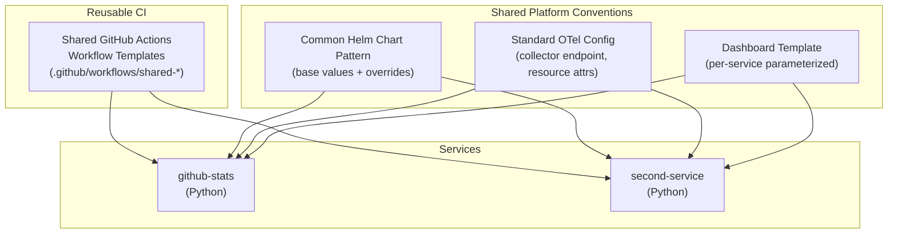

# Phase 2 — Golden Path

**Dates:** April 27 – May 10, 2026

**Goal:** Prove this is a reusable platform path, not a one-service demo. Onboard a second service using the same conventions. Extract and standardize shared patterns.

---

## Diagram

---

## What Gets Built

### Second Service
A second Python service onboarded through the same path as `github-stats`. Candidates:
- A small internal utility API (e.g., a health aggregator that polls other services)
- A simple async worker

The second service exists primarily to prove the pattern works for more than one team/service — not for its own functionality.

### CI Caller Pattern
The reusable CI template (`.github/workflows/_service-template.yml`) and composite actions were established in Phase 1. Onboarding the second service requires one new file: `.github/workflows/<second-service>.yml`, a thin caller that invokes the template with the service name. No CI logic is duplicated.

### Standardized Config Conventions
A documented contract for what any Foundry service must provide:
- Required environment variables (OTel endpoint, service name, service version)
- Required labels on Kubernetes resources (`app.kubernetes.io/name`, `app.kubernetes.io/version`, etc.)
- Required Helm values structure
- Required health endpoint (`GET /health`)

### Observability
OTel configuration is provided by the `generic-service` base chart via env vars (`OTEL_EXPORTER_OTLP_ENDPOINT`, `OTEL_SERVICE_NAME`, `OTEL_RESOURCE_ATTRIBUTES`) and Prometheus pod annotations — established in Phase 1. Each service instruments itself with the OTel Python SDK. No shared library required; no per-service observability config required.

### Dashboard Template
A parameterized Grafana dashboard (JSON template with `${service_name}` variables) that generates a working starter dashboard for any onboarded service.

---

## Milestones

| Date | Checkpoint |
|---|---|
| May 3 | Second service started, shared CI workflow partly extracted |
| May 10 | Two services onboarded, onboarding documentation complete, golden path clearly reusable |

---

## Deliverables

- `services/<second-service>/` — second working service
- `.github/workflows/<second-service>.yml` — second service CI caller
- `docs/onboarding.md` — "How to onboard a new service"
- `docs/service-contract.md` — required structure and conventions
- `infra/grafana-stack/dashboards/service-template.json` — parameterized dashboard template
