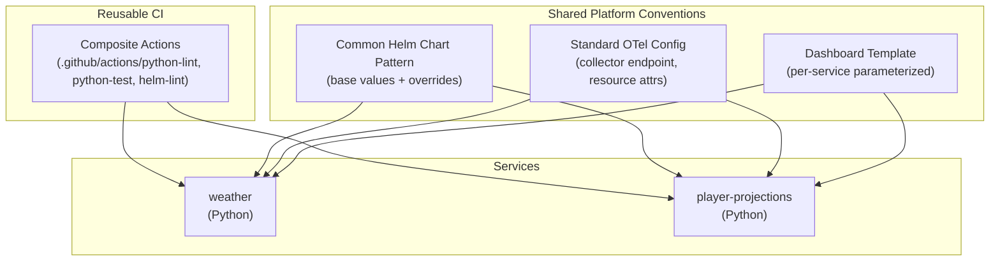

# Phase 2 — Golden Path

> **Status:** ✅ **Done** · landed in [#12](https://github.com/kakhavai/foundry/pull/12) · tagged `phase-2` · [roadmap](../../README.md#phases)

**Goal:** Prove this is a reusable platform path, not a one-service demo. Onboard a second service using the same conventions. Extract and standardize shared patterns.

---

## Diagram

```mermaid
graph TD
    subgraph "Reusable CI"
        SharedWF["Composite Actions\n(.github/actions/python-lint, python-test, helm-lint)"]
    end

    subgraph "Services"
        SvcA["weather\n(Python)"]
        SvcB["player-projections\n(Python)"]
    end

    subgraph "Shared Platform Conventions"
        HelmLib["Common Helm Chart Pattern\n(base values + overrides)"]
        OTelStd["Standard OTel Config\n(collector endpoint, resource attrs)"]
        DashTpl["Dashboard Template\n(per-service parameterized)"]
    end

    SharedWF --> SvcA & SvcB
    HelmLib --> SvcA & SvcB
    OTelStd --> SvcA & SvcB
    DashTpl --> SvcA & SvcB
```

---

## What Gets Built

### Second Service
The second service onboarded through the same path as `weather`. For Foundry this is `player-projections` — a polling service that consumes projections snapshots from S3, written by a generator that runs outside this repo. It runs in stub mode (returning empty projections) until that generator publishes, which lets the CI/CD and observability patterns be validated against a real service before its upstream exists.

### CI Caller Pattern
The composite actions were established in Phase 1. Onboarding the second service requires one new file: `.github/workflows/<second-service>.yml`, a thin caller that directly invokes the shared composite actions. No CI logic is duplicated.

### Standardized Config Conventions
A documented contract for what any Foundry service must provide:
- Required environment variables (OTel endpoint, service name, service version)
- Required labels on Kubernetes resources (`app.kubernetes.io/name`, `app.kubernetes.io/version`, etc.)
- Required Helm values structure
- Required health endpoint (`GET /health`)

### Observability
OTel configuration is provided by the `generic-service` base chart via env vars (`OTEL_EXPORTER_OTLP_ENDPOINT`, `OTEL_SERVICE_NAME`, `OTEL_RESOURCE_ATTRIBUTES`) and Prometheus pod annotations — established in Phase 1. Each service instruments itself with the OTel Python SDK. No shared library required; no per-service observability config required.

### Dashboard Template
A parameterized Grafana dashboard (JSON template with `${service_name}` variables) that generates a working starter dashboard for any onboarded service.

---

## Milestones

- [x] Second service onboarded through the same path as the first
- [x] Two services running, onboarding documentation complete, golden path clearly reusable

---

## Deliverables

- `services/<second-service>/` — second working service
- `.github/workflows/<second-service>.yml` — second service CI caller (directly invokes composite actions)
- `docs/onboarding.md` — "How to onboard a new service"
- `docs/service-contract.md` — required structure and conventions
- `infra/grafana-stack/dashboards/service-template.json` — parameterized dashboard template
