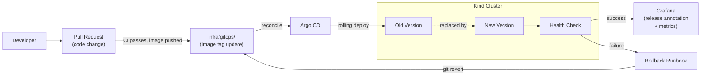

# Phase 3 — GitOps + Safe Deployment

**Dates:** May 11 – May 31, 2026

**Goal:** Make the platform safe and operationally mature. Introduce GitOps as the deployment source of truth. Add rollout visibility, rollback flow, and deployment health checks. Connect release metadata to observability.

---

## Diagram



---

## What Gets Built

### GitOps Flow with Argo CD
Argo CD is deployed to the cluster and pointed at `infra/gitops/` as the source of truth. The CI pipeline no longer runs `helm upgrade` directly — it commits the new image tag to `infra/gitops/` and Argo CD reconciles.

Directory structure under `infra/gitops/`:
```
infra/gitops/
  apps/
    github-stats/
      values.yaml        # contains image.tag
    second-service/
      values.yaml
  argo/
    app-of-apps.yaml     # Argo CD Application definitions
```

### Environment Overlays
Values are separated by environment. Even with a single local cluster, the structure anticipates multiple environments:
```
infra/gitops/
  envs/
    local/
      github-stats/values.yaml
    staging/               # placeholder
    prod/                  # placeholder
```

### Rollback Flow
Rollback is a `git revert` of the image tag commit in `infra/gitops/`, followed by Argo CD reconciling back to the previous image. The runbook documents the exact steps including verification.

### Deployment Health Checks
Post-deploy health verification runs as a GitHub Actions job after the image tag commit:
1. Wait for Argo CD to report `Synced + Healthy`
2. Hit `GET /health` on the service
3. Check error rate in Prometheus for 2 minutes post-deploy
4. Annotate the Grafana dashboard with the release event

### Release Metadata in Telemetry
Every deploy adds a Grafana annotation marking the release with:
- Service name
- Image tag / Git SHA
- Deployer (GitHub Actions)
- Timestamp

This makes it trivial to correlate a spike in errors with a recent deploy on any dashboard.

---

## Milestones

| Date | Checkpoint |
|---|---|
| May 17 | Argo CD in place, GitOps repo flow working, environment separation defined |
| May 24 | Rollback flow, deployment health checks, release-to-observability connection |
| May 31 | Phase complete, GitHub cleaned up, tradeoff writeup done |

---

## Deliverables

- `infra/gitops/` — GitOps manifests (Argo CD source of truth)
- `infra/argo/` — Argo CD installation and app-of-apps config
- `.github/workflows/deploy-health-check.yml` — post-deploy verification job
- `docs/runbooks/rollback.md` — rollback runbook
- `docs/deployment-lifecycle.md` — full deploy flow documentation
- `docs/why-this-design.md` — tradeoff writeup (updated/completed)
