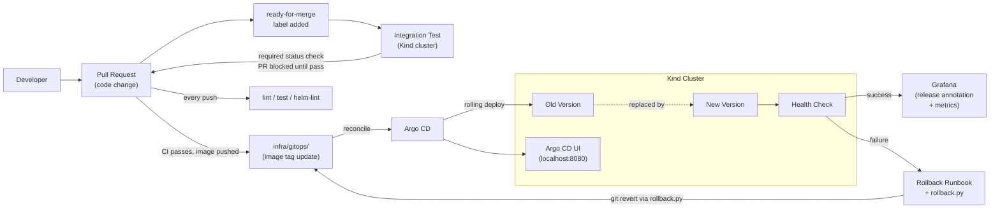

# Phase 3 — GitOps + Safe Deployment

**Goal:** Make the platform safe and operationally mature. Introduce GitOps as the deployment source of truth. Add rollout visibility, rollback flow, and deployment health checks. Connect release metadata to observability.

---

## Diagram


```mermaid
graph LR
    Dev["Developer"]
    PR["Pull Request\n(code change)"]
    Label["ready-for-merge\nlabel added"]
    IntTest["Integration Test\n(Kind cluster)"]
    GitOps["infra/gitops/\n(image tag update)"]
    Argo["Argo CD"]

    subgraph "Kind Cluster"
        Old["Old Version"]
        New["New Version"]
        Health["Health Check"]
        ArgoUI["Argo CD UI\n(localhost:8080)"]
    end

    Telemetry["Grafana\n(release annotation\n+ metrics)"]
    Runbook["Rollback Runbook\n+ rollback.py"]

    Dev --> PR -->|"every push"| CI["lint / test / helm-lint"]
    PR --> Label --> IntTest -->|"required status check\nPR blocked until pass"| PR
    PR -->|"CI passes, image pushed"| GitOps
    GitOps -->|"reconcile"| Argo
    Argo --> ArgoUI
    Argo -->|"rolling deploy"| Old -.->|"replaced by"| New
    New --> Health
    Health -->|"success"| Telemetry
    Health -->|"failure"| Runbook -->|"git revert via rollback.py"| GitOps
```

---

## What Gets Built

### GitOps Flow with Argo CD
Argo CD is deployed to the cluster and pointed at `infra/gitops/` as the source of truth. The CI pipeline no longer runs `helm upgrade` directly — it commits the new image tag to `infra/gitops/` and Argo CD reconciles. Argo CD runs in the `argocd` namespace with automated sync and self-healing enabled.

`stack-up.py` gains an Argo CD port-forward so the UI is accessible at `http://localhost:8080` alongside Grafana and the services.

### App-of-Apps Pattern
One Argo CD `Application` resource per service, managed by a parent app-of-apps. Each Application merges two values sources:
- `helm/values/<service>/values.yaml` — stable config (port, resources, image repo)
- `infra/gitops/envs/local/<service>/values.yaml` — live image tag (updated by CI on every merge)

Adding a new service = adding a file to `infra/gitops/argo/`. No manual `kubectl apply` needed.

### Directory Structure

```
infra/
  argo/
    helmfile.yaml              # installs Argo CD into the cluster
    values.yaml                # Argo CD config (repo URL, sync policy)
  gitops/
    envs/
      local/
        weather/values.yaml    # image.tag: <sha>
        player-projections/values.yaml
      staging/                 # placeholder
      prod/                    # placeholder
    argo/
      app-of-apps.yaml         # Argo CD Application definitions
  ci/
    Dockerfile                 # CI runner image: kind + kubectl + helm + helmfile + uv
```

### CI Runner Image
A custom Docker image (`ghcr.io/kakhavai/foundry/ci-runner:latest`) with all CI tools pre-installed at pinned versions. Built from `infra/ci/Dockerfile` and published to GHCR. The integration test job pulls this image instead of installing tools on every run.

### CI Pipeline Changes

**On every PR push** (fast path — unchanged):
- lint, test, helm-lint

**On `ready-for-merge` label added** (integration gate):
- `integration-test` workflow fires using the CI runner image
- Spins up Kind cluster, runs `stack-up.py`, waits for Argo CD `Synced + Healthy`
- Smoke tests every endpoint on each service
- Tears down cluster
- Configured as a **required status check** — PR merge button locked until this passes
- Label is removed on failure, requiring re-label to re-run

**On merge to main**:
- build-push (existing) — builds and pushes image to GHCR with SHA tag
- update-gitops-tag (new composite action) — commits new tag to `infra/gitops/envs/local/<service>/values.yaml` using `GITHUB_TOKEN` with `contents: write`
- Argo CD reconciles automatically

### Rollback Flow
Rollback is a `git revert` of the image tag commit in `infra/gitops/`, followed by Argo CD reconciling back to the previous image.

**`scripts/rollback.py`** handles the mechanics:
```bash
python scripts/rollback.py weather abc1234
```
Updates the tag in `infra/gitops/`, commits, pushes, and prints verification steps.

**`docs/runbooks/rollback.md`** covers the judgement: when to roll back, how to find the target tag, how to verify the rollback landed, and the escalation path if rollback itself fails.

### Deployment Health Checks
Post-deploy health verification runs locally via a script after `stack-up.py`:
1. Wait for Argo CD to report `Synced + Healthy`
2. Hit `GET /health` on each service
3. Check error rate in Prometheus for 2 minutes post-deploy
4. Annotate the Grafana dashboard with the release event

The CI integration test job also exercises this path on every merge gate run.

### Release Metadata in Telemetry
Every deploy adds a Grafana annotation marking the release with:
- Service name
- Image tag / Git SHA
- Deployer (GitHub Actions)
- Timestamp

This makes it trivial to correlate a spike in errors with a recent deploy on any dashboard.

---

## Milestones

- [x] Argo CD in place, GitOps repo flow working, environment separation defined, CI runner image published
- [x] Integration test job wired with label trigger and required status check
- [x] Rollback flow (script + runbook), deployment health checks, release-to-observability connection
- [x] Phase complete, GitHub cleaned up, tradeoff writeup done

---

## Deliverables

- `infra/argo/` — Argo CD helmfile installation
- `infra/gitops/` — GitOps manifests (Argo CD source of truth, environment overlays)
- `infra/ci/Dockerfile` — CI runner image with pinned tool versions
- `.github/actions/update-gitops-tag/action.yml` — composite action: commits new image tag to infra/gitops/
- `.github/workflows/integration-test.yml` — label-triggered Kind cluster smoke test (required status check)
- `scripts/rollback.py` — rollback script
- `docs/runbooks/rollback.md` — rollback runbook
- `docs/deployment-lifecycle.md` — full deploy flow documentation
- `docs/why-this-design.md` — tradeoff writeup (updated with GitOps, integration test, rollback decisions)
