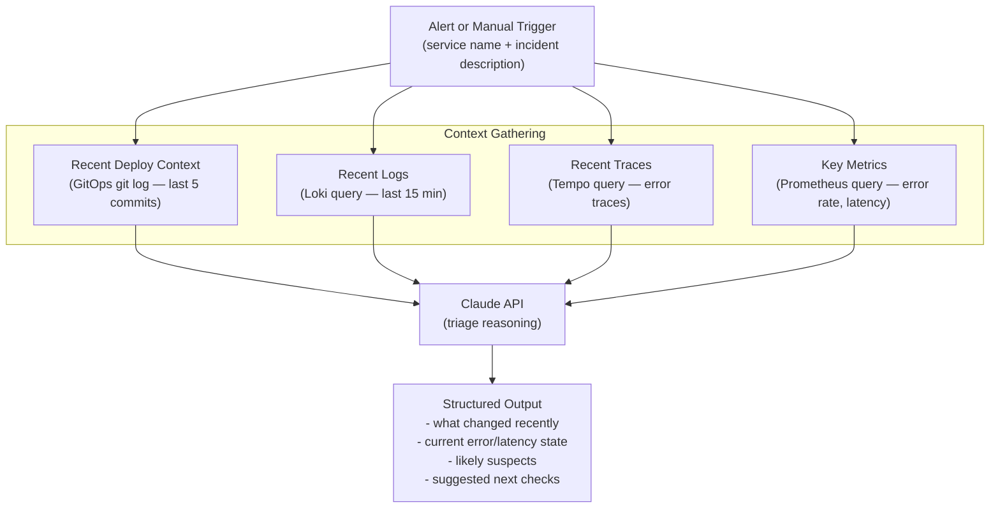

# Phase 4 — Incident Assistant

**Dates:** June 1 – June 14, 2026

**Goal:** Add a realistic AI-powered triage layer. Assistive, not autonomous — helps an engineer understand what is happening faster, not take actions on their behalf.

---

## Diagram



---

## What Gets Built

### Incident Assistant CLI
A Python CLI (`foundry triage`) that accepts:
```
foundry triage --service github-stats --incident "elevated error rate on /activity endpoint"
```

Steps:
1. Queries the last N commits to `infra/gitops/<service>/` (deploy history)
2. Queries Loki for recent error logs for the service
3. Queries Tempo for recent error traces
4. Queries Prometheus for current error rate and latency
5. Sends all gathered context to the Claude API with a structured triage prompt
6. Prints a formatted triage summary

### Output Format
```
=== Foundry Triage: github-stats ===

INCIDENT: elevated error rate on /activity endpoint

RECENT DEPLOYS (last 48h):
  - 2026-06-10 14:32 UTC  sha: abc1234  "bump image to v0.4.1"
  - 2026-06-09 09:15 UTC  sha: def5678  "update OTel config"

CURRENT STATE:
  - Error rate: 12.4% (baseline: ~0.2%)
  - P95 latency: 4.2s (baseline: ~0.3s)
  - First elevated error: ~14:35 UTC (3 min after last deploy)

LIKELY SUSPECTS:
  1. The v0.4.1 deploy at 14:32 correlates with the onset of errors
  2. Error traces show timeout calling api.github.com — possible rate limit or upstream issue
  3. No config changes between v0.4.0 and v0.4.1 that affect the /activity endpoint

SUGGESTED NEXT CHECKS:
  - Check GitHub API status page
  - Compare /activity trace waterfall between v0.4.0 and v0.4.1
  - If upstream, rollback is low-value — consider adding retry logic
  - If code regression, rollback with: foundry rollback --service github-stats
```

### Design Boundaries
- **Assistive only.** The CLI never takes action. It surfaces context. The engineer decides.
- **No autonomous remediation.** No auto-rollback, no auto-scaling, no alert suppression.
- **Explicit limitations doc.** A `docs/incident-assistant-limitations.md` describes what the tool does not do and why.

---

## Milestones

| Date | Checkpoint |
|---|---|
| June 7 | CLI scaffolded, context gathering working for at least 2 signals |
| June 14 | Full triage flow working, example incident flows documented, limitations doc written |

---

## Deliverables

- `services/foundry-cli/` — the incident assistant CLI
- `docs/incident-assistant-design.md` — design rationale
- `docs/incident-assistant-limitations.md` — what it does not do and why
- At least 2 example incident flow recordings or writeups
