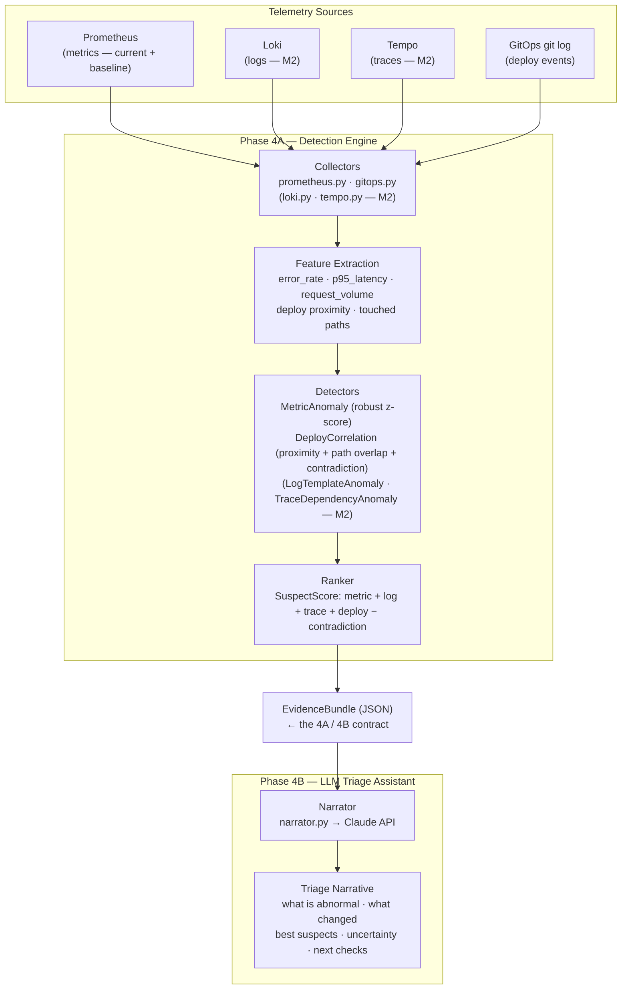

# Phase 4 — Incident Detection and Triage Engine

> **Status:** ✅ **Done** · landed in [#36](https://github.com/kakhavai/foundry/pull/36) · tagged `phase-4` · [roadmap](../../README.md#phases)

**Goal:** A deterministic detection engine produces a structured evidence bundle and ranked suspects before Claude sees anything. Claude only narrates. Detection is statistical, testable, and evaluable; explanation is what the LLM is actually good at.

---

## Overview

The Phase 4 detection engine is split on a single hard boundary — a structured `EvidenceBundle` JSON document:

- **Phase 4A — Detection Engine.** Deterministic. Queries telemetry, extracts features, scores anomalies, ranks suspects, and emits the `EvidenceBundle`. No LLM. Independently testable and evaluable with documented accuracy numbers.
- **Phase 4B — LLM Triage Assistant.** Consumes the `EvidenceBundle` and produces a human-readable triage narrative via the Claude API. Never re-derives detection; only narrates and communicates uncertainty. Assistive only — never takes action.

The split matters because detection and explanation are different jobs. Detection — deciding what is abnormal, localizing a fault, ranking suspects — is a statistical and correlation problem that wants deterministic, testable code. Explanation is what an LLM is actually good at. Conflating the two produces an assistant that cannot be evaluated, has no accuracy numbers, and is the kind of AI theater this platform is designed to disprove.

The detector is usable headless: `foundry triage --json` emits only the bundle, so an automated harness can invoke detection without touching the LLM.

---

## Diagram



---

## Phase 4A — Detection Engine

### Code layout

All triage code lives in the existing `foundry-cli` service:

```
services/foundry-cli/foundry/triage/
  collectors/
    prometheus.py            # current + baseline windows, by service+route+metric
    gitops.py                # recent deploy events from infra/gitops git log + touched paths
    loki.py                  # M2 — raw log lines for the affected service/window
    tempo.py                 # M2 — error/latency traces for the affected route
  detectors/
    metric_anomaly.py        # robust z-score vs. trailing baseline
    deploy_correlation.py    # onset proximity + path overlap + contradiction
    log_template_anomaly.py  # M2 — Drain templating + template-rate anomaly
    trace_dependency_anomaly.py  # M2 — downstream span suspect ranking
  models/
    incident.py              # Incident (service, endpoint, description)
    evidence.py              # EvidenceBundle + the per-signal anomaly records
    suspect.py               # SuspectScore (the ranking model)
  ranker.py                  # detector outputs -> ranked suspects
  narrator.py                # 4B — EvidenceBundle -> Claude -> narrative
  cli.py                     # `foundry triage ...`
  eval/
    scenarios/*.yaml         # how to induce + expected answer per scenario
    run_eval.py              # induce, detect, score top-1/top-3/FP/time-to-detect
```

The fault toggle (4A's own incident source) is not a module here — it lives in the
`weather` service's upstream adapter (`services/weather/weather/adapters/forecast.py`),
env-var-guarded so it is inert in production. See the Fault toggle section below.

It was originally in `weather/client.py`; Phase 8's 8A retrofit deleted that file
and carried `_maybe_inject_fault` into the forecast adapter, so the toggle and its
`FAULT_UPSTREAM_*` Helm plumbing still work unchanged.

Each unit has one purpose and a defined interface: a **collector** turns a telemetry source into typed records; a **detector** turns records into scored anomalies for one signal; the **ranker** turns all anomalies into ranked suspects; the **narrator** turns the bundle into prose. Collectors and detectors never call the LLM; the narrator never queries telemetry.

### Data flow

1. `foundry triage --service weather --incident "elevated error rate on /activity"` (or `--auto`, triggered by an alert).
2. Collectors query Prometheus (a short *current* window and a trailing *baseline* window) and the GitOps git log.
3. Detectors score each signal independently.
4. The ranker combines detector output into ranked suspects and assembles the `EvidenceBundle`.
5. `narrator.py` sends the bundle to Claude → triage narrative (skipped when `--json`).
6. CLI prints the human view (evidence + narrative); `--json` prints only the bundle.

### The EvidenceBundle contract

This JSON is the boundary between 4A and 4B and the unit of evaluation. Milestone 1 populates `metric_anomalies`, `deploy_events`, and `suspects`; `log_anomalies` and `trace_anomalies` are present but empty until Milestone 2:

```json
{
  "incident": {
    "service": "weather",
    "endpoint": "/activity",
    "description": "elevated error rate"
  },
  "metric_anomalies": [
    { "metric": "error_rate", "current": 0.124, "baseline": 0.002, "score": 8.7 },
    { "metric": "p95_latency", "current_ms": 4200, "baseline_ms": 300, "score": 7.9 }
  ],
  "log_anomalies": [],
  "trace_anomalies": [],
  "deploy_events": [
    {
      "sha": "abc1234",
      "minutes_before_anomaly": 3,
      "touched_paths": ["services/weather/..."],
      "score": 0.73
    }
  ],
  "suspects": [
    { "name": "api.github.com upstream dependency", "score": 0.86, "evidence": ["..."] },
    { "name": "weather v0.4.1 deploy regression", "score": 0.58, "evidence": ["..."] }
  ]
}
```

`models/evidence.py` defines these as dataclasses and serializes to exactly this shape. A schema test pins the contract so 4B and Phase 5 can rely on it.

The numeric values above are illustrative — see [Why the numbers aren't magic](#why-the-numbers-arent-magic) below.

### Metric anomaly detector — robust statistics, not neural nets

For each `service × route × metric` (`error_rate`, `p95_latency`, `request_count`), the detector compares the current window against the trailing baseline using a robust z-score:

```
score = abs(current_value - baseline_median) / (baseline_mad + epsilon)
```

Median and MAD (median absolute deviation) resist the outliers that wreck mean/stddev on bursty telemetry. The detector emits a `MetricAnomaly` per metric.

### Deploy correlation detector — correlation, not just proximity

From the GitOps git log, the detector collects recent deploys (SHA, timestamp, `touched_paths`) and scores each:

- **higher** when the anomaly onset is soon after the deploy;
- **higher** when `touched_paths` intersect the affected service or route;
- **lower (contradiction penalty)** when an external or downstream dependency is failing independently, or when the same error spans many unrelated services (evidence points away from this deploy).

### Ranker — designed for all four signals from day one

```python
@dataclass
class SuspectScore:
    suspect: str
    metric_support: float
    log_support: float
    trace_support: float
    deploy_support: float
    contradiction_penalty: float
    evidence: list[str]

    @property
    def total(self) -> float:
        return (
            self.metric_support
            + self.log_support
            + self.trace_support
            + self.deploy_support
            - self.contradiction_penalty
        )
```

In Milestone 1 the candidate suspects are the recent deploy(s) and the service/route itself; `log_support` and `trace_support` are 0 until their detectors exist. The ranker reserves those slots now so Milestone 2 lights them up without a refactor. Suspects are sorted by `total`; each carries the human-readable `evidence` lines that justify its rank.

### Why the numbers aren't magic

A "baseline" is not a number a human picks. The detector queries a trailing window (default 24 hours) from Prometheus at triage time and takes the **median** of the service's metric over that period — per `service × route × metric`. That median is the baseline. "Normal" is learned from what the service actually did recently, not hand-set.

The anomaly score is then the robust z-score `|current − median| / (MAD + ε)`, where **MAD** measures how spread out normal is. There is no universal cutoff like "score 8 = incident." What counts as alarming is calibrated by the eval harness against reproducible fault scenarios — that is precisely why the eval is part of this design.

Median/MAD is a well-established robust-statistics technique chosen over mean/stddev because it resists the outliers that bursty telemetry produces. The specific numbers are tunable knobs validated by the eval harness:

- **baseline window length** (default 24h) and **current window length** (1m / 5m / 15m)
- the **ε** smoothing term (prevents divide-by-zero on a flat baseline)
- the **metric-anomaly flag threshold** (z-score above which a metric is reported)
- **deploy-proximity weighting** and the **contradiction penalty** in deploy correlation

If the eval shows the heuristics are insufficient, that is the signal to revisit them. The numeric values in the `EvidenceBundle` example above are illustrative placeholders — the method is standard; the cutoffs are tuned against the eval scenarios.

### Live baselines — no datastore

Baselines are computed on demand by querying Prometheus at triage time. There is no separate baseline datastore and no background job — Prometheus already retains history, so the detector stays stateless. A persisted or streaming baseline store is a clean future upgrade if Phase 4 ever moves to continuous detection, but is YAGNI for an on-demand CLI.

### Fault toggle

The evaluation harness needs reproducible incidents, but the only fault-injection mechanism on the roadmap (Chaos Mesh) is Phase 5, which comes after Phase 4. Phase 4 therefore ships a minimal, deterministic fault toggle.

Env-var-guarded fault behavior in the `weather` upstream client, mirroring the existing OTel-guard convention (behavior is inert unless the env var is set):

| Env var | Effect |
|---|---|
| `FAULT_UPSTREAM_LATENCY_MS` | inject N ms of latency into the upstream call |
| `FAULT_UPSTREAM_ERROR_RATE` | fail that fraction of upstream calls with a 5xx |

Injected via Helm values and ConfigMap. Because it is guarded, it adds no behavior to a normal production deploy. Phase 5's chaos layer supersedes this toggle later.

### Evaluation harness

This is what makes the engine engineering rather than theater. `eval/scenarios/*.yaml` — each scenario defines how to induce the fault (which `FAULT_*` env vars) and the expected answer:

```yaml
true_primary_cause: "github-api upstream latency"
acceptable_suspects: ["github-api", "external dependency"]
bad_suspects: ["postgres", "redis"]
```

`run_eval.py` for each scenario: record a clean baseline → induce the fault → wait → run the detector → capture the bundle → score. Metrics:

- **Top-1 accuracy** — highest-ranked suspect matches the true cause.
- **Top-3 accuracy** — true cause appears in the top 3.
- **False-positive rate** — does the detector flag a clean window?
- **Time-to-detect** — minutes from onset to detection.

**Milestone 1 scenarios** (expressible with metric + deploy signals):
1. **App regression after deploy** — `/activity` starts returning 500s shortly after a deploy; primary cause: the deploy.
2. **Upstream latency spike, no deploy** — upstream p95 jumps with no recent deploy; primary cause: external dependency; the contradiction penalty keeps any deploy low.
3. **No-deploy external failure** — upstream errors with no app change; primary cause: external dependency.

**Milestone 2 scenarios** (require log and trace detectors): DB-slowdown fault localization, bad-config single-endpoint break, and log-template-novelty detection.

---

## Phase 4B — LLM Triage Assistant

`narrator.py` takes the `EvidenceBundle` and prompts Claude to produce a narrative covering:

- what is abnormal
- what changed
- which suspects are best supported and why
- what checks would reduce uncertainty
- what not to assume

It strictly narrates the structured evidence — it does not re-query telemetry, re-rank suspects, or invent signals not present in the bundle. The model used is `claude-opus-4-8`.

### Design boundaries

- **Assistive only.** The CLI never takes action — it surfaces ranked evidence and a narrative. The engineer decides.
- **No autonomous remediation.** No auto-rollback, auto-scaling, or alert suppression.
- **Narration only.** The narrator never re-detects. Detection is 4A's job; 4B only explains what 4A found.

---

## Milestones

- [ ] **4A-M1 — Detection spine:** Prometheus + GitOps collectors, MetricAnomaly + DeployCorrelation detectors, ranker, `EvidenceBundle`, `foundry triage --json`. Fault toggle + 3 metric/deploy eval scenarios with documented top-1/top-3 accuracy.
- [ ] **4B — Triage narrator:** `narrator.py` consumes the bundle; `foundry triage` prints evidence + narrative; limitations doc written.
- [ ] **4A-M2 — Smart detectors (follow-on plan):** Loki + Tempo collectors, LogTemplateAnomaly (Drain-style) + TraceDependencyAnomaly, ranker `log_support`/`trace_support` wired, 3 additional eval scenarios.

4A-M2 is explicitly deferred to a follow-on implementation plan. The M1 spine is designed to accept it without a refactor (the `SuspectScore` dataclass already reserves the `log_support` and `trace_support` slots).

---

## Deliverables

- `services/foundry-cli/foundry/triage/` — collectors, detectors, models, ranker, narrator, CLI, eval harness
- `services/weather/weather/adapters/forecast.py` — env-var-guarded fault toggle (eval incident source; was `weather/client.py` before 8A deleted it)
- Env-var fault toggle in the `weather` service + Helm values plumbing
- `eval/scenarios/` + `run_eval.py` with documented accuracy metrics
- `docs/incident-assistant-limitations.md` — what this tool does not do and why
- This document

---

## Design Decisions

**Why split on the EvidenceBundle.**
Detection and explanation are different jobs. A detector that is "Claude reads the logs" cannot be evaluated, has no accuracy numbers, and fails Phase 5's requirement that triage be in the critical path with verifiable performance. Splitting on a structured JSON boundary makes both halves independently testable: unit tests feed synthetic metrics to the detector and assert suspect ranking; the eval harness induces real faults and measures top-1 accuracy; the narrator is tested against a recorded bundle fixture with the LLM call mocked.

**Why robust statistics, not a neural net or ML model.**
The eval harness is the honest answer to "is the detector good enough?" If median/MAD heuristics produce acceptable accuracy on the eval scenarios, they are the right choice — simpler, more explainable, and easier to tune. A learned model adds training data requirements, a training pipeline, and explainability overhead, all without a proven accuracy advantage. The heuristics are the right first bet; the eval is the honest gate.

**Why live baselines with no datastore.**
Prometheus already retains history. Querying a 24-hour trailing window on demand keeps the detector stateless and eliminates an entire infrastructure component (a time-series store, a background job, a sync mechanism). The tradeoff is that the baseline reflects the last 24 hours, not a longer-horizon model. For an on-demand CLI this is the right default; continuous detection would warrant revisiting.

**Why ship the fault toggle now.**
The eval harness needs reproducible incidents to produce accuracy numbers. Phase 5 (chaos engineering) is the right long-term fault-injection layer, but it comes after Phase 4. The env-var toggle follows the same pattern the platform already uses for OTel (inert unless the env var is set), adds no production behavior, and is explicit about being superseded by Phase 5. Building evaluation reproducibility before Phase 5 is what separates a tested engine from theater.
