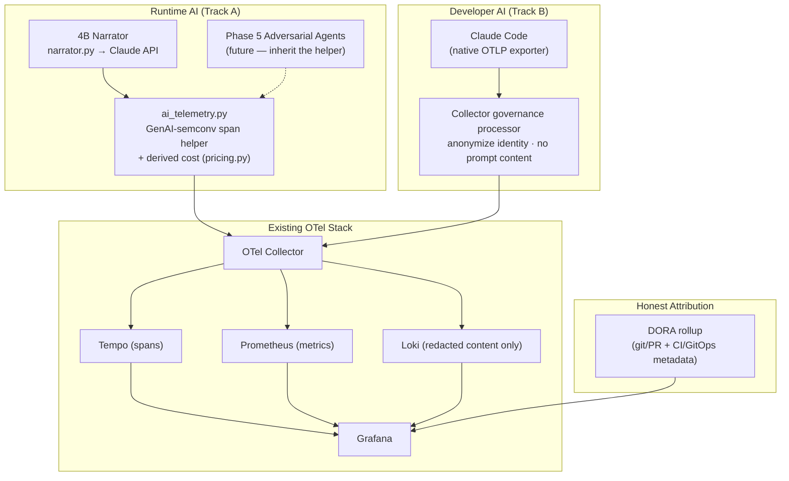

# Phase 7 — AI Observability & Governance

**Goal:** Make every AI interaction in the platform — the AI the platform *runs* and the AI developers *use to build it* — a first-class observable signal in the existing OpenTelemetry / Grafana stack, with lightweight governance. Close the current blind spot: the platform instruments every HTTP request to death, yet its one real AI call (the Phase 4 triage narrator) and the tools that build it (Claude Code) emit nothing.

**Positioning:** This is Phase 7, after Phase 6, but deliberately **independent of Phase 6**. Everything here instruments things that exist *today* on the local Kind stack — the Phase 4 `foundry-cli` narrator and Claude Code in the developer workflow — and rides the existing OTel Collector to AWS unchanged when Phase 6 lands. No AWS dependency.

---

## Overview

Phase 4 established the platform's stance on AI: if AI is in the critical path, it is measured like anything else, never trusted on vibes. The detection engine is deterministic and evaluable; the LLM only narrates. Phase 7 extends that same thesis to AI *usage itself* — if AI runs in the platform or builds the platform, its cost, latency, quality, and behavior must be observable, not assumed.

The work splits into two independently shippable tracks:

1. **Track A — Runtime/Product AI Observability.** Observe the AI the platform *runs*: the Phase 4B triage narrator today, and the Phase 5 adversarial agents when they are built. Manual OpenTelemetry GenAI-convention spans, emitted through the existing Collector.
2. **Track B — Developer AI Observability.** Observe the AI developers *use*: Claude Code (Copilot-ready), via its native OTLP exporter pointed at the existing Collector, with a governance processor and a delivery-metrics pairing that keeps the numbers honest.

Both tracks are **governance-first, not dashboard-first**. The substantive design work is cost budgets, PII protection, identity anonymization, provenance, and honest attribution — not the plumbing, which the existing stack already provides.

**Hard constraint:** everything lands in the existing OTel Collector → Prometheus / Loki / Tempo / Grafana stack. No separate SaaS AI-observability product. The notable commercial tools in this space (Arize, Braintrust, LangSmith, Datadog / New Relic / Dynatrace LLM observability, and others) are closed silos that would *replace* Grafana rather than feed it — they are explicit non-goals for this platform.

---

## Diagram



---

## Track A — Runtime/Product AI Observability

### What Gets Built

**The instrumented surface.** The 4B narrator's Claude call in `services/foundry-cli/foundry/triage/narrator.py` — today it calls `messages.create()` and emits nothing. It gets wrapped in a span using the OpenTelemetry GenAI semantic conventions.

**A reusable helper, not a one-off.** The instrumentation lives in a small reusable module (`foundry/triage/ai_telemetry.py`) so that Phase 5's adversarial agents inherit the exact same span shape, cost derivation, and governance when they are built. Instrument the AI once; every future AI surface reuses it. This is the "instrument once, agents inherit" payoff.

**Signals captured per AI call:**

| Signal | Source | Notes |
|---|---|---|
| `gen_ai.request.model` / `gen_ai.response.model` | response object | e.g. `claude-opus-4-8` |
| `gen_ai.usage.input_tokens` / `gen_ai.usage.output_tokens` | `response.usage` | plus reasoning tokens where present |
| `gen_ai.response.finish_reasons` | response | drives the refusal / error signal |
| operation duration | span timing | histogram, filterable by model |
| **cost (USD)** | *derived* | `tokens × per-model price table` — not in the standard; we own it |
| cache read / write tokens | `response.usage` | prompt-cache hit rate — a real cost lever |
| `gen_ai.operation.name`, `gen_ai.system=anthropic` | static | |
| prompt / response content | **opt-in, off by default** | only via a redacted path → Loki |

**Cost derivation.** A small versioned price table (`foundry/triage/pricing.py`) maps model id → input / output / cache per-MTok rates. Cost is computed at span time and recorded as both a span attribute and a metric, so Grafana can roll it up per model, per feature (triage vs. agent), and per agent-run. Cost in currency is deliberately owned by the platform because the GenAI semconv does not define it.

**Where it lands.** The existing Collector fans the call out to **Tempo** (the AI call as a span, correlated with the incident trace the narrator was explaining), **Prometheus** (token, cost, and duration histograms), and **Loki** (redacted content only, and only when content capture is explicitly enabled). No new backend.

**Semconv version policy.** The OpenTelemetry GenAI semantic conventions are still *experimental* (converging but subject to attribute renames). The platform pins a semconv version (≥ 1.37) and centralizes all `gen_ai.*` attribute names inside the helper, so a future rename is a one-file change rather than a scatter-gun edit.

### Deliverables

- `services/foundry-cli/foundry/triage/ai_telemetry.py` — reusable GenAI-semconv span helper (narrator now, Phase 5 agents later)
- `services/foundry-cli/foundry/triage/pricing.py` — versioned per-model price table + cost function
- Narrator instrumented; the AI-call span correlated with the incident trace
- Grafana dashboard: token usage, derived cost (by model / feature / agent-run), operation duration, finish-reason / error rate, cache-hit rate
- Unit tests: span emitted with the correct `gen_ai.*` attributes, cost math, and content capture verified off by default
- Doc: the GenAI-semconv schema the platform commits to, and the version-pin / rename policy

---

## Track B — Developer AI Observability

### What Gets Built

**The observed surface.** How developers use AI coding tools, starting with **Claude Code** — it is natively OpenTelemetry-instrumented and it is the tool that builds this repo. The design is vendor-shaped so a Copilot or Cursor source can be added later, but Claude Code is the only concrete source in this phase.

**Connection is configuration, not engineering.** A committed, documented environment block (a managed `.claude/settings.json` `env` block and/or a `scripts/` helper) sets:

```bash
CLAUDE_CODE_ENABLE_TELEMETRY=1
OTEL_METRICS_EXPORTER=otlp
OTEL_LOGS_EXPORTER=otlp
OTEL_EXPORTER_OTLP_ENDPOINT=<existing collector>   # 4317 gRPC / 4318 HTTP
OTEL_RESOURCE_ATTRIBUTES=team=<team>,cost_center=<cc>   # cohort tags for slicing — not identity
```

**Signals (native, free):** `claude_code.cost.usage` (USD/session), `claude_code.token.usage`, `claude_code.session.count`, `claude_code.active_time.total`, `claude_code.lines_of_code.count`, `claude_code.commit.count`, `claude_code.pull_request.count`, and tool accept/reject decisions.

**The governance processor — the real work of this track.** A Collector processor runs on the Claude Code telemetry pipeline and:

- **Drops or hashes `user.id`, `user.email`, `user.account_uuid`.** Dashboards report team / fleet health, never per-developer scorecards.
- **Enforces no prompt-content logging.** The `OTEL_LOG_USER_PROMPTS`, `OTEL_LOG_ASSISTANT_RESPONSES`, and raw-body switches stay off by default; the processor is the backstop so a stray client setting cannot leak prompt content into Loki.
- **Passes through cohort tags** (`team`, `cost_center`) for slicing.

**Honest attribution — pairing with delivery.** AI-usage counts measure *activity*, not *outcome*. Token spend, sessions, lines "AI-authored," and acceptance rate all rise simply when the tool is used more — whether or not anything ships faster or better. Industry findings reinforce this: the DORA 2025 report shows AI lifting individual throughput while team-level *stability* often stays flat or worsens, and a controlled study found experienced developers were measurably slower with AI while *believing* they were faster. A dashboard of activity counts would hide exactly that gap.

So the developer-AI dashboard pairs the AI signals with **DORA outcomes**. DORA — DevOps Research and Assessment, the long-running (now Google-led) research program — defines the four metrics that are the industry-standard measure of software *delivery performance*: **deploy frequency** and **lead time for changes** (throughput), and **change failure rate** and **mean time to restore** (stability). Three reasons this is the framework Phase 7 reaches for, named explicitly:

1. **They are outcome metrics, the exact counterweight to activity.** Activity answers "how much is the tool used?"; DORA answers "did delivery actually get faster *and* stay stable?" — which is the question activity dashboards silently dodge.
2. **They are vendor-neutral and research-backed.** They describe the delivery system, not any one AI tool, so the reading stays honest as tools change, and they are the metrics the DORA-2025 AI findings above are themselves stated in — the comparison is apples-to-apples.
3. **The platform can already derive them from data it owns** — git / PR history plus the existing CI / GitOps metadata — so pairing adds no new dependency or SaaS, consistent with the OTel-native constraint.

AI activity is therefore always read *beside* delivery health — diagnostic ("is the tool being adopted?"), never a standalone productivity claim.

**Explicit non-goals.** Lines-of-code and "percent AI-authored" as success metrics, and any per-developer leaderboard, are rejected by design — they are the documented Goodhart failure modes that poison both the data and the culture.

### Deliverables

- `.claude/settings.json` env block (and an optional `scripts/` enable helper), documented for macOS **and** Windows
- Collector processor config: anonymize identity, enforce no prompt content, pass cohort tags
- Grafana dashboard: cost per active developer (team-level), sessions / active-time trend, tokens by model, commits / PRs via Claude Code, tool accept/reject ratio — **paired with a DORA rollup panel**
- `docs/ai-observability.md` — the measurement philosophy, governance rules, and non-goals
- A documented note on the Anthropic Usage & Cost Admin API as an *optional* org-level billing-reconciliation layer (admin key) — not required for the phase

---

## Governance

The research behind this phase was consistent that the substance is governance, not plumbing. Phase 7 commits to the following controls, shared across both tracks:

| Control | Track A (runtime) | Track B (developer) |
|---|---|---|
| **Cost visibility & budgets** | per-run token/cost budgets + Grafana alerts (per agent-run, per feature) | cost per active developer (team-level), alertable |
| **PII / content protection** | prompt/response capture off by default; redact before Loki | no prompt-content logging; processor backstop |
| **Identity** | service-level only (which surface), no end-user identity | anonymize / hash user id + email at the Collector |
| **Provenance** | record model id + prompt version per call | model id + Claude Code version as resource attributes |
| **Audit** | audit-log adversarial-agent actions (Phase 5) | n/a |
| **Eval gate (future)** | CI eval suite mirroring the required `integration-test` gate | n/a |

The **CI eval gate is explicitly deferred** — designed for, not built in this phase. It needs Phase 5's agents and an evaluation corpus before it is worth wiring. It is named here as the forward hook so a later phase or implementation plan can pick it up.

---

## Milestones

- [ ] **Track A:** narrator emits `gen_ai.*` spans via the reusable helper; cost derived from the price table; runtime-AI Grafana dashboard live (tokens / cost / latency / finish-reason / cache-hit)
- [ ] **Track B:** Claude Code OTLP wired to the Collector; governance processor anonymizing identity and enforcing no-prompt-content; developer-AI dashboard live, paired with a DORA rollup panel
- [ ] **Cross-cutting:** `docs/ai-observability.md` written (schema commitment, semconv pin policy, governance rules, non-goals); `architecture-overview.md` and the README phase table updated to include Phase 7

---

## Deliverables Summary

| Area | Key Artifacts |
|---|---|
| Track A | `ai_telemetry.py` helper, `pricing.py`, instrumented narrator, runtime-AI dashboard, tests |
| Track B | `.claude/settings.json` env block (mac + Windows), Collector governance processor, developer-AI + DORA dashboard |
| Docs | `docs/ai-observability.md`, `architecture-overview.md` + README updates |

---

## Design Decisions

**OTel-native, no SaaS silo.** Both AI surfaces feed the existing LGTM stack. The commercial AI-observability tools would replace Grafana rather than feed it, fragmenting observability away from the stack the platform already runs. Reach for a self-hosted OSS eval UI (e.g. Langfuse) only if a future eval-UX need justifies it.

**Adopt the OTel GenAI semantic conventions as the schema.** They are the anchor standard and the platform is already OTel-native, so runtime AI calls emit `gen_ai.*` attributes that any Grafana dashboard can read. Accept that the conventions are experimental — pin a version and centralize the attribute names so a rename is cheap.

**Derive cost ourselves.** Cost in currency is not defined by the semconv. A small versioned per-model price table, owned by the platform, turns token counts into the number that actually matters for governance.

**Instrument runtime AI once; agents inherit.** The helper is built for the narrator but shaped for reuse, so Phase 5's adversarial agents get identical observability and governance for free. Phase 7 does not introduce a new AI surface — it puts observability on the AI the platform already has.

**Keep detection out of the AI's hands (unchanged from Phase 4).** Track A instruments the narrator — the AI half of the triage engine — precisely because that is the only AI in the loop. The telemetry gathering and correlation stay in the deterministic 4A detector. Observing the AI does not expand what the AI is trusted to do.

**Governance-first, not dashboard-first.** The dashboards are cheap on this stack; the durable design work is cost budgets, PII protection, identity anonymization, and provenance. Get those right and the panels follow.

**Reject activity-only developer metrics.** Lines-of-code, "percent AI-authored," and per-developer leaderboards are named non-goals. Developer-AI activity is only reported beside DORA delivery outcomes, so the platform never claims productivity from raw activity.

**Why DORA specifically.** DORA's four metrics are chosen as the delivery counterweight for three concrete reasons: they measure *outcome* (delivery throughput + stability) rather than activity, so they answer the question activity dashboards dodge; they are vendor-neutral and research-backed — the same terms the DORA-2025 AI findings are stated in, keeping the comparison honest as tools change; and they are derivable from data the platform already owns (git/PR + CI/GitOps metadata), so pairing adds no new dependency and stays within the OTel-native constraint.

**Independent of Phase 6.** Everything here instruments what exists today on the local Kind stack and rides the Collector to AWS unchanged. Phase 7 can be executed before, after, or alongside Phase 6.
