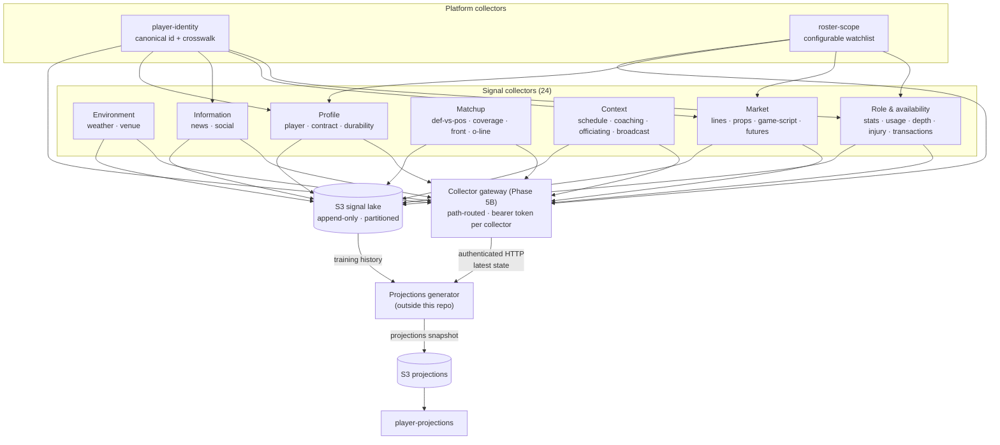

# Phase 8 — Data Source Collectors

> **Status:** 🚧 **In progress** — 8A delivered: `weather` retrofitted onto the capture model, the shared `collector-core` library (auth, five-route contract surface, capture loop, signal lake), and the append-only S3 lake. 8B–8F not started. · [roadmap](../../README.md#phases)

**Goal:** Build the fleet of data-source collectors that feed the out-of-repo projections generator, and the paved road that makes adding the twenty-seventh collector a day of work rather than a week. Phase 8 turns "the generator needs good sources" from an aspiration into a specified, staged, extensible catalog.

**Positioning:** Phase 5B builds the collector *platform* — one path-routed gateway, bearer-token auth per collector, `weather` as the first tenant. Phase 8 builds the *catalog* that runs on it. 5B answers "how does a collector get exposed"; 8 answers "what collectors exist, what do they emit, and how does a new one get added."

---

## Overview

The projections generator lives outside this repository and always will — the ML and ranking methodology is the product's value. Foundry's job is to be the thing the generator reaches into: a set of small services that each gather one kind of raw football signal, normalize it, serve it over an authenticated HTTP API, and accumulate it into a shared object-storage lake the generator can train against.

Twenty-six collectors are specified here, shipping across six sub-phases in batches of two to seven. The catalog is deliberately wider than any single stage will build, because the expensive decision is the *contract* — once every collector emits the same envelope, resolves players through the same identity service, and registers in the same registry, adding a source is an adapter and a config entry.

Three decisions shape everything below:

**Collectors capture, they do not merely proxy.** Most of this catalog is perishable. A betting line at Wednesday 3pm is gone forever if nobody wrote it down, and social sentiment cannot be re-derived a week later. So every collector polls on a cadence and appends every poll to an append-only S3 lake, while serving the latest snapshot from memory over HTTP. Weather's original stateless-proxy shape does not generalize, and `weather` is retrofitted onto the capture model in 8A.

**Specs are upstream-agnostic.** Each collector spec defines its *normalized output contract* and treats the upstream as a pluggable adapter. Candidate upstreams appear only in a non-normative line per collector. This is what lets a collector survive its data source disappearing, going paid, or being replaced by a better one — the generator never sees the change.

**Identity is a service, not a convention.** Every upstream names players differently: GSIS ids, Sleeper ids, and free-text betting-book strings like `P. Mahomes`. Without a canonical crosswalk, twenty-six collectors produce data that cannot be joined, and the failure is silent — a 3% join-failure rate looks exactly like a slightly quiet week. `player-identity` exists to make that failure loud and measurable.

---

## Diagram



Note the two directions. The generator reaches **in** over HTTP for current state and reads the lake for history; results come **back** as a file in S3. Foundry never calls out to the generator.

---

## The Collector Contract

Every collector in the catalog implements the same contract. This is the whole extensibility mechanism — a generator that can consume one collector can consume all of them, and a new collector inherits the platform's observability, testing, and deployment for free.

### The five routes

| Route | Purpose |
|---|---|
| `GET /health` | Existing platform convention — liveness and readiness |
| `GET /metrics` | Prometheus scrape endpoint |
| `GET /catalog` | Self-description: signal types, field list, cadence class, envelope version, coverage window, last successful capture |
| `GET /signals` | The data, filtered by `season`, `week`, `player_id`, `team` |
| `POST /refresh` | Force-refresh bypassing the cadence |

`GET /catalog` is what makes the fleet introspectable: the gateway's registry says a collector *exists*, and `/catalog` says what it currently *offers*. A collector whose deployed `/catalog` disagrees with its registry entry is a CI failure, not a runtime surprise.

`GET /signals` returns the latest captured envelope for the requested scope. It reads from memory, never from the upstream — a collector is never a synchronous pass-through, so an upstream outage degrades freshness rather than availability.

### `POST /refresh` — capture on demand

Waiting on a timer is the wrong behavior during breaking news, a backfill, or an incident. `POST /refresh` triggers an immediate capture outside the cadence:

- Bearer-authenticated, same token as the rest of the collector
- Accepts an optional `scope` body (`{"season": 2026, "week": 4}`) to re-capture a specific window
- Returns `202 Accepted` with a `refresh_id`; the capture runs asynchronously and lands in the lake like any other
- Guarded by a **minimum-interval floor** per collector, returning `429` when called too soon — force-refresh must not become a way to get an API key banned by an upstream that rate-limits

A CLI wrapper covers the operator path: `python scripts/refresh-collector.py <name> [--scope season=2026,week=4]`.

### The signal envelope

Every HTTP response body and every object in the lake shares one envelope, contracted in `contracts/signal-envelope/`:

```json
{
  "envelope_version": "1",
  "collector": "usage-share",
  "signal_type": "player_usage_weekly",
  "captured_at": "2026-09-17T14:03:00Z",
  "upstream": {
    "adapter": "example-adapter",
    "fetched_at": "2026-09-17T14:02:57Z",
    "source_ref": "opaque upstream cursor, etag, or request id"
  },
  "scope": { "season": 2026, "week": 3 },
  "coverage": {
    "expected": 312,
    "present": 309,
    "missing": ["fdy-a1b2c3", "fdy-d4e5f6", "fdy-g7h8i9"]
  },
  "errors": [],
  "signals": [ { "player_id": "fdy-a1b2c3", "…": "…" } ]
}
```

The `coverage` block is the part worth defending. Without it, a collector that returns 309 of 312 players is indistinguishable from a healthy one, and the generator quietly trains on a hole. With it, partial capture is a first-class fact the platform can alert on and the generator can weight. Each collector's spec below states exactly what `coverage.expected` counts.

`upstream.source_ref` carries whatever the upstream gives for provenance — an ETag, a cursor, a request id. It is opaque to Foundry and exists so a disputed row can be traced back to the exact fetch that produced it.

### The signal lake

```
s3://<bucket>/signals/<collector>/v<envelope_version>/season=<YYYY>/week=<NN>/<captured_at>.json
```

Append-only. Objects are never mutated or deleted in place. Partitioning by season and week means the generator reads a training window with a single prefix scan rather than a full-bucket listing.

Two consequences worth naming:

- **Corrections produce two objects, not one edit.** When an upstream revises a value after the fact — a stat correction days after a game is the common case — the later capture lands as a new object with a later `captured_at`. The generator resolves by recency. Nothing is lost, and the revision itself is visible.
- **Failed captures still write.** A poll that fails writes an envelope with `coverage.present: 0` and a populated `errors` array. A gap in the lake is therefore always explicit and never has to be inferred from absence — the difference between "we failed" and "we never tried" is recorded rather than reconstructed.

This is `player-projections`' S3 pattern run in reverse: signals flow out through object storage, results come back through it.

### Cadence classes

Cadence is a declared property of each collector, not an ad-hoc number, so the platform can reason about staleness uniformly.

| Class | Interval | Collectors |
|---|---|---|
| `static reference` | on change, checked daily | `venue`, `player-profile` |
| `seasonal` | daily | `player-identity`, `player-contract`, `team-scheme`, `durability-history`, `season-futures` (plus `coaching-staff` and `player-incentives`, deferred) |
| `weekly` | post-game, then daily | `roster-scope`, `player-stats`, `usage-share`, `game-script`, `schedule-context`, `broadcast-context`, `officiating`, and all four matchup collectors |
| `volatile` | 15 minutes | `weather`, `betting-lines`, `depth-chart`, `injury-report`, `roster-transactions`, `news-feed`, `social-signal` |
| `perishable` | 5 minutes in-window | `player-props`; `weather` escalates into this class inside its pre-kickoff window |

`collector_staleness_seconds` alerts against the declared class, so "this collector is late" is a uniform check rather than twenty-six bespoke ones.

---

## The Registry

`contracts/collector-registry.yaml` is the source of truth for what the catalog contains:

```yaml
collectors:
  - name: usage-share
    path: /collectors/usage-share
    stage: 8B
    cadence_class: weekly
    envelope_version: "1"
    signal_types: [player_usage_weekly]
    scope_aware: true
    depends_on: [player-identity, roster-scope]
```

The gateway serves it live at `GET /collectors`, so the generator can fetch the catalog at runtime rather than needing repository access. CI asserts three things:

1. Every registry entry has a deployed collector, and every deployed collector has a registry entry.
2. Each collector's live `GET /catalog` agrees with its registry entry on signal types, cadence class, and envelope version.
3. Every `depends_on` names a collector that exists.

A committed registry is reviewable — a PR that changes a signal's shape shows up in the diff. A live index is accurate. Serving the committed file through the gateway gets both, and the CI drift gate is what keeps the two honest.

---

## Adding a Collector

```bash
python scripts/new-collector.py <name>
```

Generates, in one command:

- `services/<name>/` — FastAPI app implementing all five routes, a stub adapter, `Dockerfile`, `pyproject.toml`, `uv.lock`
- `helm/values/<name>/values.yaml` — including the bearer-token `extraEnv` `secretKeyRef` block
- `infra/gitops/envs/local/<name>/values.yaml` — the image tag only. There is
  **no** `infra/gitops/argo/<name>.yaml`: `infra/gitops/argo/applicationset.yaml`
  generates the Argo CD Application from a git directory generator over
  `helm/values/*`, so the values file above is the whole GitOps registration.
- **No `.github/workflows/<name>.yml`** — `.github/workflows/services.yml`
  covers every deployable service as a matrix leg, computed from the registry.
- A `contracts/collector-registry.yaml` entry
- Registration in `scripts/deploy-local.py` and `scripts/stack-up.py`
- A test skeleton asserting envelope conformance and the five routes

What remains is the only part that is genuinely per-source: writing the adapter and normalizing its output into the collector's declared fields. That is the extensibility promise — one command plus one adapter, not six hand-wired files and a checklist.

The shared capture machinery — cadence scheduling, envelope construction, coverage accounting, lake writes, force-refresh with its interval floor, and the standard metrics — lives in a shared library the scaffold wires up, not in each service. A collector author writes an adapter and a field mapping.

---

## The Catalog

Twenty-six collectors: two platform collectors everything else depends on, and twenty-four signal collectors in seven groups. Each spec below is upstream-agnostic — it defines the normalized output contract, and names candidate upstreams only in a non-normative line.

### Platform collectors (2)

Everything else in the catalog depends on these two. They ship first, in 8A.

#### `player-identity`

**Signal types:** `player_identity_crosswalk`, `name_resolution_miss`
**Cadence class:** seasonal — full rebuild daily at 08:00 UTC; `POST /refresh` on transaction days (Tuesday/Wednesday waivers, roster cutdowns, trade deadline)
**Stage:** 8A
**Depends on:** nothing — foundational
**Scope-aware:** no — it must resolve names the scope deliberately excludes, including deep bench players and free agents that betting books and news feeds mention

Every other collector emits `player_id`, and this is the only collector that decides what a `player_id` is. It answers the join question the rest of the catalog cannot answer for itself: given a GSIS id from a play-by-play feed, a Sleeper id from a roster feed, and the free-text string `P. Mahomes` from a betting book, which of those refer to the same human, and how sure are we. Without it, a weather signal keyed by stadium and a usage signal keyed by GSIS id and a prop line keyed by a book's display string never meet in the projections generator.

**Normalized signal fields**

| Field | Type | Meaning |
|---|---|---|
| `player_id` | string | Canonical Foundry id, `fdy-` prefixed, stable for the player's career; never reissued |
| `full_name` | string | Legal/registered name as of `scope.season` |
| `first_name` | string | Given name, suffix stripped |
| `last_name` | string | Family name, suffix stripped |
| `name_suffix` | string \| null | `Jr`, `Sr`, `II`, `III`, `IV` — held separately so it never pollutes the match key |
| `normalized_key` | string | Lowercased, diacritics-folded, punctuation-stripped, suffix-removed match key; not unique on its own |
| `aliases` | array<object> | `{ name, source, valid_from, valid_to }` — prior legal names, book display strings, common misspellings |
| `position` | string | Canonical position (`QB`,`RB`,`WR`,`TE`,`K`,`DST`, defensive codes for disambiguation only) |
| `position_group` | string | `offense_skill`, `offense_line`, `defense`, `special_teams` |
| `jersey_number` | integer \| null | Number as of `jersey_as_of`; with team and position this resolves a player without the name matching at all |
| `jersey_as_of` | string (date-time) | Instant the number was true — numbers change between seasons and on trades, so this is never a static key |
| `team` | string \| null | Team abbreviation the player belonged to at `team_as_of`; `null` for free agents |
| `team_as_of` | string (date-time) | Instant the `team` value was true — consumers joining a week-4 signal must not read a week-10 team |
| `roster_status` | string | `active`, `inactive`, `ir`, `pup`, `practice_squad`, `free_agent`, `suspended`, `retired` |
| `birth_date` | string (date) \| null | Primary disambiguator for same-name collisions; null is itself a risk signal |
| `entry_year` | integer \| null | First season on an NFL roster; separates a rookie from the retired veteran who shares their name |
| `external_ids` | object | `{ <source>: { id, linked_at, link_method, match_score, match_margin } }` where `link_method` is `crosswalk`, `exact_id`, `attribute_score`, or `manual` |
| `superseded_by` | string \| null | Set on a tombstoned record when two ids are merged; consumers must follow the pointer, not error |
| `last_verified_at` | string (date-time) | Last time an upstream confirmed this record; drives staleness alerting |

`name_resolution_miss` rows carry `raw_name`, `source`, `context` (team/position/number hints supplied by the caller), `best_candidate_player_id`, `match_score`, `match_margin`, `disagreeing_attributes` (the fields that failed to agree — the label that separates a staleness problem from a genuine unknown), `first_seen_at`, `occurrence_count`.

**Extra routes beyond the standard five:** `GET /resolve` — free-text name plus optional `team`/`position`/`season` hints, returns ranked candidates with `confidence` in `[0,1]` and the `link_method` that produced each; `POST /resolve/batch` — same semantics, up to 500 names per call, for callers normalizing a whole betting slate; `GET /unresolved` — the standing miss queue, ordered by `occurrence_count`, so a name that fails 400 times a week is visible rather than dropped

**`coverage.expected` means:** every player appearing on any active roster, reserve list, or practice squad across all 32 teams for `scope.season`, plus every free agent transacted within the trailing 30 days — roughly 2,900 records, not the ~350 in fantasy scope.

**Adapter notes:** Linking is tiered, and the tiers must not be collapsed. **Tier 1 is a published crosswalk table**, adopted rather than built — the community-maintained player id maps already link GSIS, PFR, ESPN, Sleeper, Yahoo, and MFL ids to each other, and any upstream carrying one of those ids joins exactly with no matching logic at all. Tier 2 is exact match on an upstream's own stable id already seen. Tier 3 is **weighted multi-attribute scoring** over `(normalized_key, team, position_group, jersey_number, entry_year, birth_date)`.

Tier 3 scores *agreement*, not equality, and that distinction is the whole design. A strict AND across attributes is brittle in exactly the fields it depends on: a player traded on Tuesday matches a book's row on name, position, and number but disagrees on team, and an equality-based key drops a row it should have resolved. So each attribute contributes a weight, a link requires N-of-M agreement above a threshold, **and it additionally requires a margin between the best and second-best candidate**. Two candidates within the margin are a tie, and a tie goes to the miss queue rather than to the higher score.

The margin requirement is what makes the attribute key safe rather than merely accurate. Note also that with team, position, and number present, a row resolves *without the name matching at all* — which is how book display strings and nicknames (`Hollywood Brown`, `CMC`, `Deebo`) resolve without any fuzzy string handling. The genuinely hard residue is not string distance; it is attribute *staleness*, since every attribute in the key is itself a time-varying fact, which is why `team_as_of` and `jersey_as_of` exist and why a scoring function must discount an attribute whose `as_of` is older than the row being resolved.

**Failure mode to watch:** A stale attribute silently converting a resolvable row into a miss. The multi-attribute key makes wrong merges rare — a WR and a safety who share a name separate on position, a rookie inheriting a retired veteran's normalized key separates on entry year — so the residual risk moves from *wrong* to *absent*, which is harder to see. The concrete shape: a player is traded Tuesday, a betting book still carries the old team on Wednesday, the row disagrees on `team` while agreeing on everything else, and it lands in the miss queue. Nothing errors, no metric moves except a counter nobody is watching, and that player simply has no prop lines for the week they were most newsworthy.

Three guards. First, `identity_resolution_failures_total` is labelled by **which attribute disagreed**, not just by collector — a spike concentrated on `team` is a staleness problem and reads completely differently from a spike spread across attributes. Second, alert on near-miss density: rows scoring above the agreement threshold but inside the margin are ties sent to the queue deliberately, and a rising tie rate means the weights need tuning, not that the upstream got worse. Third, the injectivity invariant still holds and is still cheap — each `external_ids.<source>.id` maps to exactly one `player_id` per season, alerting on `identity_merge_conflicts_total > 0` — as does the cross-check that a `player_id` whose `position_group` is `offense_skill` accumulating defensive snap counts is a bad link, not a trick play.

**Candidate upstreams (non-normative):** nflverse player id map, Sleeper players API, Pro-Football-Reference, ESPN core API, official league transaction feed

---

#### `roster-scope`

**Signal types:** `scope_membership_weekly`, `scope_change_event`
**Cadence class:** weekly — recomputed post-game and daily at 09:00 UTC, with `POST /refresh` on depth-chart or transaction news
**Stage:** 8A
**Depends on:** `player-identity` (every slot is filled by a resolved `player_id`, never a raw name)
**Scope-aware:** no — it defines the scope

This collector answers "which players is Foundry currently paying attention to, and why," and it is the only place that answer exists. Config declares rules by position and depth — `QB≤2, RB≤3, WR≤4, TE≤2` per team, plus every kicker and all 32 team defenses — and this collector resolves those rules against the live depth chart into a concrete, versioned list of roughly 350 `player_id` values. Widening the universe to `WR≤5` is one config change here rather than 24 separate changes across the collector fleet, because every other collector fetches this list first and only pulls signals for the players on it.

**Normalized signal fields**

| Field | Type | Meaning |
|---|---|---|
| `player_id` | string | Canonical id from `player-identity`; the only identifier a consumer needs |
| `entity_type` | string | `player` or `team_defense` — DST slots have no human behind them |
| `scope_version` | integer | Monotonic version of the resolved list this row belongs to; consumers pin a version for a fetch cycle |
| `membership_status` | string | `active` (fetch signals), `grace` (fell out, still fetch), `excluded` (stop fetching) |
| `rule_id` | string | The config rule that admitted this row, e.g. `wr_depth_le_4`, `all_kickers`, `all_team_defenses` |
| `team` | string | Team abbreviation the slot belongs to |
| `position` | string | Canonical position for the slot |
| `depth_rank` | integer | 1-based rank within `(team, position)` as resolved from the depth chart |
| `previous_depth_rank` | integer \| null | Rank in the prior `scope_version`; a large delta is the churn signal |
| `depth_source_captured_at` | string (date-time) | Freshness of the depth chart this rank came from |
| `added_at_version` | integer | `scope_version` in which this player first entered scope |
| `grace_expires_week` | integer \| null | Week after which a `grace` row becomes `excluded`; null while `active` |
| `is_manual_override` | boolean | True when config pinned this player in or out regardless of depth |
| `override_reason` | string \| null | Free text recorded with the override, required when `is_manual_override` is true |

`scope_change_event` rows carry `scope_version`, `player_id`, `transition` (`entered`, `entered_grace`, `excluded`, `rank_changed`), `from_depth_rank`, `to_depth_rank`, `trigger` (`depth_chart`, `transaction`, `injury_designation`, `config_change`, `manual`), and `occurred_at`.

**Mid-week movement and drop-out.** Scope versions are immutable and additive; recomputation mints a new `scope_version` rather than editing the last one, so a collector mid-fetch is never reading a list that changes under it. A player who falls out of the rule window does not disappear — they move to `membership_status: grace` with `grace_expires_week` set two weeks out, and collectors keep fetching for them. This is deliberate: depth charts churn on Tuesday and revert on Friday, and a player who is out of scope for three days leaves a hole in a partially captured week that can never be backfilled from a real-time upstream. Signals already captured for a player who exits scope are never touched — S3 is append-only, and history remains queryable at the `player_id` regardless of current membership.

**Extra routes beyond the standard five:** `GET /scope/players` — the concrete resolved list for a `scope_version` (defaults to latest), the route every other collector calls; `GET /scope/rules` — the config as *applied*, including which rules produced zero slots; `GET /scope/diff?from=&to=` — membership transitions between two versions, for explaining why a player's data starts or stops

**`coverage.expected` means:** the number of slots the config demands — sum over 32 teams of each positional quota, plus one kicker and one team defense per team — with `present` counting slots actually filled by a resolved `player_id`. A team whose depth chart yields only three receivers under a `WR≤4` rule contributes one entry to `coverage.missing`.

**Adapter notes:** An adapter supplies a depth chart per team: ordered player references grouped by position, with a capture timestamp. Three normalizations are mandatory and none are trivial: collapsing upstream position labels (`WR`, `SE`, `FL`, `SLOT`, `X`, `Z`) into canonical groups; breaking co-listed players (`Player A OR Player B` at the same rank) into a deterministic total order rather than dropping one; and routing every name through `player-identity` before it can occupy a slot, with an unresolvable name counted as a missing slot rather than skipped. The hard part is that depth ordering is not a league-published fact — teams publish charts for media obligations, several sort alphabetically below the starter, and the ordering that actually predicts snap share is closer to last week's usage than to any published chart.

**Failure mode to watch:** The scope is wrong and reports itself as complete. Because `coverage.expected` is computed from the same resolved list that drives fetching, a stale or mis-ordered depth chart that omits the correct player produces 100% coverage across the entire fleet — every downstream collector reports full coverage for the wrong ~350 players. The concrete shape: a starter is placed on IR Tuesday, the adapter's depth chart does not update until Friday, and the promoted backup — the single most projection-relevant player of that week — is out of scope for the four days when injury designations, betting lines, and practice reports are actually generated. Nothing errors; the week simply has no data for them, and the grace window does not help because they were never in scope to begin with. The assertion that catches it is external to scope: reconcile the prior week's realized usage against membership and emit `scope_missed_producers_total` — the count of `player_id` values that recorded a nonzero snap share, target, or carry while `membership_status` was `excluded`. Alert on any nonzero value, and treat a sustained nonzero as a rule-tuning signal rather than a bug. Support it with two cheap invariants: `depth_rank` is distinct within every `(team, position)` — a duplicate rank means the adapter collapsed a co-listing — and `depth_source_captured_at` is under 48 hours old for every team, since one team's frozen chart is invisible in an aggregate freshness average.

**Candidate upstreams (non-normative):** nflverse depth charts and rosters, ESPN depth charts, Ourlads, Sleeper rosters, official team transaction wires

### Environment (2)

The stadium as it will be at kickoff — split into what changes by the hour and what changes by the decade.

#### `weather`

**Signal types:** `venue_forecast_kickoff`, `venue_conditions_current`
**Cadence class:** volatile — every 15 minutes flat, for every game in scope regardless of how far out kickoff is; escalates to 5 min (perishable) from T−90 min through the final whistle
**Stage:** 8A
**Depends on:** a bundled schedule adapter at 8A, supplying `game_id`,
kickoff timestamps, and per-game roof state. Replaced by `schedule-context`
at 8B behind the same interface. Reads `venue` for field orientation once that
collector can supply it — `venue` shipped at 8E, but with
`field_orientation_deg` null, because no source for it was found; the read is
still outstanding and so is the dependency edge.
**Scope-aware:** no — signals are keyed by game and venue, not by player

Answers what the ball and the players will actually be dealing with at kickoff, for a projection generated three or four days earlier. The service as it exists today answers "what is the weather right now at Lambeau", which is a different and largely useless question on a Wednesday. The second-order signal is the *convergence*: successive snapshots of the same kickoff are appended to the lake, so the generator can see how much a Sunday forecast moved between Wednesday and Saturday and widen or narrow its own uncertainty accordingly.

**Normalized signal fields**

| Field | Type | Meaning |
|---|---|---|
| `game_id` | string | Game this forecast is for |
| `venue_id` | string | Venue key, joinable to `venue` |
| `forecast_valid_at` | timestamp | The hour this forecast describes — must equal kickoff, hour-truncated |
| `forecast_lead_hours` | float | Hours between `upstream.fetched_at` and `forecast_valid_at` |
| `environment` | enum | `outdoor`, `fixed_dome`, `retractable_open`, `retractable_closed`, `retractable_undecided` |
| `temperature_f` | float | Air temperature at kickoff; null when `environment` is a closed roof |
| `feels_like_f` | float | Wind-chill / heat-index adjusted |
| `wind_speed_mph` | float | Sustained wind at 10 m |
| `wind_gust_mph` | float | Peak gust in the kickoff hour |
| `wind_direction_deg` | int | Meteorological degrees (direction wind comes *from*) |
| `crosswind_component_mph` | float | Wind resolved perpendicular to `venue.field_orientation_deg`; still null — `venue` shipped at 8E but ships that field null, so there is nothing yet to resolve against |
| `precipitation_type` | enum | `none`, `rain`, `snow`, `sleet`, `freezing_rain` |
| `precipitation_probability` | float | 0–1 for the kickoff hour |
| `precipitation_rate_in_hr` | float | Intensity, not accumulation |
| `humidity_pct` | float | Relative humidity |
| `bands` | object | Per-quantity `{p10, p50, p90}` for temperature, wind, precipitation rate |
| `playability` | object | Derived: `kicking_difficulty` (0–1), `deep_pass_penalty` (0–1), `ball_security_risk` (0–1), each with the inputs that produced it |

**Extra routes beyond the standard five:** `GET /signals/convergence?game_id=` — the ordered series of prior forecasts for one kickoff, with the delta between consecutive snapshots. Derivable from the lake, but every consumer would otherwise reimplement it.

**`coverage.expected` means:** one `venue_forecast_kickoff` record per game
scheduled in the queried week — indoor games included, emitting a
controlled-environment record rather than being dropped. Every game in scope
is captured on the same 15-minute cadence regardless of how far out kickoff
is — there is no separate hourly tier for distant games. Only
`forecast_lead_hours` (larger) and `bands` width (wider) grow as a game gets
farther from kickoff, never how often it is captured, so
`coverage.expected` counts the full week's games from the first capture
onward rather than moving as kickoff approaches.

**Adapter notes:** An adapter must resolve a venue to a forecast point, request the *specific kickoff hour* rather than a daily summary, and carry the model's own spread through into `bands` instead of publishing a bare point estimate. Unit normalization is real work here: the current service emits Celsius and km/h, and the envelope standardizes on the suffixed imperial fields above. The hard part is the roof: an outdoor forecast for a closed dome is not merely wrong, it is confidently wrong, so `environment` must be resolved before any meteorological field is populated, and `retractable_undecided` must be representable rather than guessed.

**Failure mode to watch:** An adapter asked for an hour beyond its model horizon quietly returns current conditions instead of a forecast. The record looks entirely normal — plausible temperature, plausible wind — and the generator treats Tuesday's weather as Sunday's. Catch it two ways: assert `forecast_valid_at == kickoff_at` truncated to the hour on every record at write time, and alarm on the convergence series — a genuine forecast series narrows as `forecast_lead_hours` falls, so a `bands` width that stays flat across snapshots, or a p50 that tracks the capture time rather than the target time, means the collector is republishing nowcasts. A per-collector metric of mean band width bucketed by lead time makes the flat line obvious.

**Candidate upstreams (non-normative):** Open-Meteo (already wired), NOAA/NWS gridpoint forecast API, Visual Crossing, Tomorrow.io

#### `venue`

**Signal types:** `venue_static`, `venue_game_assignment`
**Cadence class:** static reference — re-read daily, snapshot appended only when the content hash of a venue record changes
**Stage:** 8E
**Depends on:** nothing
**Scope-aware:** no — venues are not players

Answers the fixed properties of the place a game is played, which is the counterpart to everything `weather` reports about the same place changing hour to hour. Surface and altitude move rushing efficiency, injury risk, and kicking distance in ways that persist all season and are invisible in a player's own game log. The `venue_game_assignment` signal type exists because "home team's stadium" is a bad assumption roughly a dozen times a year — London, Munich, São Paulo, neutral-site relocations after a stadium becomes unavailable, and both MetLife tenants.

**Normalized signal fields**

| Field | Type | Meaning |
|---|---|---|
| `venue_id` | string | Stable venue key |
| `effective_from` / `effective_to` | date | Validity window of this revision; `effective_to` null means current |
| `name`, `city`, `country` | string | Identity; `country` is not assumed to be `US` |
| `latitude`, `longitude` | float | Forecast point and travel-distance anchor |
| `timezone` | string | IANA zone, for local-kickoff and body-clock math |
| `altitude_ft` | int | Field-level elevation |
| `roof_type` | enum | `open`, `fixed_dome`, `retractable` |
| `roof_state_policy` | enum | For retractables: `usually_open`, `usually_closed`, `game_time_decision` |
| `surface_class` | enum | `natural_grass`, `hybrid`, `synthetic_turf` |
| `surface_product` | string | The specific product and generation, e.g. `field_turf_core`, `matrix_turf_helix` — not just "turf" |
| `surface_installed_on` | date | Last full installation |
| `surface_last_resurfaced_on` | date | Last resurfacing or re-sod |
| `field_orientation_deg` | int | Compass bearing of the goal-line-to-goal-line axis; feeds `weather.crosswind_component_mph` |
| `seating_capacity` | int | Listed capacity |
| `crowd_noise_profile` | object | `{typical_peak_db, enclosure_class, home_false_start_index}` |
| `year_built`, `year_last_renovated` | int | Structural vintage |
| `home_team_ids` | array[string] | Tenants; length 2 for shared venues, 0 for neutral-only sites |

`venue_game_assignment` carries `game_id`, `venue_id`, `designated_home_team_id`, `is_neutral_site`, `is_international`, and `home_field_advantage_class` (`normal`, `shared_venue`, `neutral`, `international`).

**Extra routes beyond the standard five:** `GET /venues/{venue_id}/revisions` — the full ordered revision history for one venue, so a consumer can resolve the record that was true on a given date without scanning the lake.

**`coverage.expected` means:** every venue hosting at least one game in the current season has exactly one revision whose validity window contains today, and every scheduled game has exactly one `venue_game_assignment`.

**Adapter notes:** Most of this is not available from any single feed; an adapter assembles it from a maintained reference table plus targeted per-season corrections. The requirement that makes it tractable is that the adapter never mutates a record — a surface change produces a new revision with `effective_from` set to the install date and closes the prior one. The genuinely hard part is `surface_product`: sources report "turf" or "grass" and the fantasy-relevant differences are between generations of the same manufacturer's product.

**Failure mode to watch:** Because the data is nominally static, an adapter overwrites in place, and a mid-season surface replacement or roof retrofit is retroactively applied to the whole season — Week 2 games get attributed a surface that was not installed until Week 11. Nothing looks broken; the season simply becomes internally consistent with a fiction. The assertion that catches it: no game may resolve to a venue revision whose `[effective_from, effective_to)` window excludes its kickoff date, checked as a join at read time, plus a per-season count of venues with exactly one revision — a venue known to have changed surfaces showing a single revision is the tell.

**Candidate upstreams (non-normative):** a hand-maintained reference table committed alongside the adapter, nflverse stadium tables, Wikidata venue entities, club facility pages for surface-replacement announcements

### Role and availability (5)

Who is playing, in what role, and how much. The block that first makes a real projection possible.

#### `player-stats`

**Signal types:** `player_box_weekly`
**Cadence class:** weekly — a sweep at each game's final whistle, again at T+3h, then daily through the following Wednesday to absorb corrections
**Stage:** 8B
**Depends on:** `player-identity`, `roster-scope`
**Scope-aware:** yes (reads `roster-scope`)

Answers what a player actually produced in a completed game, expressed once in raw counting stats and once as fantasy points under each scoring format the platform serves. No other collector carries realized production; every backward-looking feature the generator builds — trailing averages, boom/bust variance, format-sensitivity — resolves to rows from here. It is deliberately the only collector permitted to compute fantasy points, so scoring rules live in exactly one place.

**Normalized signal fields**

| Field | Type | Meaning |
|---|---|---|
| `player_id` | string | Canonical id from `player-identity` |
| `game_id` | string | Canonical game key; a player traded mid-season yields one row per game, never a merged season row |
| `team` | string | Team the player played for in this game, not their current team |
| `opponent` | string | Defense faced |
| `position` | string | Position played in this game, which may differ from the roster position |
| `played` | bool | False for inactive, healthy-scratch, or roster-but-zero-snaps; distinct from a missing row |
| `offense_snaps` | int | Offensive snaps recorded, used as the sanity denominator against `usage-share` |
| `passing` | object | `{attempts, completions, yards, touchdowns, interceptions, sacks_taken, air_yards}` |
| `rushing` | object | `{attempts, yards, touchdowns, first_downs}` |
| `receiving` | object | `{targets, receptions, yards, touchdowns, air_yards, yards_after_catch, first_downs}` |
| `misc` | object | `{fumbles_lost, two_point_conversions, return_touchdowns}` |
| `rates` | object | Derived only: `{yards_per_attempt, catch_rate, yards_per_target, yac_per_reception}`; never an input to any sum |
| `fantasy_points` | object | `{standard, half_ppr, ppr}` floats computed here from the counting stats |
| `scoring_rules_version` | string | Version of the pinned scoring table used to compute `fantasy_points` |
| `stat_state` | enum | `live` \| `provisional` \| `final` — upstream's certification level for this box score |
| `revision` | int | Monotonic per `(game_id, player_id)`; increments whenever a restatement changes any counting stat |

**Extra routes beyond the standard five:** `GET /revisions?since=<timestamp>` — restated `(game_id, player_id, revision)` tuples, so the generator can invalidate cached features without re-reading the whole week

**`coverage.expected` means:** One row per `roster-scope` watchlist player whose team has completed its game for the scoped week, plus any non-watchlist player who recorded at least one offensive snap in those games.

**Adapter notes:** An adapter must map upstream stat columns onto the counting-stat objects and leave `rates` and `fantasy_points` entirely alone — those are computed downstream of normalization so that two adapters cannot disagree on what a PPR point is. It must expose upstream's own notion of finality onto `stat_state` rather than inferring it from elapsed time, and must surface a stable upstream revision marker if one exists. The hard part is neither: it is deciding a player's `team` for a game played the same week they changed teams, because most upstreams key the row to the current roster rather than the roster at kickoff.

**Failure mode to watch:** A stat correction issued days after a game — a reception rescored as a lateral, a fumble reassigned — silently changes a value the lake already captured. Because the lake is append-only, two snapshots for the same `(game_id, player_id)` now disagree and nothing in the envelope says which one wins. Guard it with a monotonicity assertion on `revision` per `(game_id, player_id)` and a hard assertion that a row once emitted as `stat_state: final` never changes again without `revision` incrementing; alert on `player_stats_restatements_total` spiking outside the normal Monday-to-Wednesday window, which usually means an adapter is re-emitting unchanged rows as new revisions.

**Candidate upstreams (non-normative):** nflverse weekly player stats, ESPN box-score endpoints, Sleeper, Pro Football Reference

---

#### `usage-share`

**Signal types:** `player_usage_weekly`
**Cadence class:** weekly — post-game sweep, repeated daily through Wednesday because participation data typically lands 12–36h after the box score
**Stage:** 8B
**Depends on:** `player-identity`, `roster-scope`
**Scope-aware:** yes (reads `roster-scope`)

Answers what the offense *gave* a player, independent of what they converted it into. Opportunity is the more stable half of production: target share and route participation persist week to week where yards and touchdowns do not, so a backup who inherits 80% of the routes is projectable before a single box score reflects it. This is also the only collector that carries the team-level denominators, without which every share is uninterpretable.

**Normalized signal fields**

| Field | Type | Meaning |
|---|---|---|
| `player_id` | string | Canonical id from `player-identity` |
| `game_id` | string | Usage is always per game; season aggregates are the generator's job |
| `team` | string | Team whose denominators these shares are taken against |
| `snap_share` | float | Offensive snaps / team offensive snaps, excluding kneels, spikes, and special teams |
| `route_participation` | float | Routes run / team dropbacks; null when the upstream cannot supply routes |
| `target_share` | float | Targets / team targets |
| `air_yards_share` | float | Player air yards / team air yards |
| `wopr` | float | Weighted opportunity: `1.5 * target_share + 0.7 * air_yards_share` |
| `carry_share` | float | Carries / team carries |
| `redzone` | object | `{carries, targets, snap_share}` inside the opponent 20 |
| `goal_line` | object | `{carries, targets}` inside the opponent 5, tracked separately because touchdown equity concentrates here |
| `two_minute` | object | `{snaps, route_participation}` for two-minute and hurry-up situations |
| `alignment` | object | `{slot_rate, wide_rate, inline_rate, backfield_rate}`, summing to 1.0 for players with a nonzero snap count |
| `denominators` | object | `{team_offense_snaps, team_dropbacks, team_targets, team_air_yards, team_carries}` — every share above is recomputable from these |
| `usage_source` | enum | `charted` \| `derived` \| `mixed` — whether routes and alignment came from a charting feed or were inferred from play-by-play |

**Extra routes beyond the standard five:** none

**`coverage.expected` means:** One row per `roster-scope` watchlist player whose team has completed its game for the scoped week, and a complete `denominators` object for every team that played.

**Adapter notes:** An adapter must emit both the numerators and the team denominators it divided by; a share arriving without its base is rejected rather than stored. Route and alignment data commonly come from a different feed than snaps, on a different clock, so an adapter must be able to publish a partial row with `route_participation: null` and `usage_source: derived` instead of blocking the whole week. The hard part is defining the denominator consistently: whether a team's snap count includes kneel-downs, spikes, and plays nullified by penalty moves every share by one to three points, which is enough to reorder a depth chart.

**Failure mode to watch:** Shares computed against the wrong denominator produce numbers that look entirely normal — 0.71 snap share is plausible whether the base was 62 real snaps or 68 including special teams and kneels. The tell is aggregate, not per-row: assert that the sum of `target_share` across a team's players falls in [0.97, 1.03] and that `snap_share` never exceeds 1.0, and alert on `usage_share_team_sum_drift`. The second, quieter variant is scope drift — a player promoted into the watchlist in week 9 has no rows for weeks 1–8, so any trailing average silently computes over a shorter denominator and reads as stable; catch it by asserting that a player's row count matches their team's games played before any rate is derived.

**Candidate upstreams (non-normative):** nflverse participation and play-by-play, NFL Next Gen Stats, PFF (licensed), FantasyPros snap counts

---

#### `depth-chart`

**Signal types:** `team_depth_chart`, `depth_chart_stability`
**Cadence class:** volatile — every 15 minutes
**Stage:** 8B
**Depends on:** `player-identity`, `roster-transactions` (for mid-week invalidation)
**Scope-aware:** no — the chart is a team-level structure, and ranking only watchlist players hides the backup one move away from entering it

Answers who is ahead of whom at each position on each team, and separately whether the ordering can be believed. The published depth chart and the functional one disagree often enough that treating them as the same field would be an error: a team may list a veteran as the starter while the rookie takes 70% of the routes. Carrying both, plus how long the current ordering has held, lets the generator weight the chart by its own reliability instead of trusting it flatly.

**Normalized signal fields**

| Field | Type | Meaning |
|---|---|---|
| `team` | string | Team abbreviation |
| `position` | string | Position group the ordering applies to |
| `player_id` | string | Canonical id from `player-identity` |
| `official_rank` | int | Rank as published by the team or league; null when no chart was published |
| `functional_rank` | int | Rank inferred from recent snap and route participation; null when not determinable |
| `rank_source` | enum | `official` \| `inferred` \| `blended` — provenance of the rank actually served |
| `disagreement` | int | `official_rank - functional_rank`; 0 when they agree, null when either is missing |
| `role_label` | enum | Normalized role: `wr_x`, `wr_slot`, `early_down_back`, `passing_down_back`, `te_inline`, `qb1`, and so on |
| `is_starter` | bool | Whether this player opened the most recent game at the position |
| `weeks_at_rank` | int | Consecutive weeks the player has held this `official_rank` |
| `rank_changes_4w` | int | Count of rank changes at this position over the trailing four weeks |
| `stability_score` | float | 0–1, derived from `rank_changes_4w` and `weeks_at_rank`; higher means the ordering has held |
| `roster_status` | enum | `active` \| `practice_squad` \| `ir` \| `pup` \| `nfi` \| `suspended`, reconciled against `roster-transactions` |
| `chart_published_at` | timestamp | When the underlying chart was published upstream, not when it was fetched |
| `chart_hash` | string | Content hash of the team-position ordering, used to distinguish a real change from a re-publish |

**Extra routes beyond the standard five:** `GET /signals/diff?from=<captured_at>&to=<captured_at>` — the ordering changes between two captures, so a consumer can react to a promotion without diffing full snapshots itself

**`coverage.expected` means:** One ordering per `(team, position)` pair across all 32 teams for the configured position set — coverage counts position groups, not players, so a team publishing a chart with a position group omitted registers as missing.

**Adapter notes:** An adapter supplies `official_rank` and `chart_published_at` from whatever chart the upstream publishes and leaves `functional_rank` to be computed in-repo from `usage-share`, so the inferred half of the signal does not vary by vendor. It must normalize vendor-specific position labels (`WR1/WR2/WR3` versus `LWR/RWR/SWR`) onto the platform's position set before ranking, since some upstreams order by field side rather than by quality. The hard part is `chart_hash`: several upstreams re-serialize an unchanged chart with a different tie-break order, so the hash must be computed over a canonically sorted ordering rather than over the response bytes.

**Failure mode to watch:** A stale chart reads as maximum confidence. If an upstream freezes a preseason chart and keeps serving it, `weeks_at_rank` climbs every week and `stability_score` converges on 1.0 — the collector reports its strongest possible signal precisely when the data is dead. Nothing in the row itself looks wrong. Catch it with a freshness assertion on `chart_published_at` relative to the scoped week (alert when any team's chart is older than 10 days during the season), and by cross-checking `disagreement`: a team whose `stability_score` is high while `disagreement` is nonzero for three or more positions is serving a chart the field has already overtaken.

**Candidate upstreams (non-normative):** ESPN depth charts, Ourlads, official club depth charts, Sleeper

---

#### `injury-report`

**Signal types:** `player_injury_status`, `team_injury_report`
**Cadence class:** volatile — every 15 minutes from Wednesday through each game's kickoff
**Stage:** 8B
**Depends on:** `player-identity`
**Scope-aware:** yes (reads `roster-scope`'s membership list **union** its matchup list) — an opposing defender's absence changes a player's projection as much as their own, and defenders never appear on the offense-oriented membership list at all. That is the reason this collector also reads the separately-bounded matchup list rather than the reason it stays unnarrowed: `roster-scope` publishes a ~608-slot CB/S/LB/DL/OL universe for exactly this case, and the union of the two lists is this collector's watchlist. Only `player_injury_status` is filtered by it; `team_injury_report` is team-keyed and answers a question every scheduled team owes regardless of which of its players are in scope

Answers whether a player will be available and, more usefully, the week-long trajectory that predicts it: a Questionable tag preceded by DNP/DNP/Limited means something different from one preceded by Limited/Full/Full. It carries the report for every team, not only for watchlist players, because a shadow corner ruled out or a run-stuffing interior lineman missing reshapes the matchup for players who are perfectly healthy themselves. It is the only collector that distinguishes "no designation was published" from "published as healthy."

**Normalized signal fields**

| Field | Type | Meaning |
|---|---|---|
| `player_id` | string | Canonical id from `player-identity` |
| `team` | string | Reporting team |
| `side_of_ball` | enum | `offense` \| `defense` \| `special_teams` — how the generator finds opponent-side entries |
| `game_designation` | enum | `out` \| `doubtful` \| `questionable` \| `none`; null means not yet published, which is not the same as `none` |
| `designation_history` | array | `[{published_at, designation}]` for the current week, in publication order |
| `practice_participation` | array | `[{practice_date, day_label, participation, is_estimated}]` where participation is `dnp` \| `limited` \| `full` and `is_estimated` marks walkthrough or short-week estimates |
| `body_part` | enum | Normalized body part: `knee`, `hamstring`, `ankle`, `shoulder`, `concussion`, and so on |
| `body_part_raw` | string | Upstream's original text, retained because normalization loses laterality and specificity |
| `is_non_injury` | bool | True for rest, illness, personal, or not-injury-related designations |
| `absence_reason` | enum | `injury` \| `rest` \| `illness` \| `personal` \| `suspension` \| `unspecified` |
| `roster_status` | enum | `active` \| `ir` \| `ir_designated_return` \| `pup` \| `nfi` \| `suspended` — the long-horizon status behind the weekly designation |
| `report_published_at` | timestamp | When this team published the report this row came from |
| `is_final_report` | bool | True once the team has filed its final pre-game report |
| `game_id` | string | Game the designation applies to |

**Extra routes beyond the standard five:** none

**`coverage.expected` means:** One `team_injury_report` per team with a scheduled game in the scoped week, per practice day elapsed — a team that has published nothing is recorded as a missing report, never as a roster of healthy players.

**Adapter notes:** An adapter must preserve the distinction between an absent report and an empty report; collapsing both to "no injuries" is the single most damaging normalization this collector can make. Practice participation and game designation frequently arrive from different places on different days, so the adapter appends to `designation_history` and `practice_participation` rather than overwriting, and marks estimated reports (Thursday-night and post-bye weeks) with `is_estimated`. The hard part is body-part normalization: upstream text runs from "knee" to "left knee (patellar tendinitis)" to "lower body," and the enum must degrade to `unspecified` rather than guess.

**Failure mode to watch:** A veteran given a scheduled rest day is coded `dnp` identically to a player who could not practice, and by Friday the model has flagged a fully healthy starter as at-risk — every field is populated and plausible. `is_non_injury` and `absence_reason` exist to separate them, and an adapter that cannot populate them must emit `unspecified` rather than defaulting to `injury`. The companion failure is silent under-coverage: a team's feed breaks and its players simply have no rows, which downstream reads as healthy. Track `injury_report_teams_published / teams_with_games` per practice day and fail the snapshot below 1.0 rather than publishing a partial week, and assert that no player carries a `questionable` designation with an empty `practice_participation` array.

**Candidate upstreams (non-normative):** official league injury report feed, ESPN injuries endpoint, Sleeper players endpoint, RotoWire

---

#### `roster-transactions`

**Signal types:** `roster_transaction`
**Cadence class:** volatile — every 15 minutes
**Stage:** 8B
**Depends on:** `player-identity`
**Scope-aware:** no — the players who matter most here are the ones not yet on the watchlist, since the transaction is what puts them there

Answers what changed between two depth-chart snapshots and when it took effect. A depth chart is a photograph; without the transaction wire it goes stale the moment a starter lands on IR or a practice-squad receiver is elevated, and the staleness is invisible because the snapshot still parses cleanly. This collector is also the only place the platform records *eligibility* — a player signed Thursday who cannot play until week 6, an IR return window that opens in 21 days — which availability alone cannot express.

**Normalized signal fields**

| Field | Type | Meaning |
|---|---|---|
| `transaction_id` | string | Stable key derived from `(player_id, type, effective_at, to_team)`; identical across re-publishes |
| `transaction_type` | enum | `signing`, `waiver_claim`, `waiver_release`, `release`, `trade`, `ps_signing`, `ps_elevation`, `ir_placement`, `ir_designated_return`, `activation`, `suspension`, `reinstatement`, `retirement` |
| `player_id` | string | Canonical id from `player-identity` |
| `position` | string | Position at time of transaction |
| `from_team` | string | Team departed; null for a free-agent signing |
| `to_team` | string | Team joining; null for a release |
| `announced_at` | timestamp | When the move was first reported or announced |
| `effective_at` | timestamp | When the roster change binds, which is routinely a day later than `announced_at` |
| `eligible_from_week` | int | First week the player may appear for `to_team` |
| `return_window` | object | `{opens_at, must_activate_by}` for IR designated-to-return; null otherwise |
| `elevation_count_season` | int | Running count of practice-squad elevations used, since the per-player season cap makes the third one meaningfully different from the first |
| `confidence` | enum | `reported` \| `official` — agent-sourced reports precede the official wire by hours and are occasionally wrong |
| `is_void` | bool | True when the move was rescinded — failed physical, waiver claim awarded elsewhere, trade voided |
| `void_reason` | string | Populated when `is_void` is true |
| `supersedes` | string | `transaction_id` this row corrects or replaces; null for an original |
| `source_ref` | string | Upstream record pointer, mirroring the envelope's `upstream.source_ref` at row granularity |

**Extra routes beyond the standard five:** `GET /events?since=<cursor>&limit=<n>` — cursor-paged event stream, because this collector is event-shaped rather than snapshot-shaped and consumers need to resume rather than re-read a week

**`coverage.expected` means:** Coverage is over polling windows, not players: every 15-minute interval in the scoped week must have been polled and acknowledged by the upstream, so `expected` counts intervals and `missing` names the ones with no successful fetch. A quiet Tuesday with zero transactions is full coverage; a failed poll during a quiet Tuesday is not.

**Adapter notes:** An adapter must derive `transaction_id` from transaction content rather than pass through the upstream's own identifier, since the same move appears under different ids on different feeds and re-appears with a new id when upgraded from reported to official. It must keep `announced_at` and `effective_at` separate — the gap between them is exactly the window in which a depth chart is wrong — and map the vendor's transaction vocabulary onto the fixed enum, refusing rather than bucketing anything unrecognized. The hard part is retraction: an append-only lake cannot delete a voided move, so the adapter must emit a follow-up row with `is_void: true` and `supersedes` pointing at the original.

**Failure mode to watch:** The same transaction lands twice under different keys — once as `reported` on Monday evening and once as `official` on Tuesday with a different `effective_at` — and the generator counts two moves where one occurred, inferring a player was signed, released, and signed again. Nothing errors; the roster it reconstructs is simply wrong. The assertion that catches it is reconciliation, not deduplication: replay the week's transactions onto the prior roster snapshot and compare the result against the next one, alerting on `roster_reconciliation_mismatches` by team. A second check worth running is that no `(player_id, to_team)` pair receives two `signing`-class rows within 72 hours without an intervening departure.

**Candidate upstreams (non-normative):** official league transaction wire, ESPN transactions endpoint, Sleeper, nflverse roster diffs

### Market (4)

Sportsbook data, retained per-book rather than collapsed to a consensus. The most perishable group in the catalog and the one that most justifies the append-only lake.

#### `betting-lines`

**Signal types:** `game_line`, `line_movement`
**Cadence class:** volatile — every 15 minutes, from line release (typically Sunday night for the following week) through kickoff of each game
**Stage:** 8C
**Depends on:** nothing (team-scoped; no player resolution required)
**Scope-aware:** no — lines are game-level, and every game on the slate is in scope regardless of which players are rostered

Answers what the market believes about game outcome: how many points each team is expected to score, how lopsided the game is expected to be, and how those beliefs have shifted since the line opened. No other collector carries the market's own forecast of game environment, and `game-script` cannot derive implied team totals without it. Line movement between open and current is separately informative — a total moving from 44.5 to 48 after a Thursday weather forecast is a signal that no single-point-in-time capture preserves.

**Normalized signal fields**

| Field | Type | Meaning |
|---|---|---|
| `game_id` | string | Canonical game identifier, `<season>-<week>-<away_team>-<home_team>` |
| `home_team` | string | Canonical team code |
| `away_team` | string | Canonical team code |
| `kickoff_at` | timestamp | Scheduled kickoff, UTC |
| `book` | string | Normalized sportsbook identifier, e.g. `book_a`, `book_b` |
| `market` | enum | `spread`, `total`, `moneyline`, `spread_1h`, `total_1h`, `team_total` |
| `side` | enum | `home`, `away`, `over`, `under` |
| `line_value` | decimal | Handicap or total in points; null for `moneyline` |
| `price_american` | integer | American odds attached to this exact line, e.g. `-110` |
| `price_decimal` | decimal | Same price in decimal form, derived |
| `implied_probability` | decimal | Vig-inclusive probability implied by `price_american` |
| `no_vig_probability` | decimal | Derived, two-way vig removed against the paired side |
| `opening_line_value` | decimal | First `line_value` this collector observed for this book/market/side |
| `opening_price_american` | integer | Price at open |
| `line_movement` | decimal | `line_value - opening_line_value`, signed toward the recorded side |
| `is_market_suspended` | boolean | Book is publishing the market but not accepting action |
| `last_change_at` | timestamp | When this book/market/side last changed value or price |

**Extra routes beyond the standard five:** `GET /signals/movement` — the movement history for a `game_id`/`market`/`book` as an ordered series rather than the latest state, served from the S3 signal lake rather than the in-memory cache

**`coverage.expected` means:** the count of (game, book, market, side) tuples the adapter's configured book set should be quoting for every game on the current slate that has not yet kicked off.

**Adapter notes:** An adapter must map book-native market names onto the fixed `market` enum, normalize both sides of every two-way market so `no_vig_probability` can be computed as a pair, and express handicaps from a consistent perspective — books disagree on whether a spread is stated for the favorite or per side. It must also carry the price with the line as one atomic unit; a spread of -3 at -105 and -3 at -125 are different markets, and a shape that stores `line_value` without its price is unusable. The genuinely hard part is opening-line attribution: "open" is the book's first public number, which precedes this collector's first capture unless the adapter can read the book's own stated opener, so `opening_line_value` must record which of the two it is.

**Failure mode to watch:** A book leaves a stale number posted while suspended — the market has not moved because it is not live, but the row looks like a confident, unchanged line. This makes `line_movement` read as zero at exactly the moments movement matters most, and a consensus computed across books gets dragged toward the frozen quote. Catch it with an assertion that `is_market_suspended` is populated per row, plus an alert on `betting_lines_book_unchanged_seconds` exceeding roughly two hours for a book that other books are actively repricing.

**Candidate upstreams (non-normative):** odds aggregation APIs, direct sportsbook feeds, licensed data vendors

---

#### `player-props`

**Signal types:** `player_prop_line`
**Cadence class:** perishable — every 5 minutes from Wednesday market release through each game's kickoff; volatile (15 minutes) outside that window
**Stage:** 8C
**Depends on:** `player-identity` (required, for free-text name resolution), `roster-scope`
**Scope-aware:** yes (reads `roster-scope`) — prop markets exist for hundreds of players per slate and the watchlist bounds both capture volume and `coverage.expected`

Answers what the market projects for a specific player in a specific game, in the exact units a fantasy projection needs: receiving yards, receptions, rush attempts, passing touchdowns. This is a professionally priced, continuously updated forecast for the same quantity Foundry is trying to predict, which makes it both the strongest external input and the strongest benchmark. It is also the most perishable signal in the catalog — a receiving-yards line published before a Friday practice report is unrecoverable once the book reprices it.

**Normalized signal fields**

| Field | Type | Meaning |
|---|---|---|
| `player_id` | string | Canonical Foundry id resolved via `player-identity`; null only on unresolved rows |
| `upstream_player_name` | string | Free text exactly as the book emitted it, retained verbatim |
| `resolution_method` | enum | `crosswalk`, `exact_id`, `attribute_score`, `unresolved` |
| `resolution_confidence` | decimal | 0–1 score from `player-identity`; 1.0 for `exact` |
| `team` | string | Canonical team code as asserted by the book |
| `game_id` | string | Canonical game identifier, joins to `betting-lines` |
| `book` | string | Normalized sportsbook identifier |
| `prop_market` | enum | `receiving_yards`, `receptions`, `rushing_yards`, `rush_attempts`, `passing_yards`, `pass_attempts`, `completions`, `passing_tds`, `interceptions`, `anytime_td`, `longest_reception` |
| `line_value` | decimal | The over/under number; null for `anytime_td` |
| `over_price_american` | integer | American odds on the over |
| `under_price_american` | integer | American odds on the under |
| `yes_price_american` | integer | American odds for one-way markets such as `anytime_td` |
| `no_vig_line` | decimal | Derived fair line after removing vig across over/under |
| `implied_median` | decimal | Derived market-implied median for this market, used as the projection benchmark |
| `opening_line_value` | decimal | First observed line for this book/player/market |
| `is_market_suspended` | boolean | Market posted but not accepting action |
| `last_change_at` | timestamp | Last value or price change |

**Extra routes beyond the standard five:** `GET /signals/unresolved` — rows where `resolution_method` is `unresolved`, with `upstream_player_name`, book, team, and market, so a human can triage a name the crosswalk does not know

**`coverage.expected` means:** the count of (player, book, prop_market) tuples expected for players in `roster-scope` who are on an active roster for a game that has not yet kicked off, restricted to markets a book is known to offer for that player's position — a kicker has no `receptions` market and its absence is not missing coverage.

**Adapter notes:** Every row arrives with a book-authored free-text name and must pass through `player-identity` before it is emitted; the adapter never invents its own name matching. Book-native market labels vary widely ("Rec Yds", "Receiving Yards O/U", "Player Receiving Yards") and must map onto the fixed `prop_market` enum with an explicit unknown-label path rather than a silent skip. The hard part is supplying enough context for the attribute key to work: a bare "J. Williams" is unresolvable alone, but the containing market carries a team and the market type implies a position, so the adapter must pass both as resolution hints rather than sending the name by itself. A row that resolves on `attribute_score` must carry its `match_score` and `match_margin` through rather than rounding either up to a claim.

**Failure mode to watch:** A book pulling a market when injury news breaks is indistinguishable from a capture failure — both produce absent rows for that player. One is high-value information (the market has stopped pricing this player, which usually precedes the news everyone else gets) and the other is a bug that silently degrades the slate. Distinguish them by asserting that a market absent this cycle but present last cycle is recorded as an explicit withdrawal event rather than an omission, and alert on `player_props_rows_absent_total` correlating across *all* books at once, which indicates the collector and not the market. Separately, watch `player_props_unresolved_rows_total` alongside the margin: an unknown rookie mapped onto a same-surname veteran produces perfectly well-formed rows attributing a market's projection to the wrong player, which is far worse than an unresolved row — and it is exactly the case the best-versus-second-best margin exists to force into the miss queue instead.

**Candidate upstreams (non-normative):** odds aggregation APIs, direct sportsbook player-prop feeds, licensed data vendors

---

#### `game-script`

**Signal types:** `expected_volume`, `pace_profile`
**Cadence class:** weekly — recomputed daily, plus after each game completes and after any material `betting-lines` move
**Stage:** 8C
**Depends on:** `betting-lines` (required, for spread and total), plus historical team pace and play-rate inputs
**Scope-aware:** no — output is team- and game-level, and every game's script matters to whichever players are rostered from it

Answers how many opportunities a game will generate and how they will be split, which is the term a projection multiplies efficiency against. A receiver with elite yards-per-route on a team expected to run 58 plays in a controlled lead is worth less than a mediocre one on a team expected to trail and throw 42 times. Neither `betting-lines` nor any usage collector answers this directly: the market prices outcomes, not volume, and the conversion from spread and total into expected plays and pass rate is the work this collector does.

**Normalized signal fields**

| Field | Type | Meaning | Origin |
|---|---|---|---|
| `game_id` | string | Canonical game identifier | fetched |
| `team` | string | Canonical team code; one row per team per game | fetched |
| `opponent` | string | Canonical opponent code | fetched |
| `spread` | decimal | Team's point spread, negative when favored | derived from `betting-lines` |
| `game_total` | decimal | Market total for the game | derived from `betting-lines` |
| `implied_team_total` | decimal | `(game_total / 2) - (spread / 2)` | derived from `betting-lines` |
| `total_price_american` | integer | Price on the total the implied figures were derived from | derived from `betting-lines` |
| `expected_plays` | decimal | Projected offensive snaps for this team | derived |
| `seconds_per_play` | decimal | Projected pace, situation-neutral | fetched (historical) |
| `pass_rate` | decimal | Projected share of plays that are pass attempts | derived |
| `pass_rate_over_expectation` | decimal | `pass_rate` minus the league baseline for this game state | derived |
| `neutral_pass_rate` | decimal | Team's pass rate in scripted, one-score situations | fetched (historical) |
| `expected_time_of_possession_share` | decimal | Projected share of clock, 0–1 | derived |
| `blowout_probability` | decimal | Probability of a final margin of 17 or more | derived from `betting-lines` |
| `garbage_time_probability` | decimal | Probability of a fourth-quarter one-sided game state | derived |
| `script_confidence` | decimal | 0–1, degraded when the underlying line is stale or missing | derived |

**Extra routes beyond the standard five:** `GET /signals/inputs` — the exact `betting-lines` captures and historical windows that produced a given `game_id` row, so a surprising script can be traced to its source rather than re-derived by hand

**`coverage.expected` means:** two rows (one per team) for every game on the slate for which a current `betting-lines` spread and total are available; games whose lines have not been released are excluded from `expected` rather than counted as missing.

**Adapter notes:** Most of this collector is computation, not fetching, so its "adapter" spans two things: a historical pace and play-rate source, and a defined derivation from `betting-lines` output. Every derived field must record which `betting-lines` capture it consumed via `upstream.source_ref` so a script can be reproduced exactly. The hard part is that derived fields inherit their input's staleness silently — a script computed from a Tuesday line is a Tuesday script even when `captured_at` says Sunday, which is why `script_confidence` exists and must be driven by input age rather than by model fit.

**Failure mode to watch:** The spread-to-implied-total conversion is sign-sensitive, and inverting it produces two perfectly plausible numbers that are simply assigned to the wrong teams — a 27.5 implied total on the underdog and 20.5 on the favorite looks like a normal game, not an error, and every downstream projection for both teams is wrong in opposite directions. Catch it with a hard assertion that the favored team (`spread < 0`) always carries the higher `implied_team_total`, and that the two teams' implied totals sum to `game_total` within a small tolerance.

**Candidate upstreams (non-normative):** n/a for market inputs — derived from `betting-lines`; historical pace and play-rate inputs come from play-by-play data providers

---

#### `season-futures`

**Signal types:** `season_future_line`, `rest_risk`
**Cadence class:** seasonal — daily, tightening to hourly during Weeks 16 through 18
**Stage:** 8C
**Depends on:** nothing (team-scoped)
**Scope-aware:** no — futures are team-level and every team's seeding position bears on some rostered player

Answers the season-long questions that only become fantasy-relevant at the end: which teams are locked into a playoff seed, and therefore which starters are likely to be benched. Week 18 starter-rest is the highest-variance single event in a fantasy season — a locked-in team resting its quarterback turns a projected 22-point start into three snaps — and no in-season collector sees it coming because the cause is standings math, not injury or usage. For the preceding sixteen weeks this collector's win-total and division markets serve mainly as a slow prior on team quality.

**Normalized signal fields**

| Field | Type | Meaning |
|---|---|---|
| `team` | string | Canonical team code |
| `season` | integer | Season year |
| `book` | string | Normalized sportsbook identifier |
| `future_market` | enum | `win_total`, `division`, `conference`, `super_bowl`, `make_playoffs`, `seed_number` |
| `line_value` | decimal | Wins for `win_total`, seed number for `seed_number`, null otherwise |
| `side` | enum | `over`, `under`, `yes`, `no` |
| `price_american` | integer | American odds for this side |
| `implied_probability` | decimal | Vig-inclusive probability from `price_american` |
| `no_vig_probability` | decimal | Derived, vig removed across the market's full field |
| `opening_line_value` | decimal | Preseason opener for this book and market |
| `playoff_probability` | decimal | Derived, market-consensus probability of reaching the postseason |
| `seed_clinched` | boolean | Standings-derived: seed is mathematically locked |
| `seed_locked_probability` | decimal | Derived probability the team's seed cannot change with games remaining |
| `rest_risk_score` | decimal | 0–1 derived indicator that starters are benched this week |
| `rest_risk_basis` | enum | `clinched_seed`, `eliminated`, `no_seeding_stake`, `none` |
| `games_remaining` | integer | Regular-season games left for this team |
| `last_change_at` | timestamp | Last value or price change for this book and market |

**Extra routes beyond the standard five:** `GET /signals/rest-risk` — the `rest_risk_score` and its basis for every team in a given week, without the full futures market payload, since this is the only field most consumers want

**`coverage.expected` means:** the count of (team, book, future_market) tuples for all 32 teams across the adapter's configured book set and market list, with `seed_number` and `make_playoffs` counted only once those markets are posted; mathematically eliminated teams still count, since their elimination is itself a `rest_risk` input.

**Adapter notes:** An adapter must normalize futures markets whose field structure differs from the two-way game markets — division and conference odds are n-way, so vig removal is a normalization across the whole field, not a paired complement. It must also separate the two data classes this collector merges: priced market lines, which come from a book, and clinching state, which is deterministic standings arithmetic and must not be inferred from odds. The hard part is `seed_locked_probability` late in the season, when it depends on tiebreakers — head-to-head, division record, conference record, strength of victory — that are not derivable from win-loss records alone.

**Failure mode to watch:** `rest_risk_score` will read high for a team that has clinched but has publicly stated it intends to play its starters, and low for a team that has not clinched but is eliminated and rotating anyway — both produce a confidently wrong number, and because the field is only consulted in Weeks 17 and 18 the error surfaces once a year with no time to correct. Mitigate by asserting `rest_risk_basis` is never `clinched_seed` while `seed_clinched` is false, alerting when `rest_risk_score` exceeds 0.5 for any team with `games_remaining > 2`, and treating the score as a flag for human review rather than a multiplier applied automatically.

**Candidate upstreams (non-normative):** odds aggregation APIs, direct sportsbook futures feeds, league standings and tiebreaker data

### Matchup (4)

Unit-strength ratings. Every rating here is opponent-adjusted and carries a sample size, because raw positional allowance is confounded by schedule.

#### `defense-vs-position`

**Signal types:** `defense_positional_allowance`
**Cadence class:** weekly — full rebuild within 6h of each game's final whistle, plus a daily 09:00 UTC re-poll to absorb stat corrections
**Stage:** 8D
**Depends on:** `player-identity` (to attribute each allowed opportunity to a canonical player and thereby to a position and alignment class)
**Scope-aware:** no — rows are keyed by (defense team, position, alignment), so the watchlist has no row to select

Answers what a given defense concedes to the *position slot* a projected player occupies, rather than to the offense as a whole: a defense can be top-five against perimeter receivers and bottom-five against slot receivers, and a WR-level projection needs the second number, not the team's overall yards-allowed rank. It is the only collector that decomposes allowance into the fantasy-scoring components (targets, receptions, yards, YAC, touchdowns) so the generator can distinguish a defense that concedes volume from one that concedes efficiency. Every value is published both raw and opponent-adjusted, because a raw rating in Week 4 is largely a description of which offenses the defense happened to draw.

**Normalized signal fields**

| Field | Type | Meaning |
|---|---|---|
| `team_id` | string | Canonical abbreviation of the *defense* the row describes |
| `position` | enum | Fantasy position allowed against: `QB`, `RB`, `WR`, `TE`, `K`, `DST` |
| `alignment` | enum | Sub-split within the position: `slot`, `perimeter`, `receiving_back`, `early_down_back`, `inline_te`, `detached_te`, `all` |
| `scoring_format` | enum | `standard`, `half-ppr`, `ppr` — fantasy-point fields are only meaningful against a stated format |
| `games_sampled` | int | Games contributing to this row; the generator's discount lever for early-season noise |
| `opportunities_defended` | int | Denominator for the per-opportunity rates below (routes covered, or carries faced) |
| `fantasy_points_allowed_per_game` | float | Raw per-game allowance in `scoring_format` units |
| `fantasy_points_allowed_per_game_adj` | float | Same units, restated as the allowance the defense would have posted against a league-average schedule |
| `fantasy_points_allowed_per_opportunity` | float | Rate-basis allowance, immune to the volume that game script drives |
| `targets_allowed_per_game` | float | Raw targets conceded to this position/alignment |
| `receptions_allowed_per_game` | float | Raw receptions conceded |
| `receiving_yards_allowed_per_game` | float | Raw receiving yards conceded |
| `yac_allowed_per_reception` | float | Yards after catch conceded per reception — separates tackling from coverage |
| `rush_yards_allowed_per_carry` | float | Populated for `RB` alignments; null otherwise |
| `touchdowns_allowed_per_game` | float | Raw total touchdowns conceded to the split |
| `opponent_strength_index` | float | Mean offensive strength faced across `games_sampled`; `1.0` is league-average |
| `adjustment_method` | string | Identifier for the adjustment model the adapter applied (e.g. `ridge_opponent_fixed_effects_v2`) |
| `adjustment_window_weeks` | int | Trailing window the adjustment was fit over |

**Extra routes beyond the standard five:** none — ranking and slicing are the caller's job over `/signals`

**`coverage.expected` means:** all 32 defenses, each with a populated row for every (position, alignment, scoring_format) combination the collector declares in `/catalog`; a defense counts as present only when every one of its declared splits exists with `games_sampled ≥ 1`.

**Adapter notes:** The adapter must resolve every allowed opportunity to a canonical `player_id` through `player-identity`, then classify that player's *alignment on the snap in question* — not their roster-listed position — before aggregating. It must emit both the per-game and per-opportunity basis from the same underlying play set, and it must fit the opponent adjustment on offensive units, never on prior defensive ratings. The hard part is alignment classification: without per-snap alignment the slot/perimeter split degrades into a season-long player label applied retroactively to every snap, which is wrong for any receiver who moves.

**Failure mode to watch:** Defenses that build leads face pass-heavy opponents in the fourth quarter, so a strong defense accumulates inflated per-game WR and TE allowance while its per-opportunity allowance stays elite — the raw rating then reads as a soft matchup precisely for the teams that are hardest to score against. The catch is not a null check: assert the rank correlation between `fantasy_points_allowed_per_game` and `fantasy_points_allowed_per_opportunity` across the 32 defenses, and flag any team whose two ranks differ by more than eight places for manual review before the row is published.

**Candidate upstreams (non-normative):** play-by-play feeds with participation data, commercial charting providers, public nflverse-style datasets

---

#### `coverage-matchup`

**Signal types:** `coverage_assignment`, `team_coverage_profile`
**Cadence class:** weekly — post-game rebuild plus a daily 09:00 UTC refresh; callers should `POST /refresh` once inactives publish, roughly 90 minutes before kickoff
**Stage:** 8D
**Depends on:** `player-identity` (both the defender and the receiver side are player-keyed), `roster-scope`
**Scope-aware:** yes (reads `roster-scope`) — `coverage_assignment` rows are emitted per watchlisted receiver; `team_coverage_profile` rows are emitted for all 32 defenses regardless of scope

Answers the question positional averages structurally cannot: *who specifically covers this receiver, and in what scheme*. A WR1 shadowed across formations by a top-five cornerback and a WR1 who will see rotating zone with safety help over the top produce very different distributions, and both are invisible in a team-level pass-defense rating. It also supplies the man/zone and blitz split that determines whether a receiver's target share is stable (zone, volume-driven) or matchup-contingent (man, shadow-driven).

**Normalized signal fields**

| Field | Type | Meaning |
|---|---|---|
| `team_id` | string | Defensive team; present on both signal types |
| `record_type` | enum | `assignment` or `team_profile` — determines which fields below are populated |
| `receiver_id` | string | Canonical player id of the covered receiver (assignment rows) |
| `defender_id` | string | Canonical player id of the primary coverage defender (assignment rows) |
| `shadow_rate` | float | Share of the receiver's routes on which `defender_id` followed them *across alignments*, not merely aligned opposite |
| `defender_side_entropy` | float | Normalized entropy of the defender's own left/right/slot alignment; near-zero means the defender plays a fixed side and any shadow claim is suspect |
| `slot_coverage_share` | float | Share of the receiver's routes run from the slot against this defense |
| `safety_help_rate` | float | Share of the receiver's routes with a deep safety rotated to their side |
| `epa_per_target_allowed` | float | Raw efficiency conceded by `defender_id` in coverage |
| `epa_per_target_allowed_adj` | float | Same units, restated against a league-average slate of receivers faced |
| `receiver_quality_index_faced` | float | Mean quality of receivers the defender has covered; `1.0` is league-average |
| `targets_per_route_covered` | float | Raw target rate conceded by the defender |
| `man_rate` | float | Team profile: share of dropbacks in man coverage |
| `zone_rate` | float | Team profile: share of dropbacks in zone coverage |
| `blitz_rate` | float | Team profile: share of dropbacks with five or more rushers |
| `man_rate_when_blitzing` | float | Team profile: man share conditional on a blitz — the look that most changes a receiver's separation |
| `routes_covered` | int | Sample size for the row; assignment rows below the declared minimum are emitted with the field set and no adjusted values |
| `assignment_confidence` | enum | `observed`, `inferred`, `projected` — projected rows are forward-looking and carry no realized efficiency |

**Extra routes beyond the standard five:** `GET /shadows?season=&week=&player_id=` — the projected shadow assignment and scheme profile for an upcoming game, distinct from realized assignment history

**`coverage.expected` means:** all 32 `team_coverage_profile` rows, plus one `coverage_assignment` row for every watchlisted receiver on a roster playing that week; a receiver whose defense has not yet been charted is reported in `coverage.missing` rather than emitted with nulls.

**Adapter notes:** Any adapter must produce per-snap defender-to-receiver assignment, or a documented inference of it, and must distinguish *following* from *co-located*. Team man/zone/blitz shares have to be computed over dropbacks rather than over all plays, or run-heavy opponents deflate every rate. The genuinely hard part is that shadow assignment is a coaching decision made weekly and is only observable after the fact — forward-looking rows are necessarily `projected`, and the adapter must mark them so the generator can widen its variance rather than treat them as measured.

**Failure mode to watch:** Shadow detection inferred from alignment alone reports a false shadow whenever a cornerback who always plays the defensive left happens to face a receiver who mostly aligns right — the two are simply opposite each other every snap, and `shadow_rate` reads near 1.0 for a scheme that does not travel anyone. The guard is a joint assertion, not a range check: reject any row with `shadow_rate > 0.6` while `defender_side_entropy` sits below the declared threshold, because a real shadow requires the *defender* to move.

**Candidate upstreams (non-normative):** commercial charting and coverage-tagging providers, player-tracking feeds, participation-annotated play-by-play

---

#### `defensive-front`

**Signal types:** `defensive_front_strength`
**Cadence class:** weekly — full rebuild within 6h of each game's final, plus a daily 09:00 UTC refresh for injury and snap-count updates
**Stage:** 8D
**Depends on:** `player-identity` (for the starter-availability fields)
**Scope-aware:** no — rows are keyed by defensive team and unit, and the front is projected as a unit rather than as watchlisted individuals

Answers how much disruption a defensive front generates before the offense's own quality is factored in — the input to QB sack risk, pressure-driven interception rate, and the yards a running back gains before he is touched. It separates pressure that converts to sacks from pressure that merely hurries, and interior pressure (which collapses the pocket and suppresses step-up throws) from edge pressure (which QBs escape). It is the deliberate mirror of `offensive-line`: neither unit's rating is interpretable alone, and the pair is designed so the head-to-head differential is a subtraction.

**Pairing:** every metric below that has a counterpart in `offensive-line` uses the identical stem, unit, and adjustment basis, differing only in the `_generated` / `_allowed` suffix. The generator's matchup feature is `front.<metric>_generated_adj − line.<metric>_allowed_adj`, joined on `(season, week, team_id)` with no unit conversion.

**Normalized signal fields**

| Field | Type | Meaning |
|---|---|---|
| `team_id` | string | Defensive team |
| `unit` | enum | `overall` only as shipped. **The spec's `interior` / `edge` are not emitted** — see "Revised during implementation" below |
| `pass_rush_snaps` | int | Sample size for the pressure metrics |
| `run_defense_snaps` | int | Sample size for the run metrics |
| `pressure_rate_generated` | float | Raw share of opposing dropbacks producing a pressure |
| `pressure_rate_generated_adj` | float | Same units, restated against a league-average slate of offensive lines faced |
| `sack_rate_generated` | float | Raw share of opposing dropbacks producing a sack |
| `sack_rate_generated_adj` | float | Opponent-adjusted counterpart, same units |
| `pressure_to_sack_rate` | float | Conversion of pressures into sacks — the finishing component, far noisier than pressure rate itself |
| `blitz_rate` | float | Share of dropbacks with five or more rushers |
| `pressure_rate_when_blitzing` | float | Pressure rate conditional on a blitz; the gap against the four-man rate is the scheme's dependence on extra rushers |
| `mean_time_to_throw_faced` | float | Seconds; the context variable that makes raw pressure rate comparable across opponents |
| `run_stuff_rate_generated` | float | Share of carries stopped at or behind the line |
| `yards_before_contact_allowed_per_carry` | null | **Null by necessity as shipped**, with a machine-readable reason on the row; no free source publishes per-play yards before contact |
| `yards_before_contact_allowed_per_carry_adj` | null | **Null by necessity as shipped**, for the same reason |
| `adjusted_line_yards_allowed` | float | Line-attributed share of rushing yards conceded, same definition and scale as the offensive-line field |
| `front_continuity_index` | float | Share of the sampled snaps played by the current projected front rotation |
| `key_absences` | array&lt;string&gt; | Canonical player ids of front starters listed out or doubtful for the upcoming week |

**Extra routes beyond the standard five:** none — the head-to-head differential is a caller-side join against `offensive-line`, deliberately not hosted here so neither collector depends on the other

**`coverage.expected` means:** **32 defenses, one row each** — a team is
present when its row carries a pass-rush sample for the scoped week.

**This is a deliberate deviation from the original wording**, which read "all
32 defenses × the three declared `unit` values (96 rows); a team is present
only when `overall`, `interior`, and `edge` are all populated". With only
`overall` sourceable (below), that predicate is **0.0 forever** — and worse, a
ratio pinned at zero cannot report anything else either: a truncated upstream,
a dead join and a half-empty week all read identically. It is the same
clause-swallowing failure `team-scheme` and `player-contract` hit, where an
unsourceable term in the coverage predicate destroys the ratio's ability to
report a truncated upstream. **Both halves moved together** — the declared
floor *and* the `present` predicate.

**Adapter notes:** The adapter must attribute pressure to the rushing unit rather than to the play outcome, so that hurries and knockdowns count even when the ball is out. Interior/edge classification has to come from alignment technique on the snap, not from the defender's listed position, or every 3-4 outside linebacker lands in the wrong bucket. All shared-stem metrics must be emitted on the same scale as `offensive-line` — rates as fractions of the relevant snap denominator, `yards_before_contact` per carry, `adjusted_line_yards` on the identical baseline — because any divergence silently corrupts the differential rather than failing.

**Failure mode to watch:** Pressure rate is jointly produced by the front and the offense's time to throw, so a front that draws quick-game and screen-heavy opponents posts a depressed `pressure_rate_generated` that survives naive opponent adjustment, because the adjustment corrects for line quality and not for release timing. The result is a genuinely disruptive front rated as average, which then under-projects sack risk for the quarterbacks facing it. The assertion is a conditional one: regress `pressure_rate_generated_adj` on `mean_time_to_throw_faced` across the 32 teams and require the residual slope to be statistically indistinguishable from zero; a non-zero slope means the adjustment model is missing the timing term entirely.

**Revised during implementation — and it is free.** This collector was on the
"needs a paid charting provider" list. **Sixteen of the eighteen fields above
come from feeds the fleet already reads**, and the charting columns were
verified populated against the live 2025 regular season before implementation
began: on 22,002 charted pass-rush snaps, `was_pressure` is 100% populated,
`number_of_pass_rushers` 100% (0 on runs, 4 on a base rush, 5-6 on a blitz),
`defense_players` 100%, and `time_to_throw` 42.8% — the last being correct
rather than a gap, since a sack, scramble or throwaway has no release.

Four feeds, ~67.6 MiB a changed pass, freshness re-checked across formats
against the releases API before size (per `player-contract`'s finding): every
format of every feed shares a timestamp, so the abandoned-artifact exception
does not apply here. `play_by_play_<season>.csv.gz` (18.22 MiB) and
`pbp_participation_<season>.csv` (46.82 MiB) are **fatal**; `players.csv.gz`
(2.39 MiB) and `injuries_<season>.csv.gz` (0.12 MiB) degrade two fields and one
field respectively. The injury feed is an **addition** to the spec's implied
set: `key_absences` asks for "out or doubtful for the upcoming week", which is
game status, and `players.csv`'s `status` column is roster status — a different
quantity wearing the same name.

*Two narrowings, both forced by what free data supports.*

1. **`unit` is `overall` only.** The adapter note above requires the split to
   come from alignment technique on the snap rather than a listed position —
   and no free source publishes alignment. `pbp_participation` gives
   `defense_players` (ids) and `defense_positions` (roster-listed), which is
   precisely the basis this spec rules out. Synthesising it would publish two
   populated, plausible, wrong columns. The contract's enum is narrowed to
   `["overall"]` with `additionalProperties: false`, so a synthesised split
   fails conformance rather than reaching the lake. **Whether `interior` /
   `edge` warrant their own deferred entry (as `coaching-staff` and
   `player-incentives` got) rather than this note is an open question for the
   issue #102 follow-up set**; the fields are one enum value apart from what
   ships rather than a separate collector's worth of work, so it is recorded
   here for now.
2. **`yards_before_contact_allowed_per_carry` and its `_adj` are null**,
   present-and-null with a machine-readable reason, and `"type": "null"` in the
   contract so a later "fill-in" fails conformance. PFR publishes YBC
   season-level and offense-side, so it cannot be attributed to the opposing
   defense, and nothing free publishes it per play. Deliberately **not**
   derived from anything: it measures tackling depth, and
   `adjusted_line_yards_allowed` is a different quantity.

*The one place a listed position IS used* is the coarse front-versus-secondary
cut behind `front_continuity_index` (`position_group` `DL`/`LB` against `DB`).
The objection above does not generalise to it — a 3-4 outside linebacker is
listed `OLB`, which is in `LB`, which is in the front either way, and no listed
position puts a safety in the front or a nose tackle out of it.

*`adjusted_line_yards_allowed`* is the Football Outsiders line-yards weighting
(120% behind the line, full through 4, half from 5 to 10, none past 10) in
named constants. **`offensive-line` must import the identical weighting**, per
this section's own warning that a divergence corrupts the differential
silently.

*The two feeds are joined as an intersection* — a play counts only when
play-by-play calls it a regular-season dropback AND participation charted a
pass rush on it. 5.24% of charted pass-rush snaps are penalty-nullified
`no_play` rows, which can carry a pressure but never a sack; counting them
would deflate `pressure_to_sack_rate` by that much while every field stayed
populated and plausible.

**The failure mode's assertion is implemented, and it was measured before it
was trusted.** Every pass regresses `pressure_rate_generated_adj` on
`mean_time_to_throw_faced` across the league; a residual slope distinguishable
from zero flags every row and files a priority coverage error. Run on the live
2025 regular season through the shipped path: slope **-0.04940**/s, SE 0.10050,
**t -0.4915 on 30 df**, p 0.6266, 95% CI **[-0.25464, +0.15585]**, R² 0.0080
— **passes**. A shuffled null over 20,000 permutations fires it **4.66%** of
the time (an independent re-run on another seed: 5.10%; both inside
Monte-Carlo error of the nominal 5.00%, SE 0.154 pp), and an injected confound
fires it at k >= 0.30 (minimum detectable R² 0.122), so it is calibrated *and*
it can fire — unlike `coaching-scheme`'s changepoint detector, which fired on
65% of teams against a 55% null and shipped disabled.

**The guard's power decays across a season, and that is disclosed to
consumers rather than only here.** Its regressor is the league's spread in
faced release time, which 17 games of schedule averaging narrows to
**0.2601 s** by week 18 — against a minimum detectable R² of 0.122. At that
point even the *unadjusted* pressure rate shows no relationship with timing
(t -0.24), so a late-season `false` is weak evidence rather than a
certification. The test is most informative in **weeks 4-6**, when schedule
imbalance is largest. The row therefore carries `timing_guard_ran` alongside
`timing_confound_flagged` — a `false` flag with `ran: false` means nothing was
tested, not that nothing was found — and the caveat is on the schema field's
own description.

The adjustment deliberately does **not** residualise on team-mean release time.
An OLS residual is orthogonal to its own regressor by construction, so doing
that would make this assertion structurally incapable of failing — a green
number forever, on every dataset, including one where the confound is total.
The timing term instead arrives through the opponent yardstick, which is fit on
the opposing offense's own leave-one-out pressure *allowed*. Measured at the
**offense-game** level, which is where that yardstick actually estimates, over
the joined play set it is fit on: `pressure_allowed ~ own mean_time_to_throw`
has slope **+0.0733/s, t +5.05 on 541 df**, r +0.212, n 543. Offenses that hold
the ball longer allow more pressure, so a quick-release offense is rated as a
strong line and the defense that faced it is adjusted up. (An earlier revision
cited +0.106/s, t +2.10 at the offense-*season* level over *all* charted snaps;
on the joined set that is +0.0904/s, t +1.79 — not significant. The
offense-game figure is both stronger and the correct level.)

**Candidate upstreams (non-normative):** ~~commercial pass-rush charting
providers, player-tracking feeds~~, **participation-annotated play-by-play** —
nflverse `pbp` + `pbp_participation` + `players` + `injuries`. No paid vendor is
required and none is used.

---

#### `offensive-line`

**Signal types:** `offensive_line_strength`
**Cadence class:** weekly — full rebuild within 6h of each game's final, plus a daily 09:00 UTC refresh so lineup changes and IR designations land before the next projection run
**Stage:** 8D
**Depends on:** `player-identity` (starter rows are player-keyed)
**Scope-aware:** no — the unit row drives the projection and offensive linemen are not fantasy-scored, so the watchlist selects nothing here

Answers how much protection and running room an offense's front five actually provides, which sets quarterback sack risk and the share of a running back's production that comes free rather than after contact. It is the only collector that tracks *unit continuity* — the number of consecutive games with the same five starters — and the measured drop-off when a starter is replaced, so the generator can discount a line that grades well on tape it will not repeat with its current personnel. Paired with `defensive-front`, it turns a static line rating into a weekly matchup.

**Pairing:** shared-stem metrics use the identical unit and adjustment basis as `defensive-front`, suffixed `_allowed` here and `_generated` there. The intended join is `(season, week, team_id)` on both sides, differenced without conversion.

**Normalized signal fields**

| Field | Type | Meaning |
|---|---|---|
| `team_id` | string | Offensive team |
| `record_type` | enum | `unit` or `starter` — one unit row per team plus one row per projected starter |
| `pass_block_snaps` | int | Sample size for the protection metrics |
| `run_block_snaps` | int | Sample size for the run metrics |
| `pressure_rate_allowed` | float | Raw share of dropbacks on which the line conceded a pressure |
| `pressure_rate_allowed_adj` | float | Same units, restated against a league-average slate of fronts faced |
| `sack_rate_allowed` | float | Raw share of dropbacks ending in a sack |
| `sack_rate_allowed_adj` | float | Opponent-adjusted counterpart, same units |
| `mean_time_to_throw` | float | Seconds; the quarterback's contribution to the line's own pressure numbers |
| `adjusted_line_yards` | float | Line-attributed share of rushing yards, same baseline and scale as the `defensive-front` field |
| `yards_before_contact_per_carry` | float | Raw; direct counterpart to the defensive-front metric of the same stem |
| `yards_before_contact_per_carry_adj` | float | Opponent-adjusted counterpart, same units |
| `lineup_hash` | string | Stable hash of the five starting `player_id`s in position order — the join key for detecting personnel change |
| `continuity_games` | int | Consecutive games played with the current `lineup_hash`; resets to zero on any change |
| `starter_id` | string | Canonical player id (starter rows) |
| `starter_position` | enum | `LT`, `LG`, `C`, `RG`, `RT` (starter rows) |
| `starter_snap_share` | float | Share of the unit's snaps this player took in the sampled window (starter rows) |
| `starter_availability` | enum | `active`, `questionable`, `doubtful`, `out`, `ir` for the upcoming week (starter rows) |
| `replacement_delta_pressure_rate` | float | Measured or modelled change in `pressure_rate_allowed` when this starter is replaced by the current backup (starter rows) |

**Extra routes beyond the standard five:** `GET /lineups?season=&week=&team=` — the projected starting five and its continuity for an upcoming week, which is forward-looking and therefore not derivable from the realized `/signals` history

**`coverage.expected` means:** all 32 offenses, each contributing one `unit` row and five `starter` rows (192 rows total); a team with fewer than five identified starters is reported in `coverage.missing` rather than emitted partially.

**Adapter notes:** The adapter must attribute pressures to a specific blocker where the upstream supports it and to the unit where it does not, and must say which in `upstream.adapter`. `lineup_hash` has to be computed from the actual snap-weighted starters in the sampled games, not from a published depth chart, or continuity becomes a description of the team's press releases. Shared-stem metrics must match `defensive-front` on scale exactly. The hard part is `replacement_delta_pressure_rate`: for most backups there is no observed sample, so the adapter must fall back to a positional prior and mark the field's provenance rather than emitting a modelled number that looks measured.

**Failure mode to watch:** When a starter goes to IR mid-week, the unit's aggregate grades do not move, because they are computed over snaps the departed player took — the line keeps its elite `pressure_rate_allowed_adj` into the exact week it will be worst, and the sack-risk projection for that quarterback is confidently wrong in the wrong direction. Nothing about the row looks malformed. The guard is a cross-field assertion at publish time: whenever `lineup_hash` differs from the prior week's, require `continuity_games == 0` *and* require the unit row's adjusted metrics to have been recomputed with the replacement's `replacement_delta_pressure_rate` applied; a changed hash with unchanged adjusted metrics is a stale unit and must fail rather than publish.

**Implementation notes (8D, as built).** Six nflverse feeds, ~78.2 MiB a
changed pass, freshness re-checked across formats against the releases API
before size (per `player-contract`'s finding): every format of every feed
shares a timestamp, so the abandoned-artifact exception does not apply and the
fleet rule takes the `.csv.gz` where one exists.
`play_by_play_<season>.csv.gz` (18.22 MiB) and `pbp_participation_<season>.csv`
(46.82 MiB) are **fatal**; `depth_charts_<season>.csv.gz` (10.15 MiB),
`players.csv.gz` (2.39 MiB), `snap_counts_<season>.csv.gz` (0.48 MiB) and
`injuries_<season>.csv.gz` (0.12 MiB) each degrade the **starter half** — five
of six rows per team, which coverage states as 32/192 rather than hides —
while every unit rate is unaffected.

*The field this spec expected to block the collector does not.* `depth_charts`
really does carry sidedness: on the 2025 release, `pos_abb` is `LT` on 21,068
rows, `RT` 19,097, `RG` 18,896, `LG` 18,815, `C` 17,974, with `pos_name`
spelling them out. So `starter_position` ships as the full five-valued enum
rather than narrowing to `T`/`G`/`C`.

*What did nearly block it is the join.* `snap_counts` is keyed by
`pfr_player_id` and `depth_charts` by `gsis_id`, and nothing joins them
directly — `players.csv` is the only free document carrying both, and it
cross-walks **4,195 of 4,212** offensive-line snap rows on the real 2025
regular season (99.6%). A name-based join was rejected: two linemen sharing a
surname on one roster silently attributes one man's snaps to another and
changes the lineup hash.

*The two questions the spec insists on separating are separated
structurally.* `snap_counts` decides **who played** and therefore
`lineup_hash`; `depth_charts` supplies only the **slot label** the hash is
ordered by. That feed has no season or week column at all — it is 219 daily
snapshots across the 2025 release — so the label is read from the snapshot
current at that week's last game, with the calendar coming from play-by-play's
`game_date`. Labelling a week-5 lineup from the March chart would reorder the
hash and report churn on lines that never changed.

*Pressure is attributed to the **unit**, and `upstream.adapter` says so*
(`nflverse-offensive-line-unit-attributed`), which is the branch of the adapter
note this upstream forces: `was_pressure` is charted at the play with no
blocker column, and `offense_players` is an unordered list of eleven men that
would let a collector *distribute* a pressure across the line and call it
attribution — five populated, plausible, invented numbers.

*Three narrowings, all forced by what free data supports.*

1. **`yards_before_contact_per_carry` and its `_adj` are null**,
   present-and-null with a machine-readable reason and `"type": "null"` in the
   contract so a later "fill-in" fails conformance. PFR publishes YBC at
   season level, so it cannot be attributed to a week or to the front faced,
   and nothing free publishes it per play. Deliberately **symmetric** with
   `defensive-front`, which nulls its field of the same stem: a differential
   where one term is real and the other is null looks computable and is not,
   which is strictly worse than one where both are null. A test compares the
   two collectors' null sets so they cannot drift apart.
2. **`starter_availability`'s `ir` does not come from the injury report.**
   Verified on the real 2025 season, 6,068 rows: `report_status` carries only
   `Out` (1,396), `Questionable` (1,281), `Doubtful` (106) and blank (3,285),
   and nothing else. `ir` is a *roster* designation, so it comes from
   `players.csv`'s `RES`/`PUP` and the two feeds are merged with roster status
   winning — a man on injured reserve is not merely doubtful. The enum ships
   complete; it just needs two feeds.
3. **`replacement_delta_pressure_rate` carries a provenance field the spec's
   table does not list**, because the spec's own adapter note requires the
   distinction ("mark the field's provenance rather than emitting a modelled
   number that looks measured") and a consumer must be able to make it without
   joining anything. `measured` is a with/without split of that team's own
   window games, at least two on each side; `league_positional_prior` is the
   mean of every measured delta at that slot across the league in the same
   pass, over current starters only; `unavailable` means neither existed and
   the value is `null`. The prior is **empirical rather than a constant** —
   a hard-coded 0.02 for a tackle is exactly the modelled-looking-measured
   number the note forbids.

   The split is taken on the **opponent-adjusted** per-game rate rather than
   the raw one. A raw split compares two different opponent slates, and the
   front term is larger than the personnel term it is trying to isolate:
   measured on this collector's own fixture before the adjustment was added, a
   line that was demonstrably worse without its starter reported a delta of the
   **wrong sign**, because those weeks fell against the two weakest fronts.

**The failure mode's assertion is implemented, and it fails rather than
flags.** Whenever `lineup_hash` differs from the prior game's, a publish-time
cross-field assertion requires `continuity_games == 0`, a non-zero replacement
correction, and `pressure_rate_allowed_adj` to equal
`pressure_rate_allowed_adj_observed + lineup_adjustment_pressure_rate`.

*The assertion needs a third state, and finding it took an independent
review.* "The five did not change" and "this pass could not tell whether they
changed" are different facts, and only the first is safe to publish an
uncorrected rate against. The second arises whenever either game's five could
not be identified — which the label-and-crosswalk chain makes reachable from
the live documents: on 2025 exactly one lineman cannot be crosswalked from
`snap_counts` (Alec Anderson, BUF, blank `pfr_id`) and he started two full
games. Blinding one slot of the *prior* game published `pressure_rate_allowed_adj`
**51% high**, with coverage, the row's own `lineup_hash`, its five starter
rows and its schema validity all identical to a healthy pass — the row's own
hash is fine, it is the prior one that is missing, and the prior hash is not
on the row. So the unit row carries `lineup_change_known`, and when it is
false `pressure_rate_allowed_adj` and `lineup_adjustment_pressure_rate` are
both **null** with the reason on the row. A fourth guard arm enforces it.
Failing rather than flagging is the deliberate difference from
`defensive-front`'s timing guard: that one renders a statistical verdict about
a league-week and has a false-positive rate, while this one asserts an
arithmetic invariant over rows the process just built, so a violation can only
be a defect in the collector.

The neighbouring case is **coverage, not a crash**: "the lineup changed and
this pass has no replacement delta to correct it with" is missing input data,
so that team — unit row included — is dropped into `coverage.missing` as
`lineup_changed_without_replacement_delta` and the rest of the league
publishes. Both honour "a stale unit must not publish"; only one is a defect,
and failing the whole league's capture over one team's absent backup sample
would make a data gap look like a code fault.

*The correction is applied to the pressure rate only*, and
`pressure_rate_allowed_adj_observed` is published beside it so the strictly
symmetric counterpart to `defensive-front`'s `pressure_rate_generated_adj` is
still available to a differencing consumer. `sack_rate_allowed_adj` is
deliberately **not** corrected: the spec supplies a delta in pressure-rate
units only, and converting one would mean holding a team's pressure-to-sack
conversion fixed across a personnel change, which nothing free supports.

*Scale agreement with `defensive-front` is enforced rather than intended.*
`tests/test_scale_agreement.py` reads that collector's `ratings.py` **by AST**
— the two are separate uv workspace members and neither may import the other —
and compares every line-yards constant, the two `line_yards` curves numerically
at every tenth of a yard from −20 to +99, and `opponent_strengths`,
`_faced_strength` and `_adjust` statement for statement. It also asserts that
`pass_block_snaps` here is literally the same number `pass_rush_snaps` is
there, counted from opposite sides of one intersected play set.

*Four fields are additions to the spec's table*, and each is required by a
claim the spec makes elsewhere: `pressure_rate_allowed_adj_observed` (the
strictly symmetric pairing term, since `pressure_rate_allowed_adj` carries the
replacement correction), `lineup_change_known` (above), and
`replacement_delta_provenance` / `replacement_delta_sample_games` (the adapter
note's "mark the field's provenance"). The generator's owner has to be told
about all four; nothing in this repo tells them automatically.

*One operational consequence worth stating rather than discovering.*
`MIN_DELTA_GAMES` is 2 on both sides of the with/without split and the
positional prior is built from the same pass, so no replacement delta exists
before a team's fourth game — every team that changes its five in weeks 1-3 is
dropped wholesale, and league coverage sits well below 192 for the first month
of a season. A cross-season prior read back from the lake is the fix and is
not built.

**`CAPTURE_ENABLED=false`, and the reason is a 404 rather than a preference.**
Verified live on 2026-08-03: `play_by_play_2026.csv.gz`,
`pbp_participation_2026.csv` and `snap_counts_2026.csv.gz` **do not exist** —
three of the six feeds, including both fatal ones — because the season has not
been played. A running loop would fail on its first fatal feed every pass and
pin `collector_coverage_ratio` at 0.0 forever for zero data.

**Candidate upstreams (non-normative):** ~~commercial blocking-grade
providers~~, **participation-annotated play-by-play plus snap counts, depth
charts, the roster feed and official injury reports** — nflverse `pbp` +
`pbp_participation` + `snap_counts` + `depth_charts` + `players` + `injuries`.
No paid vendor is required and none is used; transaction wires are not read,
because `players.csv`'s `RES`/`PUP` already carries the only transaction fact
this collector needs.

### Team context (4)

Per-game situational facts and the coaching regime running the offense — the things that move a player's value without anything about the player changing.

#### `schedule-context`

**Signal types:** `game_situational_context`, `team_rest_context`
**Cadence class:** weekly — post-game plus a daily re-derivation, since rest and road-stretch fields change when a game is rescheduled
**Stage:** 8B
**Depends on:** nothing directly; joins to `venue` for coordinates and timezones when producing travel fields
**Scope-aware:** no — signals are keyed by game and team

Answers what the calendar is doing to a team before the ball is snapped: how many hours since they last played, how far they flew, how many time zones they crossed, and whether this is the third road game in a row. These effects are team-wide and modest per game, but they are entirely absent from a player's own history, and they are the main reason a Thursday performance systematically differs from the same team's Sunday performance.

**Normalized signal fields**

| Field | Type | Meaning |
|---|---|---|
| `game_id`, `team_id`, `opponent_id` | string | One record per team per game — two records per game |
| `home_away` | enum | `home`, `away`, `neutral` |
| `kickoff_at` | timestamp | UTC, authoritative |
| `kickoff_local_time` | time | Wall-clock time in the *venue's* zone |
| `days_rest` | float | Derived from kickoff-to-kickoff hours ÷ 24, not calendar-date subtraction |
| `previous_kickoff_at` | timestamp | The game `days_rest` is measured from; null in Week 1 |
| `is_short_week` | bool | `days_rest < 5.0` |
| `is_post_bye` / `is_pre_bye` | bool | Bye adjacency, derived from games actually scheduled |
| `travel_distance_mi` | float | Great-circle from previous venue to this venue; 0 for consecutive home games |
| `timezone_shift_hours` | int | Signed UTC-offset delta from the team's home zone to the venue zone |
| `body_clock_offset_hours` | float | Kickoff local time expressed in the team's home-zone clock |
| `travel_direction` | enum | `none`, `east`, `west` — westward and eastward shifts are not symmetric |
| `consecutive_road_games` | int | Length of the current road stretch including this game |
| `days_since_timezone_change` | int | Acclimatization proxy for teams that stayed on the road |
| `is_international` | bool | Venue country differs from the league's home country |
| `schedule_revision_count` | int | How many times this game's kickoff has moved since first publication |

**Extra routes beyond the standard five:** none

**`coverage.expected` means:** two records — one per participating team — for every game in the requested `season`/`week` scope, with `days_rest` non-null for every team past Week 1.

**Adapter notes:** An adapter needs a full-season game table with real kickoff timestamps, not dates, and must re-derive the whole team-season chain whenever any game in it moves — rest, road stretch, and acclimatization are all path-dependent, so a single flex or postponement invalidates every downstream record for both teams. Travel and body-clock fields require venue coordinates and IANA zones rather than city strings. The hard part is that rest and bye adjacency must be computed from games *played*, not games *listed*, so a postponed game leaves a real 14-day gap rather than a phantom bye.

**Failure mode to watch:** `days_rest` computed by subtracting calendar dates. A Sunday 13:00 game followed by a Thursday 20:20 game is 3.3 days of rest, but date subtraction reports 4, and every short-week effect in the model is attenuated by exactly the amount that matters. The same bug quietly inverts for a Monday-night-to-Sunday-afternoon turn. Assert that `days_rest` reconciles to `(kickoff_at − previous_kickoff_at) / 86400` to within a minute, and alarm on any team-season where the sum of `days_rest` plus bye weeks does not reconcile to the season's elapsed span; a distribution of `days_rest` values clustering on whole integers is itself the fingerprint.

**Candidate upstreams (non-normative):** nflverse schedule tables, ESPN scoreboard API, league schedule feed; venue coordinates and IANA zones sourced from the `venue` collector rather than a third party

#### `broadcast-context`

**Signal types:** `game_broadcast_window`
**Cadence class:** weekly — daily during the season, since flex decisions land as late as six days out
**Stage:** 8E
**Depends on:** `schedule-context` for canonical `game_id` and kickoff timestamps
**Scope-aware:** no — signals are keyed by game

Answers whether a game is one of eight simultaneous 1 p.m. kickoffs or the only football on television that night. The window matters because standalone primetime games change how the game itself is played and officiated late, and because it changes the pool of players a projection consumer is choosing between at that slot. Flex scheduling means this is not a season-start constant: a game's window can change twice, and *when* it changed is part of the signal.

**Normalized signal fields**

| Field | Type | Meaning |
|---|---|---|
| `game_id` | string | Joinable to `schedule-context` |
| `window_id` | enum | `intl_early`, `sun_early`, `sun_late`, `snf`, `mnf`, `tnf`, `sat_special`, `holiday`, `playoff`, `weeknight_special` |
| `network` | string | Distributing network or platform |
| `distribution` | enum | `national`, `regional`, `streaming_exclusive` |
| `games_in_window` | int | Total games kicking off in the same slot, this one included |
| `is_standalone` | bool | `games_in_window == 1` |
| `is_primetime` | bool | Kickoff local time at or after 20:00 |
| `kickoff_local_time` | time | Venue wall clock |
| `regional_coverage_pct` | float | Share of US markets carrying the game; null for national |
| `flex_status` | enum | `original`, `flexed_in`, `flexed_out`, `time_changed` |
| `previous_window_id` | enum | The window this game held before the most recent change; null if `original` |
| `flex_decided_at` | timestamp | When the change was announced |
| `announced_at` | timestamp | When *this* record's state became publicly known |

**Extra routes beyond the standard five:** none

**`coverage.expected` means:** one record per scheduled game in scope, with `window_id` non-null; a game whose window is not yet assigned counts as missing rather than defaulting to `sun_early`.

**Adapter notes:** An adapter must treat the broadcast assignment as a point-in-time fact rather than a property of the game, stamping `announced_at` from the source's publication time and never inferring it from the fetch time. `games_in_window` is a derived count over the whole slate for that slot, so a partial fetch produces a wrong value for every game in the window, not just the missing one — the adapter must compute it only from a complete slate. Mapping heterogeneous network naming into a stable `window_id` enum is tedious but mechanical; the point-in-time discipline is the part that goes wrong.

**Failure mode to watch:** Retroactive certainty. The `/signals` route serves the current broadcast state for a past week, so a game that was flexed into Sunday night in Week 12 appears to have always been a Sunday night game, and any model fit on that history has foreknowledge it could never have had at projection time. The lake is append-only and therefore correct; the API is where the leak happens. Guard it by requiring an `as_of` parameter on historical queries and asserting `announced_at <= as_of` on every returned record, and add a consistency check that any game with `flex_status != original` has at least two distinct snapshots with differing `window_id` in the lake — one snapshot plus a non-original flex status means the earlier state was never captured.

**Candidate upstreams (non-normative):** nflverse schedule tables (network and window columns), 506sports regional coverage maps, league flex-scheduling announcements

**Amendments from the shipped 8E implementation.** Four deviations were taken
deliberately and are argued in full in
[`services/broadcast-context/README.md`](../../services/broadcast-context/README.md);
two of them change this section rather than merely departing from it, so they
are recorded here:

- **`weeknight_special` is added to the `window_id` enum above.** The real feed
  carries standalone games on a Wednesday and on a non-holiday Friday (the
  2025 and 2026 openers, plus a 2026 Thanksgiving-eve game) that none of the
  nine original values describes. Leaving them unassigned would make each a
  permanent coverage miss *and* null `games_in_window` for every other game in
  the same week.
- **The consistency check above is unsatisfiable as written for
  `time_changed`.** "Two distinct snapshots with differing `window_id`" cannot
  be met by a status that, by construction, has one `window_id` and two
  kickoff instants. The implementation requires two observed states differing
  in the dimension the claimed status is about — equal-or-stronger for
  `flexed_in`/`flexed_out`, satisfiable for `time_changed`.

The other two (an optional rather than required `as_of` filter, and
`distribution` derived from slot structure with `streaming_exclusive` never
emitted) leave this section's wording intact and are disclosed in the service
README and the collector registry.

#### `officiating`

**Signal types:** `game_crew_assignment`, `crew_tendency_rates`
**Cadence class:** weekly — crew assignments publish a few days pre-game; rates recompute after each week's games complete
**Stage:** 8E
**Depends on:** `schedule-context` for `game_id`
**Scope-aware:** no — signals are keyed by game and crew

Answers who is calling the game and what that group has historically done to it. The fantasy-relevant channel is not fairness but volume: crews differ in penalties called per game, and defensive pass interference in particular converts an incompletion into a large chunk of yardage with no receiver credited, which distorts both team totals and individual receiving lines. A crew that stops the clock more often also runs more total plays, which lifts every skill player in the game.

**Normalized signal fields**

| Field | Type | Meaning |
|---|---|---|
| `game_id` | string | Assignment target |
| `crew_id` | string | Stable crew key for the season |
| `referee_name` | string | The white hat; the crew's public identity |
| `crew_members` | array[object] | `{official_id, name, position}` — the actual roster for this assignment |
| `assignment_announced_at` | timestamp | When the crew was published |
| `is_provisional` | bool | Assignment subject to change (injury replacement, postseason reshuffle) |
| `crew_continuity_pct` | float | Share of `crew_members` also on this `crew_id` in the sampled window |
| `games_sampled` | int | Games behind every rate below |
| `rate_window` | enum | `season_to_date`, `trailing_17`, `career` |
| `penalties_per_game` | float | Accepted penalties, both teams |
| `penalty_yards_per_game` | float | Accepted penalty yardage |
| `dpi_per_game` | float | Defensive pass interference calls |
| `dpi_yards_per_game` | float | The high-variance one — DPI yardage is uncapped |
| `offensive_holding_per_game` | float | Drive-killer rate |
| `defensive_holding_per_game` | float | Automatic-first-down rate |
| `plays_per_game` | float | Total offensive snaps in crew's games |
| `seconds_per_play` | float | Pace proxy |
| `is_shrunk` | bool | Whether the rate is regressed toward the league mean |
| `rate_stderr` | float | Standard error of the rate at `games_sampled` |

**Extra routes beyond the standard five:** `GET /crews/{crew_id}` — the crew's rate profile and member roster independent of any scheduled game, so a consumer can evaluate a crew before assignments publish.

**`coverage.expected` means:** one `game_crew_assignment` for every game in scope whose crew has been published, and a `crew_tendency_rates` record for every distinct `crew_id` appearing in those assignments.

**Adapter notes:** An adapter must resolve individual officials, not just the referee's name, because crews are reassembled between seasons and substituted within them — attributing rates to a name is only valid if the group behind that name is stable. Every rate must ship with `games_sampled` and `rate_stderr`, and the adapter must apply shrinkage rather than publishing a raw seventeen-game mean as if it were a parameter. The hard part is that penalty data and crew-assignment data usually come from different sources with different naming, so the join is by hand-maintained crosswalk.

**Failure mode to watch:** Rates that are pure sampling noise presented as tendencies. Seventeen games is enough for `penalties_per_game` to be marginally informative and nowhere near enough for `dpi_per_game`, where a crew's entire season may contain four calls — yet the field is populated to three decimal places and reads as signal. The compounding error is crew churn: two officials rotate out and the "crew's" history describes people who are not working the game. Catch it with a split-half stability check run each offseason — correlate each crew's odd-week and even-week rates within a season, and refuse to serve any rate whose split-half correlation is not distinguishable from zero without `is_shrunk = true`. Alarm separately when `crew_continuity_pct` drops below 0.6 for an assignment whose rates are being served.

**Candidate upstreams (non-normative):** Football Zebras weekly crew assignments, nflverse play-by-play penalty records, Pro Football Reference officials pages

#### `team-scheme`

**Signal types:** `team_scheme_profile`
**Cadence class:** seasonal — daily; rates recompute after each week's games
**Stage:** 8E
**Depends on:** `schedule-context` for the season/week grid
**Scope-aware:** no — signals are keyed by team and season

Answers what an offense is actually doing right now: how often it passes
relative to expectation, how fast it plays, what personnel it lines up in, how
often it motions or play-actions, and how aggressively it goes for it on fourth
down. Every one of those is measured from play-by-play, independently of who is
coaching.

**This collector was originally specified as `coaching-scheme`, carrying both
the scheme rates and the coaching-staff timeline. It was split during 8E
implementation.** See `coaching-staff` below for why, and for the staff fields
that moved there. The short version: no reliable free source exists for
per-week coaching staff, and a wrong staff timeline does not merely leave a
gap — it silently corrupts the rates by attributing a two-regime sample to one
regime. Removing the attribution removes the failure mode; guarding against it
does not.

**Normalized signal fields**

| Field | Type | Meaning |
|---|---|---|
| `team_id`, `season` | string, int | Subject |
| `neutral_pass_rate` | float | Pass rate in neutral game script |
| `pass_rate_over_expected` | float | PROE against a down/distance/score/time baseline |
| `sec_per_play_neutral` | float | Pace, neutral script only |
| `no_huddle_rate` | float | Share of snaps without a huddle |
| `personnel_rates` | object | `{p11, p12, p21, p13, heavy}` — snap share by personnel grouping |
| `shotgun_rate`, `play_action_rate`, `pre_snap_motion_rate` | float | Formation and design tendencies |
| `fourth_down_go_rate` | float | Go-for-it rate on fourth down |
| `fourth_down_go_rate_over_expected` | float | Against a win-probability-optimal baseline |
| `games_sampled` | int | Games behind the rates |

**Extra routes beyond the standard five:** none. The revision-timeline route
(`GET /teams/{team_id}/revisions`) belonged to the staff half and moved to
`coaching-staff`.

**`coverage.expected` means:** every team in the season grid has a profile with
`neutral_pass_rate` and `games_sampled` non-null. 32 teams is a declarable
floor independent of any fetch.

**Adapter notes:** Rates key to a **team-season**, deliberately, not to a staff
revision — see `coaching-staff`. Personnel, formation and motion rates require
charted play-by-play rather than box scores; nflverse's `pbp_participation`
(`offense_personnel`, `offense_formation`) and `ftn_charting` (`is_motion`,
`is_play_action`, `is_no_huddle`) supply them, so all of these fields are in
fact populable. Where a field's upstream is unavailable, unpopulated is
correct and invented is not.

**Failure mode to watch:** A rate window that straddles a regime change it
cannot see. Because rates are keyed to a team-season and make no regime claim,
a mid-season coordinator change produces a *blended* season profile rather than
a mis-attributed one — the number is a true statement about the season and a
poor predictor of next week. Consumers wanting regime-aware rates need
`coaching-staff` to exist first. Do not reintroduce revision-keyed rates
against an unreliable staff feed: that converts an honest blend into a
confident false attribution.

**A measured negative result, recorded so it is not re-attempted blindly:** the
original spec required a changepoint test on each team's weekly PROE series to
detect an unannounced play-calling handoff, firing on a sustained shift beyond
roughly eight points. It does not work, and the reason is not the threshold.
An oracle test — the true changepoint week supplied for free, no search and no
multiple-comparisons penalty — gives a mean absolute shift of **4.83 points at
a real head-coach change against 4.01 points at a random week**, with a
within-team weekly standard deviation of **6.89** (p = 0.18, n = 12 head-coach
changes, 2021–2025). Power at n = 12 reaches ~53% only at 6 points. The
defensible claim is that **any regime effect on weekly team PROE is smaller
than roughly six to eight points and not separable at this sample size** — not
that no effect exists. Note the naive recall figure is uninformative: at
α = 0.01 the permutation test cannot detect a perfect step of *any* size at
*any* balance ratio, because permuting a stepped series keeps recreating the
step. Of six candidate series tested with the same oracle, **shotgun rate is
the only one that separates** (1.74 vs 1.15, p = 0.038 — suggestive, not
established after correcting for six tests), and `sec_per_play_neutral`
performs *worse* than random. A future detector should start there, not from
PROE.

**Candidate upstreams (non-normative):** nflverse play-by-play, `pbp_participation`
for personnel and formation, `ftn_charting` for motion, play-action and no-huddle

#### `coaching-staff`

**Signal types:** `staff_assignment`
**Cadence class:** seasonal — daily; staff changes are announced off-cycle and mid-week
**Stage:** deferred — **paid vendor required**, see below
**Depends on:** `schedule-context` for the season/week grid
**Scope-aware:** no — signals are keyed by team and staff revision

Answers who is running a team's offense, and from when. When a coordinator is
fired in Week 8 and the quarterbacks coach takes over play-calling, the
offense's pass rate over expectation can move ten points in a week, and every
receiver's target share is drawn from a different distribution than the one
their prior nine games describe. No player-level collector can see a regime
change; this one names it and dates it, and `team-scheme` quantifies what
changed.

**Normalized signal fields**

| Field | Type | Meaning |
|---|---|---|
| `team_id`, `season` | string, int | Subject |
| `revision_id` | string | Staff configuration key |
| `effective_from_week` / `effective_to_week` | int | Weeks this revision governs; `effective_to_week` null means current |
| `head_coach_id`, `offensive_coordinator_id`, `defensive_coordinator_id` | string | Staff identity |
| `play_caller_id` | string | Who actually calls offensive plays — frequently the head coach, occasionally neither coordinator |
| `play_caller_role` | enum | `head_coach`, `offensive_coordinator`, `position_coach`, `unknown` |
| `change_event` | enum | `none`, `dismissal`, `promotion`, `interim`, `play_calling_handoff` |
| `change_reported_at` | timestamp | When the change became public; may lag the effective week |

**Extra routes beyond the standard five:** `GET /teams/{team_id}/revisions?season=`
— the ordered staff-revision timeline for one team, which is the shape
consumers actually want and which is awkward to reconstruct from filtered
`/signals` calls.

**`coverage.expected` means:** every team has at least one revision covering
the requested week, with `play_caller_id` and `play_caller_role` non-null —
`unknown` is a legitimate role value and counts as present, a null does not.

**Why this is deferred rather than built.** Every free source was enumerated
during 8E and none is usable:

| Source | Verdict |
|---|---|
| nflverse (all 25 data releases) | no coaching feed exists |
| nfldata `games.csv` `home_coach`/`away_coach` | correct through 2023, **wrong from 2024** — every row carries the opening-day coach, so a mid-season change is invisible. 2024 NYJ shows Saleh for all 17 games; he was dismissed in week 5. Same for NO, CHI and TEN. |
| ESPN core API `/seasons/{season}/teams/{id}/coaches` | returns **today's** staff for every season queried despite the season-scoped path — actively misleading rather than merely absent |
| Pro Football Reference coaching pages | HTTP 403 to automated requests |

Two workarounds were considered and **rejected on principle**: a committed
manual-override file, and snapshotting a current-state source daily so the
collector's own append-only lake accrues the transitions. Both make this
project the permanent maintainer of another project's data quality, with a
per-firing editing deadline and no coverage of unannounced handoffs.

The consequence is recorded rather than worked around: **`staff_assignment` for
a current season would be false, not merely incomplete** — it would claim one
regime where there were two — and that false claim propagates into any
consumer keying rates to it. That is why `team-scheme` keys to team-season
instead.

**Adapter notes:** An adapter must key every revision boundary to an
`effective_from_week` and never store `effective_to_week` on the record itself
— a revision's end is a fact about the *next* revision, and storing it creates
the one field an adapter can overwrite in place. Play-caller identity is the
field with no reliable feed behind it even among paid vendors; it is reported
in beat coverage and changes without announcement.

**Failure mode to watch:** A staff feed that is present, well-formed and stale.
The 2024 `games.csv` case is the canonical example: the column is populated on
every row, passes every schema check, and is wrong for twelve games. A source
that 404s is safe; a source that confidently returns last month's answer is
not. Any adapter must carry a freshness assertion independent of the feed's own
claims.

**Candidate upstreams (non-normative):** a paid staff/transaction wire, or a
charting provider that publishes play-caller attribution

### Profile (3)

Slow-moving per-player reference data. Model features rather than weekly signal.

#### `player-profile`

**Signal types:** `player_biographical`, `player_draft_capital`, `player_athleticism`, `player_career_load`
**Cadence class:** static reference — refreshed on change; a full reconciliation sweep nightly at 09:00 UTC
**Stage:** 8E
**Depends on:** `player-identity`, `roster-scope`
**Scope-aware:** yes (reads `roster-scope`)

Answers "who is this player, structurally" — the slow-moving attributes a projection model uses as features rather than as weekly evidence: exact age at a given date, draft capital, athletic testing, and how many career snaps their body has already absorbed. No other collector carries birth date, draft position, or combine measurements, and no other collector can tell you that a running back is on the far side of the position's age curve while a receiver of identical age is not. It exists so that age, pedigree, and accumulated workload are first-class model inputs instead of values scraped ad hoc at training time.

**Normalized signal fields**

| Field | Type | Meaning |
|---|---|---|
| `player_id` | string | Canonical id from `player-identity` |
| `position` | string | Primary position at capture time (`QB`, `RB`, `WR`, `TE`, `K`, `DST`) |
| `birth_date` | date | Exact date of birth; null only when no adapter can supply it |
| `age_years` | float | Age in decimal years as of `scope.as_of_date`, derived from `birth_date` |
| `position_age_percentile` | float | Age relative to the position's active-player age distribution, 0.0–1.0 |
| `position_age_curve_stage` | enum | `pre_peak`, `peak`, `post_peak`, `cliff` — position-specific bucketing, not a global age cut |
| `experience_seasons` | int | Accrued NFL seasons completed; rookies are 0 |
| `draft_year` | int | Year drafted; null if undrafted |
| `draft_round` | int | 1–7; null if undrafted |
| `draft_overall_pick` | int | Overall selection number; null if undrafted |
| `draft_capital_score` | float | Normalized 0.0–1.0 pedigree value derived from overall pick, undrafted = 0.0 |
| `breakout_age_years` | float | Age at first season crossing the position's breakout threshold; null if never |
| `height_inches` | int | Listed height |
| `weight_lbs` | int | Listed weight at most recent capture |
| `athleticism` | object | `{forty_yard, vertical_inches, broad_jump_inches, three_cone, shuttle, bench_reps, composite_score}` — any member may be null |
| `college` | string | Final collegiate program |
| `career_offensive_snaps` | int | Cumulative regular-season plus postseason offensive snaps |
| `career_snap_load_percentile` | float | Cumulative snaps relative to same-position players of equal `experience_seasons` |

**Extra routes beyond the standard five:** `GET /signals/age-curve?position=RB&season=2026` — returns the position-relative age distribution used to compute `position_age_percentile` and `position_age_curve_stage`, so a consumer can reproduce the bucketing rather than trust it.

**`coverage.expected` means:** every player in the current `roster-scope` watchlist has a profile record with a non-null `player_id`, `position`, and `experience_seasons`; athletic measurements are explicitly optional and their absence does not count as missing.

**Adapter notes:** An adapter must resolve every upstream row to a canonical `player_id` through `player-identity` before emitting, and must not invent measurements — an untested player has null combine fields, not zeros, because a zero forty time is numerically catastrophic downstream. Derived fields (`age_years`, `position_age_percentile`, `draft_capital_score`, `career_snap_load_percentile`) are computed by the collector from raw upstream values, never accepted from the upstream, so that the derivation is versioned with the collector. The hard part is birth date: multiple upstreams disagree by a year for players whose listed age was corrected mid-career, and the adapter must record which upstream supplied the date in `upstream.source_ref` so a correction can be traced.

**Failure mode to watch:** a listed weight or position that silently goes stale is invisible — a tight end converted to fullback, or a back who added fifteen pounds in an offseason, keeps producing well-formed records with the old value, and `position_age_curve_stage` then places them on the wrong curve entirely. Nothing errors; the model just quietly uses the wrong prior. The guard is a per-field `last_changed_at` on `position` and `weight_lbs` plus an assertion that fires when a scoped player's `position` has not been re-confirmed by any adapter within 45 days during the season — staleness must be a measured age, not an assumption.

**Candidate upstreams (non-normative):** nflverse player tables, Pro Football Reference, NFL Combine results feeds, team official rosters.

---

#### `player-contract`

**Signal types:** `player_contract_status`
**Cadence class:** seasonal — daily at 11:00 UTC; unconditional refresh on transaction days
**Stage:** 8E
**Depends on:** `player-identity`, `roster-scope`
**Scope-aware:** yes (reads `roster-scope`)

Answers what a player is financially committed to and for how long. The
sourceable, load-bearing part is **contract year**: a player in the final
season of a deal is in a measurably different situation from one with three
years left, and that is visible from nothing else in the fleet — not box
scores, not depth charts, not news.

**This collector was originally specified with a second signal type,
`player_incentive_progress`. It was split during 8E implementation** — see
`player-incentives` below. The short version: the free contracts feed contains
no incentive data of any kind, and the spec's own thesis is that
distance-to-threshold is the load-bearing signal. Rather than ship an empty
signal type, the incentive half is deferred and named.

**Normalized signal fields**

| Field | Type | Meaning |
|---|---|---|
| `player_id` | string | Canonical id from `player-identity` |
| `team` | string | Team id under contract at capture time |
| `contract_start_season` | int | First season of the current deal |
| `contract_end_season` | int | Final season before free agency, excluding void years |
| `is_contract_year` | bool | True when `scope.season == contract_end_season` |
| `seasons_remaining` | int | Contract seasons after the current one, excluding void years |
| `total_value_usd` | int | Full stated contract value |
| `guaranteed_total_usd` | int | Total guaranteed at signing |
| `cap_hit_current_usd` | int | Current-season cap charge — **sourced**, 75.7% of active rows |
| `signing_bonus_proration_usd` | int | Current-season prorated bonus share — **sourced**, 59.8% |
| `guaranteed_remaining_usd` | int | Guarantee not yet earned — **null, see below** |
| `dead_money_if_cut_usd` | int | Cap charge on release — **null** |
| `tag_status` | enum | `none`, `franchise_exclusive`, `franchise_non_exclusive`, `transition` — **null** |
| `void_years_count` | int | Void years appended to the deal — **null** |
| `otc_player_id` | string | OverTheCap's own key. Provenance and a future crosswalk seed — **not** an identity |
| `null_field_reasons` | object | Why each null field is null. `unsourced_by_upstream` / `requires_undefined_derivation` / `absent_in_upstream_row` |

**Extra routes beyond the standard five:** none. The incentive query route
(`GET /signals/incentives`) belonged to the deferred half.

**`coverage.expected` means:** every scoped player under an active NFL contract
has a record with non-null `contract_end_season`. Practice-squad and unsigned
free agents are excluded from `expected` rather than reported missing.

**This is a deliberate deviation from the original wording**, which also
required `cap_hit_current_usd` non-null. That field has no free source, so the
original predicate would make coverage 0 for every player forever — the same
clause-swallowing failure `team-scheme` hit, where an unsourceable field in the
coverage predicate destroys the ratio's ability to report anything else, such
as a truncated upstream.

**Adapter notes — revised during implementation, against the live document.**

*Format.* The release's `.csv.gz` artifact was last regenerated **2022-05-29**
while the release itself rebuilds daily; its newest `year_signed` is 2022 and
2,869 of its 2,887 "active" contracts had already expired. The collector reads
`historical_contracts.parquet` instead, with `pyarrow` in its own
`pyproject.toml` and nowhere else. This is a bounded exception to
`docs/collectors.md`'s CSV-over-parquet rule, which is a *size* argument and
does not govern an abandoned artifact; the rule has been amended to say
"compare `updated_at` across formats first".

*Units.* The CSV carried money as whole-dollar integers. **The parquet carries
it as doubles denominated in millions** (Mahomes: `value = 448.0`). It is
converted once, in the adapter, and published as whole USD. Getting this wrong
is wrong for every row at once and raises nothing.

*Identity.* The upstream keys players by **name**, so a `resolved: false` is a
miss with a reason and never an adopted raw id. The parquet additionally
carries `gsis_id` on 76.8% of active rows — a Tier-1 published crosswalk key —
so those resolve by adoption and the remaining 23% fall back to name agreement.
Two query shapes; the crosswalk arm withholds the name deliberately.

*Nulls.* Four fields are still emitted present-and-null with a machine-readable
reason. `guaranteed_remaining_usd` is null for a different reason from the
other three: its components exist in the per-season table but the source does
not settle what "not yet earned" means mid-season, so it carries
`requires_undefined_derivation` rather than `unsourced_by_upstream`. Nothing is
derived from `apy`, which is average annual value and is not read at all.

**Failure mode to watch:** A restructured deal. A mid-season restructure changes
proration and dead money retroactively, and the append-only S3 layout means an
old snapshot stays correct-as-of its `captured_at` and **must not be reconciled
backward**. This section previously called the risk latent "with the cap fields
null" and said it would become live the moment a feed supplied them. **It is now
live** — the parquet supplies `cap_hit_current_usd` and
`signing_bonus_proration_usd`. The discipline is structural rather than a
convention: nothing in the capture reads a prior envelope back, and no
reconcile-backward path exists to be reached for.

**Candidate upstreams (non-normative):** nflverse `contracts`
(`historical_contracts.parquet`, sourced from OverTheCap) — 6.44 MiB on the
wire, 51,785 rows, 2,931 active contracts. The `.csv.gz` variant of the same
release is **abandoned**; do not use it.

#### `player-incentives`

**Signal types:** `player_incentive_progress`
**Cadence class:** seasonal — daily; progress moves weekly, thresholds do not
**Stage:** deferred — **paid vendor required**, see below
**Depends on:** `player-identity`, `roster-scope`, `player-contract`, plus the statistics collectors for progress
**Scope-aware:** yes (reads `roster-scope`)

Answers what a player is financially motivated to do over the next eight weeks.
Late-season incentive chasing is real and measurable, and the load-bearing part
is not salary magnitude but **distance to threshold**: a receiver 140 yards
short of a $500k incentive with three games left is a different projection from
one who cleared it in October.

**Normalized signal fields**

| Field | Type | Meaning |
|---|---|---|
| `player_id` | string | Canonical id from `player-identity` |
| `incentives[].incentive_id` | string | Stable id within the contract |
| `incentives[].metric` | enum | `receiving_yards`, `receptions`, `rushing_yards`, `touchdowns`, `snap_pct`, `games_active`, `pro_bowl`, `team_playoffs`, `other` |
| `incentives[].threshold` | float | Value that must be reached |
| `incentives[].current_progress` | float | Value achieved to date this season |
| `incentives[].progress_pct` | float | `current_progress / threshold`, uncapped |
| `incentives[].payout_usd` | int | Amount triggered |
| `incentives[].classification` | enum | `likely_to_be_earned`, `not_likely_to_be_earned`, `unknown` |

**Extra routes beyond the standard five:**
`GET /signals/incentives?season=2026&week=14&max_progress_pct=0.95` — only
incentives still live and within reach, which is the query the projection
generator actually issues in the back half of a season.

**`coverage.expected` means:** every scoped player with at least one incentive
in their active contract has a record. A player with no incentives is excluded
from `expected` rather than reported missing — an incentive-free contract is a
fact, not a gap.

**Why this is deferred rather than built.** The free contracts feed carries no
usable incentive data. Verified during 8E against **both** artifacts of the
`contracts` release, and the precise claim differs between them:

* `historical_contracts.csv.gz` (31,893 rows): the `season_history` column is
  empty on every row, and no column or value anywhere mentions `incentive`,
  `escalator`, `LTBE`, `NLTBE` or `bonus`. Absent, not sparse. **That artifact
  is also four years stale** — see `player-contract` above.
* `historical_contracts.parquet` (51,785 rows — the live one, and the one
  `player-contract` actually reads): `season_history` is gone, replaced by a
  populated per-season `cols` table. That table **does** carry bonus columns —
  `prorated_bonus`, `roster_bonus`, `workout_bonus`, `option_bonus`,
  `other_bonus`, `per_game_roster_bonus`. An earlier revision of this paragraph
  said no column anywhere mentioned `bonus`; against the parquet that is
  **wrong**, and correcting it changes the argument rather than the conclusion.

**Bonus buckets are not incentives.** Those six are contractual cash the deal
allocates by year. None carries the three things `player_incentive_progress` is
defined by: a `metric` from the enum, a `threshold` to measure distance against,
and an LTBE/NLTBE classification. `per_game_roster_bonus` is the closest — it
pays per game active — and still has neither a threshold nor a classification.
So the load-bearing field, distance to threshold, remains unsourceable and the
deferral stands on the sharper statement: **the feed carries bonus amounts
without thresholds or classifications**, not "no bonus data exists".

The split matters because **the collector computes only half of each record**.
Per the original spec, `current_progress` is derived by joining
`incentives[].metric` against the statistics collectors — Foundry can do that.
The **thresholds** must be supplied by the adapter, and there is no free source
for them. A collector that can compute progress against thresholds it does not
have emits nothing.

**Adapter notes:** Contract terms are published as prose and tables with no
canonical schema, so an adapter's real work is normalizing money into integer
USD and reducing free-text incentive language into the `metric` enum, emitting
`other` with the raw text preserved rather than guessing.

**Failure mode to watch:** An incentive whose threshold is per-season but whose
`current_progress` is accidentally computed career-to-date, or across the wrong
season boundary. That produces a player who looks permanently past every
threshold — a plausible, well-formed record that silently removes the entire
incentive-chasing signal for that player rather than corrupting it visibly. The
catching assertion is a contract-level invariant that `progress_pct` for any
counting-stat metric is non-decreasing within a season and resets to 0.0 at
week 1, checked snapshot-over-snapshot; a mid-season reset or a week-1 nonzero
value fails the check.

**Candidate upstreams (non-normative):** Spotrac or OverTheCap's paid tiers,
NFLPA public salary data, club transaction wires

#### `durability-history`

**Signal types:** `player_durability_profile`, `player_injury_history`, `player_return_trajectory`
**Cadence class:** seasonal — daily at 10:00 UTC, plus a refresh after each week's game results settle
**Stage:** 8E
**Depends on:** `player-identity`, `roster-scope`, `injury-report`
**Scope-aware:** yes (reads `roster-scope`)

Answers "what happens to this player's body and production over the weeks *after* an injury," which the weekly `injury-report` collector cannot answer because it only reports current designation. This is the collector that knows a player has strained the same hamstring three times in two seasons, that soft-tissue recurrences for this player run about eighteen days apart, and that their snap share sits near 60% of baseline for two games after they return. `injury-report` says questionable; `durability-history` says what questionable has historically meant for this specific player.

**Normalized signal fields**

| Field | Type | Meaning |
|---|---|---|
| `player_id` | string | Canonical id from `player-identity` |
| `career_games_possible` | int | Team games played during the player's tenure |
| `career_games_missed_injury` | int | Games missed with an injury designation, excluding rest and discipline |
| `availability_rate` | float | `1 - (career_games_missed_injury / career_games_possible)` |
| `age_adjusted_availability_rate` | float | Availability normalized against same-position players of equal age |
| `injury_events` | array | One object per distinct injury event, career-to-date |
| `injury_events[].event_id` | string | Stable id for the event |
| `injury_events[].body_part` | enum | `hamstring`, `knee`, `ankle`, `shoulder`, `foot`, `groin`, `back`, `concussion`, `hand`, `other` |
| `injury_events[].tissue_class` | enum | `soft_tissue`, `joint`, `bone`, `head`, `other` |
| `injury_events[].onset_date` | date | First date the injury was recorded |
| `injury_events[].games_missed` | int | Games missed attributable to this event |
| `injury_events[].days_to_return` | int | Onset to first game played after the event; null if unresolved |
| `injury_events[].is_recurrence_of` | string | `event_id` of the prior event this re-aggravates; null if novel |
| `body_part_history` | object | Map of `body_part` → `{event_count, total_games_missed, last_onset_date}` |
| `soft_tissue_recurrence_rate` | float | Recurrent soft-tissue events / total soft-tissue events |
| `median_days_to_return_by_body_part` | object | Map of `body_part` → median `days_to_return` |
| `post_return_snap_trajectory` | array | Mean snap share as a fraction of pre-injury baseline for weeks +1..+4 after return |
| `post_return_production_delta` | float | Mean per-game fantasy points in weeks +1..+2 after return, relative to pre-injury baseline |
| `sample_size_events` | int | Count of resolved events backing the aggregates above |

**Extra routes beyond the standard five:** `GET /signals/return-profile?player_id=fdy-a1b2&body_part=hamstring` — the conditional return distribution for one player and one body part, which is the shape the generator wants when a player is mid-recovery and a point estimate would hide the variance.

**`coverage.expected` means:** every scoped player with at least one completed NFL season has a durability record; a record with zero injury events and `sample_size_events = 0` is present and complete, not missing — a clean history is data.

**Adapter notes:** An adapter's job is event reconstruction, not row copying: upstream sources emit per-week injury designations, and the collector must collapse consecutive weeks into one event with an onset, a resolution, and a `days_to_return`. Recurrence detection is the genuinely hard part — deciding that a hamstring strain 26 days after the last one is a re-aggravation rather than a new injury requires a documented, versioned rule (same `body_part` within a configured window), and that rule must be emitted in `upstream.adapter` so a change in the rule is distinguishable from a change in the player. Aggregates with `sample_size_events` below the configured floor are emitted with the raw events but with the derived rates null.

**Failure mode to watch:** games missed for non-injury reasons — a suspension, a personal-leave absence, a healthy scratch, or a late-season rest week for a team already seeded — get folded into `career_games_missed_injury`, and the player acquires a durability problem they do not have. It looks entirely plausible: the availability rate is a believable number, just wrong, and it biases every downstream projection for a player who has never been hurt. The guard is a required `absence_reason` on every counted missed game, sourced from the designation rather than inferred from absence, plus an assertion that the sum of injury-attributed missed games never exceeds the count of games where `injury-report` carried a designation for that player.

**Candidate upstreams (non-normative):** nflverse injury tables, Pro Football Reference game logs, official league injury report archives, club transaction wires.

---

### Information (2)

Unstructured text turned into signal. Deliberately last in the staging, and deliberately two services rather than one.

#### `news-feed`

**Signal types:** `news_item`, `news_entity_link`, `news_topic_classification`
**Cadence class:** volatile — every 15 minutes; every 5 minutes during the Sunday inactive window
**Stage:** 8F
**Depends on:** `player-identity`, `roster-scope`
**Scope-aware:** yes (reads `roster-scope`) — for prioritization and retention, not for filtering intake

Answers "what did someone with actual access just report about this player," structured well enough to act on before the depth chart or the injury report catches up. A beat writer describing a snap-count plan is a fact about next Sunday; the same claim on consumer social is a rumor, and merging the two into one number destroys the better source, which is why this collector is deliberately separate from `social-signal`. It is the only collector that turns free-text reporting into typed, entity-linked, credibility-tiered items.

**Normalized signal fields**

| Field | Type | Meaning |
|---|---|---|
| `item_id` | string | Stable id, deterministic over `source_id` + canonical URL |
| `cluster_id` | string | Id shared by all items reporting the same underlying story |
| `is_cluster_primary` | bool | True for the earliest high-credibility item in the cluster |
| `published_at` | timestamp | Upstream publication time, not fetch time |
| `source_id` | string | Normalized outlet or reporter id |
| `source_tier` | enum | `tier_1_beat`, `tier_2_national`, `tier_3_aggregator`, `tier_4_unverified` |
| `source_credibility_score` | float | 0.0–1.0, derived from tier and the source's historical confirmation rate |
| `headline` | string | Normalized headline text |
| `body_excerpt` | string | First ~500 characters of normalized body text |
| `canonical_url` | string | Deduplicated upstream URL |
| `entities` | array | Linked entities — see below |
| `entities[].player_id` | string | Canonical id; null when the entity is a team only |
| `entities[].team` | string | Canonical team id |
| `entities[].mention_text` | string | The free-text span that produced the link |
| `entities[].resolution_confidence` | float | 0.0–1.0 from `player-identity` attribute-agreement scoring |
| `classification` | enum | `injury`, `role_change`, `transaction`, `discipline`, `personal`, `other` |
| `classification_confidence` | float | 0.0–1.0 |
| `assertion_type` | enum | `fact`, `speculation`, `opinion` — whether the item reports something that happened or something that might |
| `fantasy_relevance` | enum | `high`, `medium`, `low` — whether the item plausibly changes a projection |
| `supersedes_item_id` | string | Set when this item corrects or updates an earlier one; null otherwise |

**Extra routes beyond the standard five:** `GET /signals/clusters?season=2026&week=4&since=<ts>` — returns one row per story cluster rather than one per item, which is what a consumer wants when eleven outlets have reported the same trade. `GET /catalog/sources` — the current source registry with tier and rolling credibility score, so tier changes are auditable.

**`coverage.expected` means:** every configured source in the source registry was polled successfully within the current cadence window; `expected` counts sources, not items, because the correct item count for a quiet Tuesday is zero and a zero-item window is not a coverage failure.

**Adapter notes:** An adapter normalizes one source family into the item shape: fetch, extract publication time and body text, and emit unlinked items — entity extraction, classification, `assertion_type`, and clustering are collector-side so that every source is judged by the same rules. Entity linking goes through `player-identity`'s attribute-agreement resolution and must record `resolution_confidence` rather than dropping low-confidence links, because a link at 0.4 confidence is information the consumer can threshold and a silently dropped link is not. Clustering is the hard part: the same story arrives with different headlines minutes apart, and near-duplicate detection has to be tight enough to collapse them while still separating a genuine follow-up report (which becomes `supersedes_item_id`) from a restatement.

**Failure mode to watch:** entity linking resolves a common or shared surname to the wrong player — two players named Johnson on the same roster, or a rookie sharing a name with a veteran elsewhere — producing a perfectly well-formed injury item attached to a healthy player. Nothing in the pipeline errors and the item reads correctly; the projection just moves for the wrong person. The catching assertion is a contradiction check against `injury-report`: an item classified `injury` with `assertion_type = fact` whose linked player carries no injury designation within 48 hours is flagged for review, and a rising rate of such flags for one source or one surname is the signal that linking has drifted. A per-window ratio of items linked at `resolution_confidence < 0.7` is the leading indicator.

**Candidate upstreams (non-normative):** team beat-writer RSS feeds, the league news wire, Rotowire, aggregator APIs with per-outlet attribution.

---

#### `social-signal`

**Signal types:** `player_social_sentiment`, `team_social_sentiment`, `social_volume_anomaly`, `social_topic_mix`
**Cadence class:** volatile — every 15 minutes
**Stage:** 8F
**Depends on:** `player-identity`, `roster-scope`
**Scope-aware:** yes (reads `roster-scope`) — consumer platform quotas make unscoped intake infeasible

Answers "is the crowd suddenly talking about this player, and in what flavor," which is a different and weaker question than what `news-feed` answers, kept separate on purpose. The usable part is rarely the polarity — it is the volume anomaly: a receiver whose mention volume goes to eight times baseline on a Saturday night is usually the leading edge of something the wire has not carried yet. Topic mix supplies the flavor that distinguishes a training-camp buzz spike from a legal-trouble spike, which move a projection in opposite directions.

**Normalized signal fields**

| Field | Type | Meaning |
|---|---|---|
| `player_id` | string | Canonical id; null on team-level rows |
| `team` | string | Canonical team id |
| `window_start` | timestamp | Start of the aggregation window |
| `window_end` | timestamp | End of the aggregation window |
| `source_adapter` | string | Adapter id that produced this row (`bluesky`, `reddit`, `x`, …) |
| `post_count` | int | Posts matched to this entity in the window |
| `unique_author_count` | int | Distinct authors; guards against one person posting 400 times |
| `engagement_weighted_volume` | float | Volume weighted by per-post engagement, normalized per adapter |
| `baseline_volume` | float | Trailing 14-day median `engagement_weighted_volume` for this entity |
| `volume_anomaly_z` | float | Standard deviations above baseline; the primary signal |
| `sentiment_polarity` | float | −1.0 to 1.0, engagement-weighted mean |
| `sentiment_dispersion` | float | Standard deviation of per-post polarity; high dispersion means a fight, not a mood |
| `topic_mix` | object | Map of topic → share of window volume, summing to 1.0 |
| `topics` | enum set | `training`, `injury_talk`, `role_speculation`, `team_conflict`, `off_field`, `personal_life`, `fan_reaction`, `other` |
| `confidence` | float | 0.0–1.0, driven by `unique_author_count` and `post_count` against the configured floors |
| `below_volume_floor` | bool | True when the window did not clear the minimum sample; polarity fields are null when true |
| `bot_filtered_pct` | float | Share of matched posts discarded as inauthentic before aggregation |

**Extra routes beyond the standard five:** `GET /signals/anomalies?season=2026&week=4&min_z=3.0` — the volume-spike query, which is the only one the generator runs in real time. `GET /catalog/adapters` — the enabled adapters, their quota headroom, and their normalization constants, so a polarity shift caused by an adapter swap is distinguishable from one caused by the crowd.

**`coverage.expected` means:** every scoped player was queried by every enabled source adapter in the window and the adapter returned without error; a player with zero matching posts is covered and present with `below_volume_floor = true`, not missing.

**Adapter notes:** The upstream is genuinely undecided, so the adapter interface is the contract, not the platform. Any source adapter implements exactly five methods: `describe()` returns adapter id, platform, quota limits, and the engagement fields it can supply; `authenticate()` establishes credentials from the injected bearer/API secret and is a no-op for open platforms; `search(entity_terms, window_start, window_end, limit)` returns raw posts for one entity's alias set; `normalize(raw_post)` maps one platform payload to `{post_id, author_id, created_at, text, engagement: {likes, reposts, replies}, lang}`; and `quota_state()` reports remaining request budget so the collector can shed scope before it gets rate-limited rather than after. Sentiment scoring, topic classification, bot filtering, and anomaly computation are all collector-side and identical across adapters — an adapter never returns a polarity number, only normalized posts. Per-adapter engagement scales differ by orders of magnitude, so `engagement_weighted_volume` is normalized within the adapter's own trailing distribution before any cross-adapter comparison.

**Failure mode to watch:** sentiment computed over eleven posts is numerically indistinguishable from sentiment computed over eleven thousand — a low-volume player gets a crisp, confident-looking −0.62 built on a handful of posts, and the model has no way to tell it apart from a real signal. This is a contract problem, not a model tuning problem: the guard is a minimum-volume floor (both `post_count` and `unique_author_count`) enforced in the envelope, with polarity fields emitted as null and `below_volume_floor = true` whenever the window does not clear it, so a consumer must handle the absence explicitly. The second, subtler version is alias collision — a player whose name is also a common word or a celebrity's name accumulates enormous off-topic volume and a permanently elevated baseline, so their real spikes never register as anomalous; the catching metric is the share of a player's matched posts that also carry a linked team or football-context term, alerting when it drops below a per-player threshold.

**Candidate upstreams (non-normative):** Bluesky firehose, Reddit API, X/Twitter API (paid tier), Threads, public sports-forum feeds.

---

## Staging

Phase 8 ships in six sub-phases. Each is independently deployable and leaves the platform in a working state.

| Stage | Ships | Why this is the boundary |
|---|---|---|
| **8A** | The collector contract, signal envelope, registry + drift gate, S3 lake, shared capture library, `new-collector.py` — plus `player-identity`, `roster-scope`, and the `weather` retrofit. `weather` ships first within 8A — it is the only 8A collector whose upstream already works, so the shared capture library is extracted from a working consumer rather than designed against `player-identity`, which is the catalog's least representative collector. | Nothing else can be built correctly until the contract exists. The two platform collectors and the weather retrofit prove it end to end against three different shapes. |
| **8B** | `player-stats`, `usage-share`, `depth-chart`, `injury-report`, `roster-transactions`, `schedule-context` | Who is playing, in what role, how much. The first stage after which the generator can produce a real projection rather than a placeholder. |
| **8C** | `betting-lines`, `player-props`, `game-script`, `season-futures` | The market block. Highest signal-per-service in the catalog, and all four share one auth shape, one rate-limit profile, and the same perishability problem. |
| **8D** | `defense-vs-position`, `coverage-matchup`, `defensive-front`, `offensive-line` | Matchup block — four unit-strength ratings sharing a weekly cadence, an opponent-adjustment requirement, and a sample-size discipline. |
| **8E** | `venue`, `team-scheme`, `officiating`, `broadcast-context`, `player-profile`, `player-contract`, `durability-history` | Seven services, but the cheapest seven: slow-moving reference data, near-zero cadence, small adapters. Lumpy by design rather than by accident. |
| **8F** | `news-feed`, `social-signal` | Deliberately last and deliberately alone — the only two needing entity extraction and NLP, and the only two whose payoff is uncertain. Isolating them means a sentiment rabbit-hole cannot block anything else from shipping. |

Each stage is tagged `phase-8a` through `phase-8f`; the `phase-8` milestone tag lands when 8F merges. See [`tagging-policy.md`](../tagging-policy.md).

---

## Failure Handling and Observability

The catalog's characteristic failure is not an outage. It is a collector that keeps returning `200 OK` while quietly serving less, older, or subtly wrong data. Four metrics exist specifically to make that visible.

| Metric | Type | What it catches |
|---|---|---|
| `collector_coverage_ratio{collector}` | gauge | `present / expected` — a collector silently losing rows |
| `collector_staleness_seconds{collector}` | gauge | Time since last successful capture, alerted against the declared cadence class |
| `collector_capture_failures_total{collector,reason}` | counter | Upstream errors by cause, separating rate-limits from outages from schema changes |
| `identity_resolution_failures_total{collector}` | counter | Rows whose player could not be resolved to a canonical id — the silent-join-failure problem |

That last one exists because it is the failure most likely to go unnoticed for a season. A betting-lines capture that resolves 97% of player names looks completely healthy on every other metric.

Beyond metrics:

- **Circuit breaking and backoff per collector**, reusing the Phase 5 resilience patterns. An upstream that starts rate-limiting must not turn into a retry storm.
- **Schema-drift detection.** An adapter validates its upstream response before mapping. An upstream that renames a field fails the capture loudly with `reason=schema` rather than mapping nulls into the lake.
- **Traces span the capture.** Each capture is a span through the existing OTel Collector, so a slow upstream is visible in Tempo alongside everything else.

---

## Testing

**Per-collector** (`services/<name>/tests/`): adapter contract tests with `respx`, envelope-schema validation of emitted output, coverage-accounting tests including the partial and total-failure paths, force-refresh interval-floor enforcement, and auth rejection.

**Platform** (`tests/`), run by the `platform-tests` CI job — the things no single collector can see:

- Registry drift: every registered collector deploys, every deployed collector is registered, every `depends_on` resolves
- Envelope conformance across every collector's fixtures against `contracts/signal-envelope/`
- Scaffolder golden test: `new-collector.py` output lints, renders through Helm, and passes the envelope conformance suite unmodified
- Cadence-class declarations in the registry match what each service actually schedules

### Load coverage — inherited from Phase 5B

Phase 5B's load-test harness deliberately defers all load coverage of `weather`
to 8A. The reason was structural: the pre-8A service made 30 sequential upstream
calls per request, so a single soak run would have exceeded the upstream's free
daily tier several times over. Load-testing that shape was impossible without
either hammering a third party or building a fake upstream.

8A removes the cause. The stadium routes are gone, `/signals` serves the latest
captured envelope from memory, and no request path calls an upstream — so a load
test against a collector now exercises the collector.

8A discharges the prerequisites and no more:

- `POST /refresh` returns before its capture runs, per its own `202` contract.
  Awaiting the capture made the route unloadtestable and violated the contract.
- A capture pass carries an aggregate deadline, so total upstream failure
  truncates the pass and records it rather than running for `games x timeout`.
- `FORECAST_URL` and `SCHEDULE_URL` are environment-overridable, so a load test
  can point at a fake upstream.

**Still owed, and not 8A's to write:** the k6 scripts themselves. The harness,
the in-cluster runner, the file format, and the thresholds all arrive with Phase
5B's load-test PR, and its `docs/scale-baselines.md` will state that `weather`
is uncovered and why. The follow-up that adds `weather`'s scripts replaces that
statement with measured numbers — it does not simply delete it. Layout for
per-service scripts is decided there, with both services in view, rather than
guessed at here.

---

## Contracts

Phase 8 adds two entries to `contracts/`, both hand-written and inbound-direction — siblings of `projections-snapshot/`:

| Path | Direction | Covers |
|---|---|---|
| `contracts/signal-envelope/` | inbound | The envelope every collector emits, in HTTP responses and lake objects alike |
| `contracts/collector-registry.yaml` | inbound | The catalog itself — names, paths, stages, cadence classes, signal types, dependencies |

Per-collector field schemas live under `contracts/signal-envelope/collectors/<name>.json` and are referenced from the registry, so a collector's field-level shape is reviewable in a PR diff rather than discoverable only at runtime.

---

## Milestones

- [ ] **8A:** contract, envelope, registry + drift gate, S3 lake, shared capture library, and `new-collector.py` all live; `player-identity` and `roster-scope` deployed; `weather` retrofitted onto the capture model with forecast-at-kickoff
- [ ] **8B:** role and availability block deployed; generator can assemble a first real projection input set
- [ ] **8C:** market block deployed, with per-book retention and the perishable cadence proven against a live in-window capture
- [ ] **8D:** matchup block deployed, every rating opponent-adjusted and sample-size-gated
- [ ] **8E:** context and profile block deployed
- [ ] **8F:** `news-feed` and `social-signal` deployed with a pluggable source adapter
- [ ] **Cross-cutting:** `architecture-overview.md` and the README phase table updated; `docs/collectors.md` written as the authoring guide

---

## Deliverables Summary

| Area | Key Artifacts |
|---|---|
| Contract | `contracts/signal-envelope/`, `contracts/collector-registry.yaml`, shared capture library |
| Paved road | `scripts/new-collector.py`, `scripts/refresh-collector.py`, scaffolder golden test |
| Platform collectors | `player-identity`, `roster-scope` |
| Signal collectors | 24 services across stages 8A–8F |
| Observability | Coverage, staleness, capture-failure, and identity-resolution metrics; collector fleet dashboard |
| Docs | `docs/collectors.md` authoring guide, `architecture-overview.md` + README updates |

---

## Design Decisions

**Collectors capture rather than proxy.** Most of the catalog is perishable — a line, a sentiment reading, or an injury designation is unrecoverable once the moment passes. Polling on a cadence into an append-only lake means history accumulates as a side effect of serving current state, and the generator gets training data without Foundry running a database. The stateless-proxy shape `weather` was born with does not generalize, so `weather` is retrofitted rather than grandfathered.

**Append-only, never mutate.** Corrections land as new objects with later timestamps. This costs storage and buys the ability to answer "what did we believe at the time we made this projection?" — which is the only way to evaluate a projection honestly after the fact.

**Specs are upstream-agnostic.** A collector spec defines its normalized output and treats the upstream as a pluggable adapter. Data sources in this domain disappear, go paid, and get rate-limited without warning; binding a spec to one would mean the generator's contract changes every time a vendor does. Candidate upstreams are recorded per collector but explicitly non-normative.

**A dedicated identity collector.** The alternative — every collector emitting its upstream's native ids and the generator reconciling — pushes the hardest problem out of the platform and, worse, out of the platform's observability. A 3% join-failure rate is invisible in the generator and metered in Foundry. Identity and scope are kept separate services despite the overlap, because "what a player is called everywhere" and "which players we care about" change at very different rates.

**Adopt a published crosswalk, then score attributes — and no AI resolver.** Identity resolution is a largely solved problem in this domain, and the solution is not a clever matcher. Community-maintained player id maps already link the major upstream id systems to each other, so tier 1 is adoption rather than engineering. What the crosswalk does not cover — free-text book strings, nicknames, display names — is handled by weighted agreement across name, team, position, jersey number, entry year, and birth date, which resolves a row even when the name matches nothing. An LLM tier was considered and rejected: it would sit on the primary key of the entire catalog, where nondeterminism is least acceptable and where an append-only lake makes a bad link permanent; its knowledge cutoff is weakest on rookies and mid-season trades, which are precisely the hard cases; and the nickname problem it would exist to solve is already solved by the attribute key, since `(KC, WR, #5)` resolves without reading the name at all. Revisit only if the miss queue shows a persistent residue that attributes demonstrably cannot separate — and then as an offline proposer writing cached aliases, never as a live resolver.

**Scope is a service, not a config file per collector.** One place declares the player universe by position and depth-chart rules; every collector reads it. Widening the universe is one config change that drops cost and coverage expectations in lockstep across the fleet, instead of twenty-six configs drifting apart until the generator is joining across inconsistent player sets.

**`injury-report` narrows to a union, not a single list.** The opponent's injuries change a player's projection as much as their own, and a defender never appears on the offense-oriented membership list — so this collector reads `roster-scope`'s membership list *and* its separately-bounded matchup list, and narrows to the union of the two rather than staying unnarrowed. A handful of collectors have a comparable wrinkle in how they use scope, and each states it explicitly in its `Scope-aware` line rather than leaving it to be inferred. (Its narrowing code path is real but currently publishes zero rows against a live `roster-scope`, because its `player_id` minting and `roster-scope`'s do not yet share a crosswalk — see its own section above.)

**A registry that is both committed and served.** Committed makes a signal-shape change reviewable in a PR. Served means the generator needs no repository access. The CI drift gate between them is what stops the committed file from becoming a well-formatted lie.

**Uniform contract over declarative manifests.** A YAML-driven generic runtime would make simple pass-throughs free, but most of this catalog needs real logic — multi-attribute identity resolution, opponent adjustment, derived implied totals, sentiment scoring. A scaffolder plus a shared capture library gets the same "adding a source is cheap" outcome without capping what a source is allowed to do.

**One service per source, not one service with adapters.** A single multi-adapter deployment would mean fewer pods and less Helm overhead, at the cost of one blast radius, one scaling profile, and one deploy cadence for twenty-six very different workloads. A rate-limit problem in one adapter would take down every signal. The per-service split is the same reasoning the rest of the platform already applies.

**Coverage is part of the contract, not a health check.** Making `expected`/`present`/`missing` a required envelope field forces every collector author to answer "what does complete mean here?" at design time. That question has a different and non-obvious answer for each collector, and it is the question that would otherwise never get asked.

---

## Definition of Done

Per stage (8A–8F):

- [ ] All stage deliverables implemented and merged to `main`
- [ ] Tests green in CI; integration gate passing
- [ ] Every new collector registered, drift gate passing, `/catalog` agreeing with the registry
- [ ] Stage commit tagged `phase-8<letter>` and pushed

For the phase:

- [ ] This doc's Status banner flipped to ✅ **Done** with the delivering PR
- [ ] README Phases table updated (Status + Landed)
- [ ] Milestone commit tagged `phase-8` and pushed — see [tagging-policy.md](../tagging-policy.md)
